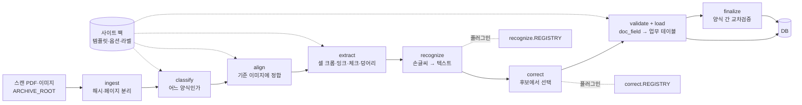
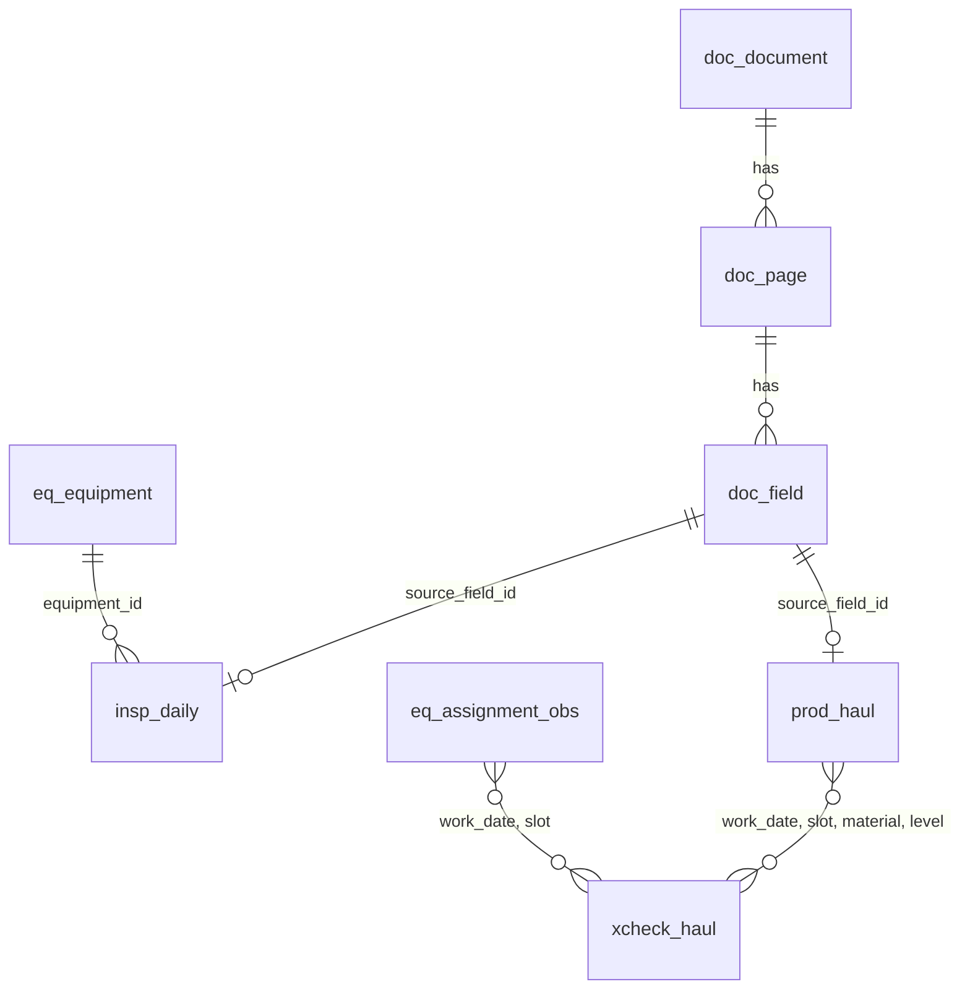

# 아키텍처

## 1. 무엇을 만드는가

현장에서 손으로 쓴 문서를 스캔하면 사람 손을 거치지 않고 데이터베이스에 들어가는 파이프라인이다.
전체 사업은 두 단계다.

| 단계 | 내용 | 이 저장소 |
|---|---|---|
| 1단계 | 스캐너 → 인식 → 데이터베이스. 독립 소프트웨어로 등록 | **여기** |
| 2단계 | 통합 데이터베이스, 직접 입력 체계, 시각화, 물질수지 조정 | 별도. 1단계의 업무 테이블을 읽는다 |

두 단계가 만나는 면은 DB 의 업무 테이블(`eq_*`, `insp_*`, `prod_*`, `xcheck_*`)이다.
스캔으로 들어온 값과 2단계에서 직접 입력한 값이 같은 테이블에 들어가고 `entry_source` 로 구분한다.

## 2. 설계 원칙

1. **양식은 데이터다** — 양식 하나는 YAML 정의와 기준 이미지다. 새 양식에 코드가 필요 없다.
2. **인쇄된 값은 읽지 않는다** — 템플릿에서 확정한다. OCR 대상은 손으로 쓴 것뿐이다.
3. **모든 값은 출처를 가진다** — 페이지, 좌표, 원문, 최종값, 신뢰도, 후보.
4. **교정은 선택이지 생성이 아니다** — 후보 중에서 고른다. 고유값은 마스터와 맞춘다.
5. **사람은 예외만 본다** — 확신 없는 값만 검수로 보내고, 검수 결과는 학습 데이터가 된다.
6. **인식기는 갈아 끼우는 부품이다** — 같은 평가셋의 수치로 비교해 바꾼다.

## 3. 파이프라인



| 단계 | 모듈 | 하는 일 | 모델 필요 |
|---|---|---|---|
| ingest | `pipeline/runner.py`, `imaging/io.py` | 파일 SHA-256 으로 문서 등록(중복 차단), PDF 를 200 dpi 회색조로 렌더링 | 아니오 |
| classify | `forms/classify.py` | 각 템플릿 기준 이미지와 ORB 정합을 시도해 인라이어가 가장 많은 양식을 고른다. 1위/2위 비율이 낮으면 표시 | 아니오 |
| align | `imaging/align.py` | ORB → 비율 검정 → RANSAC 호모그래피. 정합 뒤 표마다 괘선을 다시 검출해 템플릿과의 오차(px, 중앙값)를 잰다. 기준 미달이면 `align_failed` | 아니오 |
| extract | `imaging/cells.py`, `marks.py`, `blobs.py` | 셀 크롭과 잉크 비율, ✓ 판정, 괘선 제거 + RLSA 로 글씨 덩어리를 셀에 배정(여러 칸에 걸친 메모 구분) | 아니오 |
| recognize | `recognize/` | 셀 크롭 + 문맥 → 텍스트·신뢰도·후보 | **예 (플러그인)** |
| correct | `correct/` | 후보(문구 DB, 마스터)에서 고르거나 편집거리 제한 안에서만 수정 | 선택 (플러그인) |
| validate + load | `handlers/` | 양식의 의미를 적용해 `doc_field` 와 업무 테이블에 적재, 행 단위 검수 여부 결정 | 아니오 |
| finalize | `validate/crosscheck.py` | 모든 문서를 처리한 뒤 양식 간 교차검증, 그날의 실제 배차 관측 | 아니오 |

인식 백엔드가 없어도(`null`) 나머지는 전부 돈다. 이때 손글씨 셀은 "값이 있다"는 사실만 기록되고 검수 대기로 간다.
값의 유무만으로도 교차검증이 가능하다(어느 칸에 적었는지가 두 양식에서 같아야 한다).

### 실행기가 아는 것과 모르는 것

`pipeline/runner.py` 는 단계 순서와 상태 기록만 안다. 양식의 기하는 템플릿이, 의미는 핸들러가, 글자는 인식 백엔드가 안다.
같은 파일을 다시 넣으면 같은 키로 덮어쓰므로(멱등), 인식기를 바꾼 뒤 그대로 다시 돌리면 된다.

### 상태

```
doc_document.status : received → processed | needs_review
doc_page.status     : unknown_form | classified_only | align_failed | loaded
doc_field.review_status / 업무 행 review_status : auto | pending → reviewed
```

- `unknown_form` — 어느 템플릿과도 맞지 않는다 (새 양식이거나 양식이 아닌 페이지).
- `classified_only` — 양식은 알지만 셀 정의가 아직 없는 템플릿(스텁). 분류 통계에만 잡힌다.
- `align_failed` — 정합 품질 미달. 값을 뽑지 않고 검수로 보낸다(잘못된 좌표에서 뽑은 값은 없는 것보다 나쁘다).

## 4. 계층과 데이터 위치

```
ARCHIVE_ROOT   스캔 원본. 읽기 전용으로 취급 (공유 드라이브·NAS)
SITE PACK      현장별 양식 정의·옵션·라벨·회귀 기준. 저장소 밖 (개인정보 포함)
WORK_ROOT      정합 이미지, SQLite DB, 리포트. 로컬 디스크. 언제든 다시 만들 수 있다
DB             운영에서는 PostgreSQL (예정). 지금은 WORK_ROOT 의 SQLite
저장소          코드, 문서, 합성 데이터 생성기. 현장에 관한 것은 없다
```

소프트웨어는 현장을 모른다. 장비 구분, 파일명 규칙, 교차검증에서 뺄 광종 같은 것은 전부 사이트 팩의 `site.toml` 에서 읽는다.
다른 광산에 적용할 때 바뀌는 것은 사이트 팩뿐이다.

## 5. 양식 정의와 핸들러

- **템플릿**(`template.yaml`)은 *어디에 무엇이 있는가* 를 정한다: 표(region)의 괘선 좌표, 열의 종류, 행의 키와 메타, 표 밖 자유 필드.
- **핸들러**는 *그것이 업무상 무엇인가* 를 정한다: 추출한 셀을 어느 업무 테이블의 어떤 행으로 옮기는지.

| 핸들러 | 대상 | 업무 테이블 |
|---|---|---|
| `generic` | 아무 양식 | 없음 (`doc_field` 만) |
| `inspection` | 행 = 장비, 열 = 점검내역 + 이상 유/무 체크 | `eq_equipment`, `insp_daily` |
| `haul` | 운반 횟수. `role: log`(차량별 일보) 또는 `role: matrix`(편×차량 행렬) | `prod_haul`, 그리고 `finalize` 에서 `xcheck_haul`, `eq_assignment_obs` |

열의 종류(`kind`): `printed`(템플릿 값 사용) · `handwritten_text` · `handwritten_number` · `checkmark` · `signature`.

형식은 [SITE_PACK.md](SITE_PACK.md) 에 있다.

## 6. 데이터 모델

`store/schema.sql`. 세 층으로 나눈다.



| 층 | 테이블 | 내용 |
|---|---|---|
| 문서 | `doc_document` | 원본 파일. ID = SHA-256 앞 16자리 → 같은 스캔의 중복 접수 차단 |
| | `doc_page` | 페이지별 양식, 분류 여유, 정합 품질, 정합 이미지 경로, 상태 |
| | `doc_field` | 셀 하나. 좌표(bbox), 잉크, 값 유무, 원문, 최종값, 신뢰도, 후보, 값을 만든 주체, 검수 상태 |
| 마스터 | `eq_equipment` | 장비. ISO 23725 의 FleetDefinition 구조(식별자 UUID, HID, 장비 유형)를 따른다. 같은 키는 항상 같은 UUID |
| | `eq_assignment_obs` | 그날 실제로 누가 어느 차를 몰았는가 (관측값). 인쇄된 머리글과 다르면 표시 |
| 업무 | `insp_daily` | 일일 장비 점검: 날짜 × 장비 → 이상 유/무, 점검내역 |
| | `prod_haul` | 운반 실적: 날짜 × 자리(차량) × 광종 × 편 × 근무조 → 횟수. 두 양식에서 각각 들어온다 |
| | `xcheck_haul` | 두 양식의 같은 값 비교: `match` / `mismatch` / `missing_log` / `missing_matrix` |

규칙:
- 쓰기는 `store.db.upsert()` 만 쓴다 (`INSERT … ON CONFLICT … DO UPDATE`). 재실행은 덮어쓴다.
- SQLite 와 PostgreSQL 에서 같이 도는 문법만 쓴다. 날짜·시각은 ISO 8601 문자열, 불리언은 0/1.
- 업무 테이블의 모든 행은 `source_field_id` 로 `doc_field` 를, 거기서 페이지와 정합 이미지의 좌표를 가리킨다.

## 7. 교차검증과 물질수지

현장 기록은 서로 맞지 않는다. 1단계의 역할은 그 차이를 **계산해서 계속 보여 주는 것**이다. 맞추는 것(reconciliation)은 2단계다.

지금 구현된 교차검증은 운반 횟수 하나다. 같은 값이 두 곳에 적힌다.

```
차량별 일보 (log)      한 장 = 차량 한 대.  행 = 광종×편,  열 = 근무조
편×차량 행렬 (matrix)  한 장 = 상차 장비 한 대.  행 = 광종×편,  열 = 차량 자리(slot)
```

두 문서를 잇는 키는 행렬의 **열 자리(slot)** 다. 행렬에 인쇄된 운전자·차량번호는 양식을 만든 당시 상태로 굳어 있어
실제와 다를 수 있으므로, 그날 일보에 손으로 적힌 (차량번호, 작성자)를 사실로 보고

1. 작성자가 머리글 운전자와 같으면 그 자리
2. 아니면 차량번호가 머리글 차량번호와 같은 자리

순서로 자리를 정한다. 그 결과가 `eq_assignment_obs` 다. 하루에 행렬이 여러 장이면 전부 합쳐서 비교하고,
같은 (자리, 광종, 편)에 근무조가 여럿이면 값 유무는 OR, 횟수는 합으로 본다.
인식기가 없으면 값의 유무만 비교하고, 숫자를 읽으면 횟수까지 비교한다.

물질수지 관점에서 문서들이 놓이는 자리는 다음과 같다. 노드 사이를 잇는 교차검증을 하나씩 늘려 간다.

| 노드 | 근거 문서 | 상태 |
|---|---|---|
| 채광 (갱내 운반) | 차량별 운반 일보 ↔ 상차 장비 행렬 | 구현 (`xcheck_haul`) |
| 선광 | 선광 작업일지 | 양식 미정의 |
| 출하 | 갱외 상차 일보, 경비 근무일지 | 분류만 |
| 장비 | 일일 점검표, 중기 운행일보, 전기 안전일지 | 점검표 구현, 나머지 분류만 또는 미정의 |
| 굴진 | 천공 작업 내역 (엑셀) | 미착수 |

## 8. 인식과 교정 (플러그인)

```python
class Recognizer(Protocol):
    name: str
    def recognize(self, crops: list[np.ndarray], contexts: list[CellContext]) -> list[Recognition]: ...

class Corrector(Protocol):
    name: str
    def correct(self, recs: list[Recognition], contexts: list[CellContext]) -> list[Recognition]: ...
```

`CellContext` 는 템플릿에서 확정된 문맥을 준다: 양식, 표, 열 이름, 종류, 행 키(어느 장비·어느 편인지), 날짜, 닫힌 집합이면 그 목록(`choices`),
같은 행의 최근 값·반복 문구(`hints`). 인식기는 이 문맥을 프롬프트나 제약 디코딩에 쓸 수 있다.
`Recognition` 은 텍스트, 신뢰도(0~1), 후보 목록을 돌려준다. 신뢰도가 `auto_accept_conf` 이상이면 자동 적재한다.

기본 백엔드:
- `null` — 빈 텍스트, 신뢰도 0. 인식기가 생기기 전의 자리표시자.
- `oracle` — 정답을 그대로 돌려준다. 인식기를 뺀 나머지가 맞는지 확인하는 용도. 이걸로 CER 이 0 이 아니면 파이프라인의 버그다.

### 참조한 특허 세 건이 놓이는 자리

| 특허의 핵심 | 이 구조에서의 자리 | 상태 |
|---|---|---|
| ① 표 제거 + RLSA 로 서식을 벗어난 수기 영역 검출 | `imaging/blobs.py` — 템플릿 정합 뒤에 쓰므로 표 검출은 필요 없고, 덩어리가 어느 셀에 속하는지와 셀을 넘었는지만 판정 | 구현 |
| ② 문서 레이아웃(그래프) 기반 OCR 오류 교정 | `correct/` — 레이아웃 문맥은 템플릿이 확정해서 `CellContext` 로 넘긴다. 행(장비)·열별 문구 DB 에서 후보를 내는 교정기 | 계획 |
| ③ 도메인 특화 언어모델 교정 | `correct/` — 후보 목록을 주고 고르게만 하는 교정기. 자유 생성은 하지 않는다 | 계획 |

## 9. 평가

`evaluate/`. 모든 변경은 수치로 판단한다.

| 지표 | 뜻 |
|---|---|
| CER | 문자 오류율 — 수기 텍스트 인식·교정의 품질 |
| 필드 정확도 | 필드 단위 완전 일치율 — 숫자·코드는 한 글자만 틀려도 틀린 값 |
| 자동 적재율 | 검수 없이 적재된 비율 — 현장의 업무 부담 |

세 가지 시험이 있다.

1. **합성 데이터 시험** (`pytest`) — `tools/synth.py` 가 만든 양식에 무엇을 적었는지 알고 있으므로, 분류·정합·체크·값 유무·교차검증·배차 관측이
   정답과 **정확히** 같은지 본다. 저장소만 있으면 어디서나 돈다.
2. **오라클 시험** — 정답을 돌려주는 백엔드로 돌려 CER 0 을 확인한다. 합성(`pytest`)과 실데이터(`run --inspection-csv` + `eval`) 양쪽에서 한다.
3. **실데이터 회귀** (`minedocscan regress`, `pytest -m realdata`) — 사이트 팩의 `expected/regression.json` 에 저장한 기준 수치와 비교한다.

합성 데이터로 잴 수 있는 것은 기하와 논리다. 한글 손글씨 인식률은 실데이터 평가셋으로만 말한다.

## 10. 확장 지점

| 하려는 일 | 손대는 곳 | 코드 변경 |
|---|---|---|
| 같은 종류의 새 양식 | 사이트 팩의 `templates/<이름>/` | 없음 |
| 다른 현장 | 새 사이트 팩 | 없음 |
| 새 종류의 업무 기록 | `handlers/` + `store/schema.sql` + `tools/synth.py` + 테스트 | 있음 |
| 새 인식 백엔드 | `recognize/<이름>.py` + `register()` | 있음 (파이프라인은 그대로) |
| 새 교정 백엔드 | `correct/<이름>.py` + `register()` | 있음 (파이프라인은 그대로) |
| 새 교차검증 | `validate/` + 해당 핸들러의 `finalize()` | 있음 |
| 운영 DB | `store/db.py` 의 연결·자리표시자 | 있음 (스키마는 그대로) |

## 11. 프로그램 형태

지금은 명령줄 도구 하나다(`minedocscan`). 1단계가 완성되었을 때의 모습은 다음과 같고, 전부 같은 패키지를 쓴다.

```
스캐너가 접수 폴더에 PDF 저장
      ↓
감시 서비스 (예정)      새 파일을 발견하면 Pipeline.process_file()
      ↓
DB (PostgreSQL 예정)
      ↓
검수 화면 (예정)        pending 인 값을 정합 이미지의 그 자리와 함께 보여 주고 고친다 → reviewed
```

구현 상태와 순서는 [ROADMAP.md](ROADMAP.md) 에 있다.
