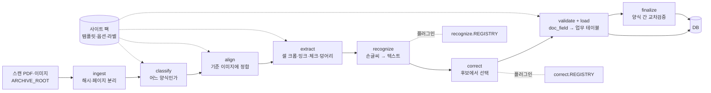
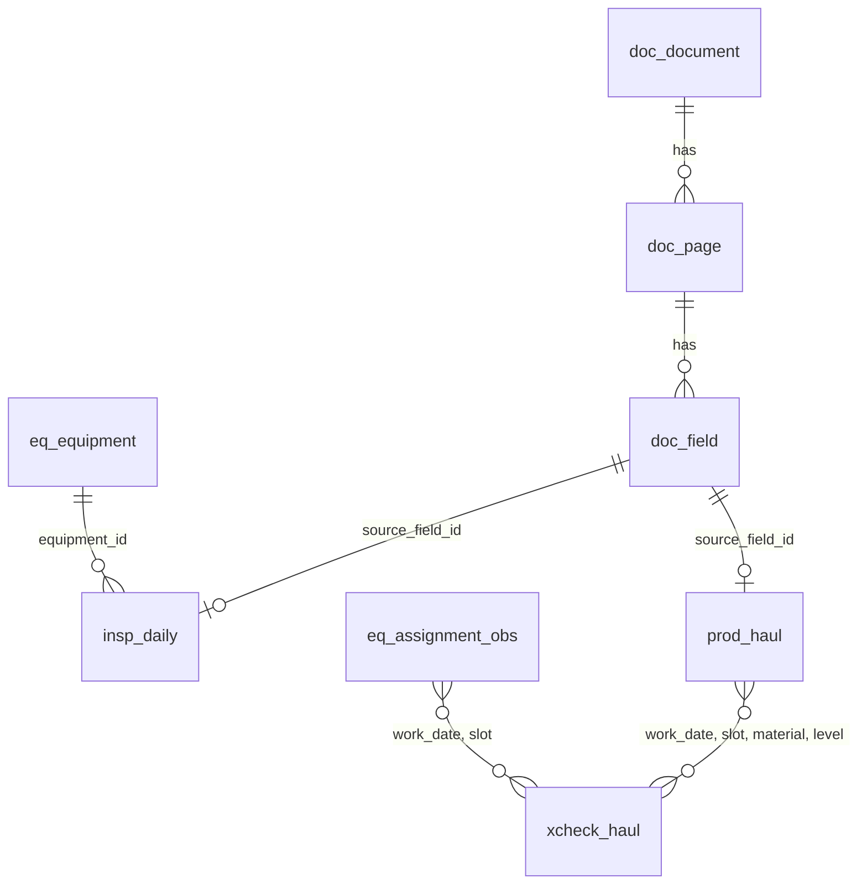

# 아키텍처

## 1. 무엇을 만드는가

현장에서 손으로 쓴 문서를 스캔하면 사람 손을 거치지 않고 데이터베이스에 들어가는 파이프라인이다.
전체 사업은 두 단계다.

| 단계 | 내용 | 이 저장소 |
|---|---|---|
| 1단계 | 스캐너 → 인식 → 데이터베이스. 독립 소프트웨어로 등록 | **여기** |
| 2단계 | 통합 데이터베이스, 직접 입력 체계, 시각화, 물질수지 조정 | 별도. 1단계의 업무 테이블을 읽는다 |

두 단계가 만나는 면은 DB 의 업무 테이블(`eq_*`, `insp_*`, `prod_*`, `xcheck_*`)이다.
스캔으로 들어온 값과 2단계에서 직접 입력한 값이 같은 테이블에 들어가고 `entry_source` 로 구분한다.

## 2. 설계 원칙

1. **양식은 데이터다** — 양식 하나는 YAML 정의와 기준 이미지다. 새 양식에 코드가 필요 없다.
2. **인쇄된 값은 읽지 않는다** — 템플릿에서 확정한다. OCR 대상은 손으로 쓴 것뿐이다.
3. **모든 값은 출처를 가진다** — 페이지, 좌표, 원문, 최종값, 신뢰도, 후보.
4. **교정은 선택이지 생성이 아니다** — 후보 중에서 고른다. 고유값은 마스터와 맞춘다.
5. **사람은 예외만 본다** — 확신 없는 값만 검수로 보내고, 검수 결과는 학습 데이터가 된다.
6. **인식기는 갈아 끼우는 부품이다** — 같은 평가셋의 수치로 비교해 바꾼다.

## 3. 파이프라인



| 단계 | 모듈 | 하는 일 | 모델 필요 |
|---|---|---|---|
| ingest | `pipeline/runner.py`, `imaging/io.py` | 파일 SHA-256 으로 문서 등록(중복 차단), PDF 를 200 dpi 회색조로 렌더링 | 아니오 |
| classify | `forms/classify.py` | 각 템플릿 기준 이미지와 ORB 정합을 시도해 인라이어가 가장 많은 양식을 고른다. 1위/2위 비율이 낮으면 표시 | 아니오 |
| align | `imaging/align.py` | ORB → 비율 검정 → RANSAC 호모그래피. 정합 뒤 표마다 괘선을 다시 검출해 템플릿과의 오차(px, 중앙값)를 잰다. 기준 미달이면 `align_failed` | 아니오 |
| extract | `imaging/cells.py`, `marks.py`, `blobs.py` | 셀 크롭과 잉크 비율, ✓ 판정, 괘선 제거 + RLSA 로 글씨 덩어리를 셀에 배정(여러 칸에 걸친 메모 구분) | 아니오 |
| recognize | `recognize/` | 셀 크롭 + 문맥 → 텍스트·신뢰도·후보 | **예 (플러그인)** |
| correct | `correct/` | 후보(문구 DB, 마스터)에서 고르거나 편집거리 제한 안에서만 수정 | 선택 (플러그인) |
| validate + load | `handlers/` | 양식의 의미를 적용해 `doc_field` 와 업무 테이블에 적재, 행 단위 검수 여부 결정 | 아니오 |
| finalize | `validate/crosscheck.py` | 모든 문서를 처리한 뒤 양식 간 교차검증, 그날의 실제 배차 관측 | 아니오 |

인식 백엔드가 없어도(`null`) 나머지는 전부 돈다. 이때 손글씨 셀은 "값이 있다"는 사실만 기록되고 검수 대기로 간다.
값의 유무만으로도 교차검증이 가능하다(어느 칸에 적었는지가 두 양식에서 같아야 한다).

### 실행기가 아는 것과 모르는 것

`pipeline/runner.py` 는 단계 순서와 상태 기록만 안다. 양식의 기하는 템플릿이, 의미는 핸들러가, 글자는 인식 백엔드가 안다.
같은 파일을 다시 넣으면 같은 키로 덮어쓰므로(멱등), 인식기를 바꾼 뒤 그대로 다시 돌리면 된다.

### 상태

```
doc_document.status : received → processed | needs_review | failed
doc_page.status     : unknown_form | classified_only | align_failed | loaded | error
doc_field.review_status / 업무 행 review_status : auto | pending → reviewed
```

- `unknown_form` — 어느 템플릿과도 맞지 않는다 (새 양식이거나 양식이 아닌 페이지).
- `classified_only` — 양식은 알지만 셀 정의가 아직 없는 템플릿(스텁). 분류 통계에만 잡힌다.
- `align_failed` — 정합 품질 미달. 값을 뽑지 않고 검수로 보낸다(잘못된 좌표에서 뽑은 값은 없는 것보다 나쁘다).
- `failed` / `error` — 문서를 읽지 못했거나(문서, 롤백) 쪽 하나에서 예외가 났다(쪽, `SAVEPOINT` 로 그 쪽의 행만 되돌림). `error` 컬럼에 예외 종류와
  메시지만 남는다. 한 문서의 실패가 전체를 멈추지 않고, 숨기지도 않는다: 요약에 목록이 나오고 종료 코드는 1 이다. `run --strict` 는 첫 오류에서 멈춘다.
  `run --skip-existing` 은 끝까지 처리된 같은 해시의 문서만 건너뛰고 `failed` 는 다시 한다 — 템플릿이나 인식기를 바꾼 뒤에는 쓰지 않는다.
- `reviewed` — 사람이 종이를 보고 값을 확정했다(`value`) 또는 빈 칸임을 확정했다(`empty`). 읽을 수 없다고 표시한 셀(`illegible`)은
  `pending` 으로 남고 대기열과 정답에서 빠진다. 업무 행은 구성 필드 중 하나라도 `pending` 이면 `pending`, 아니고 하나라도 `reviewed` 면
  `reviewed`, 아니면 `auto` 다. 검수 흐름은 §7.1.

## 4. 계층과 데이터 위치

```
ARCHIVE_ROOT   스캔 원본. 읽기 전용으로 취급 (공유 드라이브·NAS)
SITE PACK      현장별 양식 정의·옵션·라벨·회귀 기준. 저장소 밖 (개인정보 포함)
WORK_ROOT      정합 이미지, SQLite DB, 리포트. 로컬 디스크. 언제든 다시 만들 수 있다
DB             운영에서는 PostgreSQL (예정). 지금은 WORK_ROOT 의 SQLite
저장소          코드, 문서, 합성 데이터 생성기. 현장에 관한 것은 없다
```

소프트웨어는 현장을 모른다. 장비 구분, 파일명 규칙, 교차검증에서 뺄 광종 같은 것은 전부 사이트 팩의 `site.toml` 에서 읽는다.
다른 광산에 적용할 때 바뀌는 것은 사이트 팩뿐이다.

## 5. 양식 정의와 핸들러

- **템플릿**(`template.yaml`)은 *어디에 무엇이 있는가* 를 정한다: 표(region)의 괘선 좌표, 열의 종류, 행의 키와 메타, 표 밖 자유 필드.
- **핸들러**는 *그것이 업무상 무엇인가* 를 정한다: 추출한 셀을 어느 업무 테이블의 어떤 행으로 옮기는지.

| 핸들러 | 대상 | 업무 테이블 |
|---|---|---|
| `generic` | 아무 양식 | 없음 (`doc_field` 만) |
| `inspection` | 행 = 장비, 열 = 점검내역 + 이상 유/무 체크 | `eq_equipment`, `insp_daily` |
| `haul` | 운반 횟수. `role: log`(차량별 일보) 또는 `role: matrix`(편×차량 행렬) | `prod_haul`, 그리고 `finalize` 에서 `xcheck_haul`, `eq_assignment_obs` |

열의 종류(`kind`): `printed`(템플릿 값 사용) · `handwritten_text` · `handwritten_number` · `checkmark` · `signature`.

표 밖 자유 필드에 `meta_key`(`vehicle_no`, `operator` …)를 주면 그 필드의 검수값이 쪽의 메타가 된다 (날짜는 안 된다).
쪽 메타의 우선순위는 **검수값 > 페이지 라벨 > 문서 라벨 > 파일명 규칙** 이다 (`review/store.page_meta`).

### 양식의 판

같은 양식의 개정판은 이름이 다른 템플릿이고, `family`·`valid_from`·`valid_to` 로 묶는다. 쪽의 날짜를 알면 그날 유효한 템플릿만 분류 후보다.
개정판끼리는 머리글 몇 글자만 달라 모양으로는 가릴 수 없다(분류 여유 ≈ 1). 같은 계열에서 기간이 겹치면 사이트 팩을 읽을 때 오류다 (ADR 0010).

형식은 [SITE_PACK.md](SITE_PACK.md) 에 있다.

## 6. 데이터 모델

`store/schema.sql`. 세 층으로 나눈다.



| 층 | 테이블 | 내용 |
|---|---|---|
| 문서 | `doc_document` | 원본 파일. ID = SHA-256 앞 16자리 → 같은 스캔의 중복 접수 차단. `source_rel`(archive_root 기준)로 다른 컴퓨터에서도 원본을 찾는다. 상태·오류·경고(`warning` — 복구해서 연 PDF, `[pipeline] damaged_pdf = "warn"`) |
| | `doc_page` | 페이지별 양식, 분류 여유, 정합 품질, 정합 이미지 경로, 호모그래피(렌더링한 쪽 픽셀 → 템플릿 픽셀)와 렌더링 dpi, 상태, 오류 |
| | `doc_field` | 셀 하나. 좌표(bbox), 잉크, 값 유무(기계 `has_value_raw` / 최종 `has_value`), 원문 `value_raw`, 최종값 `value_final`, 신뢰도, 후보, 값을 만든 주체, 검수 상태(`review_status`)와 기계가 정한 상태(`status_raw` — 자동 적재 오류율의 분모) |
| | `doc_review` | 사람이 입력한 값 한 건. 원본은 사이트 팩의 `reviews/reviews.jsonl` 이고 이 테이블은 사본이다 (ADR 0008) |
| | `meta_schema` | 스키마 버전. 버전이 다른 DB 파일은 열지 않는다 (`run --fresh` 로 다시 만든다) |
| 마스터 | `eq_equipment` | 장비. ISO 23725 의 FleetDefinition 구조(식별자 UUID, HID, 장비 유형)를 따른다. 같은 키는 항상 같은 UUID |
| | `eq_assignment_obs` | 그날 실제로 누가 어느 차를 몰았는가 (관측값). 인쇄된 머리글과 다르면 표시 |
| 업무 | `insp_daily` | 일일 장비 점검: 날짜 × 장비 → 이상 유/무, 점검내역 |
| | `prod_haul` | 운반 실적: 날짜 × 자리(차량) × 광종 × 편 × 근무조 → 횟수. 두 양식에서 각각 들어온다. `trips` 는 최종, `trips_raw` 는 기계가 읽은 값 |
| | `xcheck_haul` | 두 양식의 같은 값 비교: `match` / `mismatch` / `missing_log` / `missing_matrix`. 판정은 최종 값, 기계 값의 합도 `*_trips_raw` 에 같이 둔다 |

규칙:
- 쓰기는 `store.db.upsert()` 만 쓴다 (`INSERT … ON CONFLICT … DO UPDATE`). 재실행은 덮어쓴다.
- **기계 값과 최종 값을 따로 둔다.** `value_raw`·`confidence`·`backend`·`has_value_raw`·`status_raw`·`trips_raw` 는 언제나 기계의 것이고 검수해도 바뀌지 않는다.
  `value_final`·`has_value`·`trips` 는 최종 값이다. 업무 테이블은 최종 값에서 만든다.
- 컬럼이 바뀌면 `store/db.py` 의 `SCHEMA_VERSION` 을 올린다. 마이그레이션은 없다 (ADR 0005). 사람이 입력한 값은 파일에 있으므로 DB 는 언제든 다시 만든다.
- SQLite 와 PostgreSQL 에서 같이 도는 문법만 쓴다. 날짜·시각은 ISO 8601 문자열, 불리언은 0/1.
- 업무 테이블의 모든 행은 `source_field_id` 로 `doc_field` 를, 거기서 페이지와 정합 이미지의 좌표를 가리킨다.

## 7. 교차검증과 물질수지

현장 기록은 서로 맞지 않는다. 1단계의 역할은 그 차이를 **계산해서 계속 보여 주는 것**이다. 맞추는 것(reconciliation)은 2단계다.

지금 구현된 교차검증은 운반 횟수 하나다. 같은 값이 두 곳에 적힌다.

```
차량별 일보 (log)      한 장 = 차량 한 대.  행 = 광종×편,  열 = 근무조
편×차량 행렬 (matrix)  한 장 = 상차 장비 한 대.  행 = 광종×편,  열 = 차량 자리(slot)
```

두 문서를 잇는 키는 행렬의 **열 자리(slot)** 다. 행렬에 인쇄된 운전자·차량번호는 양식을 만든 당시 상태로 굳어 있어
실제와 다를 수 있으므로, 그날 일보에 손으로 적힌 (차량번호, 작성자)를 사실로 보고

1. 작성자가 머리글 운전자와 같으면 그 자리
2. 아니면 차량번호가 머리글 차량번호와 같은 자리

순서로 자리를 정한다. 그 결과가 `eq_assignment_obs` 다. 하루에 행렬이 여러 장이면 전부 합쳐서 비교하고,
같은 (자리, 광종, 편)에 근무조가 여럿이면 값 유무는 OR, 횟수는 합으로 본다.
인식기가 없으면 값의 유무만 비교하고, 숫자를 읽으면 횟수까지 비교한다.

일치율(`report` 의 `xcheck_agreement`)은 양쪽 다 횟수가 있는 칸 중 횟수가 같은 비율이다. 최종 값 기준과 기계 값 기준을 따로 내고 분모를 같이 본다.
정확도가 아니다 — 두 문서를 같은 방식으로 틀리게 읽으면 일치로 잡힌다 (ADR 0007).

### 7.1 검수 흐름

검수는 **옮겨 적기**다. 검수자는 종이에 적힌 그대로 입력하고, 두 문서가 달라도 각각 적힌 대로 적는다. 어느 쪽이 맞는지는 정하지 않는다 (ADR 0006).

```
minedocscan review serve --queue haul-numbers --reviewer jp      # 127.0.0.1:8765, 표준 라이브러리 서버 + HTML 한 장
   화면: 행 띠(인쇄된 광종·편이 보인다) + 3배 셀 → 숫자 입력 → Enter
   POST /api/review → review/store.save():
      1. <site>/reviews/reviews.jsonl 에 한 줄 추가 (원본, 추가 전용)
      2. doc_review (사본)
      3. doc_field: value_final·has_value·review_status 를 덮는다. 기계 값은 그대로
      4. 핸들러의 on_review(): 그 셀의 업무 행(prod_haul / insp_daily)과 그 날짜의 교차검증만 다시 계산
      5. 문서 상태(needs_review) 갱신
```

- 대기열(`review/queue.py`): `haul-numbers`(운반 숫자 표본, 기계 값 숨김), `mismatch`(교차검증 불일치 칸의 일보·행렬 셀 묶음, 기계 값 숨김),
  `pending`(검수 대기 필드 전부, 기계 값을 미리 채움), `page-fields`(차량번호·작성자 같은 쪽 메타 — 항목 = 쪽 하나, 행렬 머리글과 지금까지의
  값이 후보 목록으로 붙는다). 정답을 만드는 대기열에서 기계 값을 숨기는 이유는 보여 주면 그 값에 끌리기 때문이다.
- 페이지 필드를 저장하면 그 쪽의 `prod_haul` 차량·작성자와 그 날짜의 교차검증·배차 관측이 바로 갱신된다 — 수동 라벨(`labels/pages.json`)을 대신한다.
- 셀 이미지는 원본에 닿으면(아카이브가 연결된 컴퓨터) 쪽의 호모그래피로 원본을 300 dpi 로 렌더링해 그 셀만 정합한 것이고(`imaging/hires.py`),
  아니면 200 dpi 정합 이미지다. 응답 머리글 `X-Crop-Source` 로 어느 쪽인지 알린다. 좌표계는 그대로 템플릿 좌표 하나다.
- 파이프라인은 시작할 때 검수 파일을 읽어 들이고, 필드 행을 만든 뒤 유효한 검수를 덮고(`handlers/base.apply_reviews`), 그 최종 행에서 업무 행을 만든다.
  그래서 `run --fresh` 로 DB 를 지우고 다시 돌려도 입력한 값이 그대로 다시 붙고, 검수된 셀도 인식기를 돌리므로 새 인식기의 `value_raw` 를 검수값과 비교할 수 있다.
- **불변식**: 저장 직후의 DB 는, 같은 검수 파일을 가지고 처음부터 다시 돌린 DB 와 같다 (`tests/test_review_store.py` 가 고정한다).
- 검수값은 그대로 정답이다: `review export-answers` → `eval --answers … --target raw --only-listed`.

물질수지 관점에서 문서들이 놓이는 자리는 다음과 같다. 노드 사이를 잇는 교차검증을 하나씩 늘려 간다.

| 노드 | 근거 문서 | 상태 |
|---|---|---|
| 채광 (갱내 운반) | 차량별 운반 일보 ↔ 상차 장비 행렬 | 구현 (`xcheck_haul`) |
| 선광 | 선광 작업일지 | 양식 미정의 |
| 출하 | 갱외 상차 일보, 경비 근무일지 | 분류만 |
| 장비 | 일일 점검표, 중기 운행일보, 전기 안전일지 | 점검표 구현, 나머지 분류만 또는 미정의 |
| 굴진 | 천공 작업 내역 (엑셀) | 미착수 |

## 8. 인식과 교정 (플러그인)

```python
class Recognizer(Protocol):
    name: str
    def recognize(self, crops: list[np.ndarray], contexts: list[CellContext]) -> list[Recognition]: ...

class Corrector(Protocol):
    name: str
    def correct(self, recs: list[Recognition], contexts: list[CellContext]) -> list[Recognition]: ...
```

`CellContext` 는 템플릿에서 확정된 문맥을 준다: 양식, 표, 열 이름, 종류, 행 키(어느 장비·어느 편인지), 날짜, 닫힌 집합이면 그 목록(`choices`),
같은 행의 최근 값·반복 문구(`hints`). 인식기는 이 문맥을 프롬프트나 제약 디코딩에 쓸 수 있다.
`Recognition` 은 텍스트, 신뢰도(0~1), 후보 목록을 돌려준다. 신뢰도가 기준(`auto_accept_conf`, 또는 백엔드가 정한 `threshold`) 이상이면 자동 적재한다.

**크롭 규격** (ADR 0011). 인식기에 넘기는 그림은 `imaging/cropspec.CropSpec`(해상도 `aligned`|`source`, 배율, 여유) 하나로 정의하고,
파이프라인·`review export-crops`·검수 화면이 같은 함수(`crop_cell`)로 자른다 — 같은 칸이면 화소까지 같다. 백엔드가 규격을 선언한다
(`crop_spec` 또는 `crop_spec_for(kind)`). 선언이 없으면 예전 크롭(정합 이미지, 칸 그대로). `source` 는 쪽의 호모그래피로 원본(300 dpi)에서
그 칸만 다시 정합한다. 좌표는 여전히 템플릿 좌표 하나다.

**칸 종류별 백엔드**: `[recognize.by_kind] handwritten_number = "digits"` — 나머지 종류는 `[recognize] backend`. 파이프라인은 여전히
`Recognizer` 하나만 안다 (`recognize.ByKindRecognizer`). 각 칸의 `doc_field.backend` 에 실제로 읽은 백엔드가 남는다.

기본 백엔드:
- `null` — 빈 텍스트, 신뢰도 0. 인식기가 생기기 전의 자리표시자.
- `oracle` — 정답을 그대로 돌려준다. 인식기를 뺀 나머지가 맞는지 확인하는 용도. 이걸로 CER 이 0 이 아니면 파이프라인의 버그다.
- `digits` — 숫자 칸(운반 횟수) 인식기 (`recognize/digits/`, ADR 0011·0012). 사이트 팩의 모델(`models/<이름>/model.onnx` + `card.json`)을
  OpenCV `cv2.dnn` 으로 돌린다 — torch 없음. 카드의 규격·온도·자동 적재 기준을 그대로 쓴다. 숫자 칸이 아닌 칸은 읽지 않고 검수 대기로 돌려준다.

### 숫자 인식기 `digits`

- 입력: 크롭(카드의 규격, 기본 원본·1.5배·여유 = 행 높이의 절반) → 32×96 으로 줄이고 종이·잉크로 밝기를 맞춘 잉크 채널 + 가로·세로 위치 채널.
- 망: 합성곱·배치 정규화·ReLU·최대 풀링만 (OpenCV 가 읽는 층). 세로는 최대 풀링으로 접고, 가로 24칸 × 12문자(blank, 0–9, `?`)의 CTC.
  파라미터 약 14.5만, ONNX 약 0.58 MB, 셀 하나 1 ms 안팎 (CPU).
- 답 (ADR 0012): 숫자열(앞의 0 을 뗀다) · 빈 칸 `""` (X 표·지운 것·이웃 칸 글씨·메모) · 거절 `"?"`. 신뢰도 = 그 답으로 접히는 경로의 확률 합(빔 탐색)
  을 온도로 보정한 것. 후보 상위 5개. `Recognition.answer` 에 답의 종류를, `threshold` 에 자동 적재 기준을 담는다.
- 자동 적재 (`handlers/base.number_status`): 숫자열(범위 안)·빈 칸은 신뢰도 ≥ 기준이면 자동 적재(빈 칸은 `has_value_raw` 0),
  아니면 값 있음 + 검수 대기. 거절은 늘 검수 대기, 운반 횟수 칸(운반 핸들러의 `region`)은 범위 밖(`site.toml [haul] trips_max`)도 늘 검수 대기.
  잉크 판정이 "값 없음"인 칸은 인식기에 가지 않는다.
  답의 종류를 말하지 않는 백엔드(`null`·`oracle`)는 예전 규칙.
- 학습 (`recognize/digits/train.py`, 선택 의존성 `[train]` — torch 는 여기서만): `review export-crops` 의 크롭 + 합성 셀(`tools/synth_cells.py`,
  실제 크롭의 규격·칸 크기로)을 배치마다 반반. test 줄이 있거나 규격이 섞인 폴더는 거절. 검증은 train 날짜 안에서 날짜 단위(소금값 + `":val"`).
  ONNX 로 내보낸 뒤 그 파일을 OpenCV 로 다시 읽어 검증 셀(잉크가 있던 칸)에서 온도·자동 적재 기준(오류율 ≤ 목표인 가장 낮은 임계값)·성적을 정해
  카드에 적는다. 검증 날짜의 실제 셀이 없으면 기준을 정하지 않는다(자동 적재 없음).

### 참조한 특허 세 건이 놓이는 자리

| 특허의 핵심 | 이 구조에서의 자리 | 상태 |
|---|---|---|
| ① 표 제거 + RLSA 로 서식을 벗어난 수기 영역 검출 | `imaging/blobs.py` — 템플릿 정합 뒤에 쓰므로 표 검출은 필요 없고, 덩어리가 어느 셀에 속하는지와 셀을 넘었는지만 판정 | 구현 |
| ② 문서 레이아웃(그래프) 기반 OCR 오류 교정 | `correct/` — 레이아웃 문맥은 템플릿이 확정해서 `CellContext` 로 넘긴다. 행(장비)·열별 문구 DB 에서 후보를 내는 교정기 | 계획 |
| ③ 도메인 특화 언어모델 교정 | `correct/` — 후보 목록을 주고 고르게만 하는 교정기. 자유 생성은 하지 않는다 | 계획 |

## 9. 평가

`evaluate/`. 모든 변경은 수치로 판단한다.

| 지표 | 뜻 |
|---|---|
| CER | 문자 오류율 — 수기 텍스트 인식·교정의 품질 |
| 필드 정확도 | 필드 단위 완전 일치율 — 숫자·코드는 한 글자만 틀려도 틀린 값. 정답이 빈 칸인 셀과 값이 있는 셀을 따로 낸다 (빈 칸이 대부분이라 합치면 가려진다) |
| 자동 적재율 | 검수 없이 적재된 비율 — 현장의 업무 부담 |
| 자동 적재 오류율 | 인식기가 자동 적재한 칸(값이든 빈 칸이든 — `status_raw = auto`) 중 기계의 답이 정답과 다른 비율. 분자·분모·윌슨 95 % 구간, 필드 종류별로도. 아무도 보지 않는 오류라서 자동 적재율과 같이 본다 |
| 값 유무 정밀도·재현율 | 기계의 `has_value_raw` 대 검수의 `value`/`empty` — 값을 놓치거나 만들어 내는 오류 |
| 교차검증 일치율 | 양쪽 다 횟수가 있는 칸 중 같은 비율, 기계 값 기준과 최종 값 기준 (정답 없이 인식기를 비교하는 수단) |

`eval --target final|raw`: 최종값 또는 기계가 읽은 값을 비교한다. 검수값으로 만든 정답과 비교할 때는 `raw` 를 쓴다 (`final` 은 검수값 자신이라 언제나 맞는다).
`report` 는 수기 칸을 백엔드별로 센다(칸 수, 기계의 자동 적재, 지금 대기·검수됨).

**크롭 단위 평가** (`recognizer eval --crops DIR --model NAME --split val|test|train`): 파이프라인 없이 내보낸 크롭에서 바로 — 정확도(전체·값·빈 칸·거절),
값별 표, 많이 틀린 쌍, 신뢰도 구간별 정확도, 임계값별 자동 적재율·오류율, `illegible` 칸 중 자동 적재될 것, `--errors` 틀린 칸 모아 보기.
같은 칸이면 이 평가의 답과 파이프라인의 `value_raw` 가 같다 (크롭 규격이 하나라서 — 시험으로 고정). `val` 은 카드의 검증 규칙으로 고른 train 날짜다.

**평가셋 분할**: 날짜 단위로 `test` / `train` 을 나누고, 어느 날짜가 `test` 인지는 날짜와 사이트 팩의 소금값(`[eval] split_salt`, `test_share`)만으로 정한다
(`evaluate/split.py`, ADR 0009). `review export-answers --split`, `eval --split`, `review export-crops --split` 이 둘을 섞지 않는다.
`test` 는 학습·문구 사전·임계값 조정에 쓰지 않는다. 내보낸 크롭(`OUT/<split>/<kind>/<이름>.png` + `labels.jsonl` — 이름은 field_id 에서 파일 이름에
못 쓰는 글자를 바꾼 것이라 읽는 쪽은 `labels.jsonl` 의 `file` 을 본다)은 저장소 밖에 둔다.

세 가지 시험이 있다.

1. **합성 데이터 시험** (`pytest`) — `tools/synth.py` 가 만든 양식에 무엇을 적었는지 알고 있으므로, 분류·정합·체크·값 유무·교차검증·배차 관측이
   정답과 **정확히** 같은지 본다. 저장소만 있으면 어디서나 돈다.
2. **오라클 시험** — 정답을 돌려주는 백엔드로 돌려 CER 0 을 확인한다. 합성(`pytest`)과 실데이터(`run --inspection-csv` + `eval`) 양쪽에서 한다.
3. **실데이터 회귀** (`minedocscan regress`, `pytest -m realdata`) — 사이트 팩의 `expected/regression.json` 에 저장한 기준 수치와 비교한다.

합성 데이터로 잴 수 있는 것은 기하와 논리다. 한글 손글씨 인식률은 실데이터 평가셋으로만 말한다.

## 10. 확장 지점

| 하려는 일 | 손대는 곳 | 코드 변경 |
|---|---|---|
| 같은 종류의 새 양식 | 사이트 팩의 `templates/<이름>/` | 없음 |
| 다른 현장 | 새 사이트 팩 | 없음 |
| 새 종류의 업무 기록 | `handlers/` + `store/schema.sql` + `tools/synth.py` + 테스트 | 있음 |
| 새 인식 백엔드 | `recognize/<이름>.py` + `register()`, 원하는 크롭 규격은 `crop_spec`/`crop_spec_for` 로 선언 | 있음 (파이프라인은 그대로) |
| 숫자 모델을 새로 학습 | `recognizer train` → 사이트 팩의 `models/<이름>/`, 설정 `[recognize.digits] model` | 없음 |
| 새 교정 백엔드 | `correct/<이름>.py` + `register()` | 있음 (파이프라인은 그대로) |
| 새 교차검증 | `validate/` + 해당 핸들러의 `finalize()` | 있음 |
| 운영 DB | `store/db.py` 의 연결·자리표시자 | 있음 (스키마는 그대로) |

## 11. 프로그램 형태

지금은 명령줄 도구 하나다(`minedocscan`). 1단계가 완성되었을 때의 모습은 다음과 같고, 전부 같은 패키지를 쓴다.

```
스캐너가 접수 폴더에 PDF 저장
      ↓
감시 서비스 (예정)      새 파일을 발견하면 Pipeline.process_file()
      ↓
DB (PostgreSQL 예정)
      ↓
검수 화면 (최소 형태 구현)  셀 크롭을 보여 주고 값을 입력한다 → reviews.jsonl + reviewed (review/). 문서 단위 화면은 예정
```

구현 상태와 순서는 [ROADMAP.md](ROADMAP.md) 에 있다.
