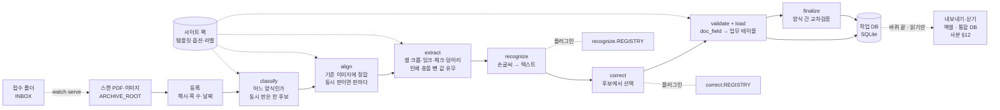
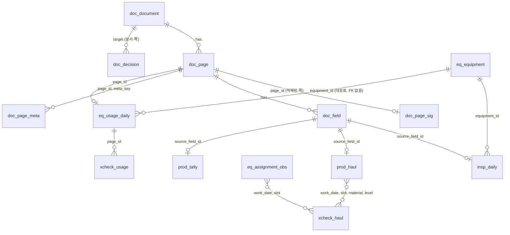

# 아키텍처

## 1. 무엇을 만드는가

현장에서 손으로 쓴 문서를 스캔하면 사람 손을 거치지 않고 데이터베이스에 들어가는 파이프라인이다.
전체 사업은 두 단계다.

| 단계 | 내용 | 이 저장소 |
|---|---|---|
| 1단계 | 스캐너 → 인식 → 데이터베이스 → 내보내기(엑셀·통합 DB). 독립 소프트웨어로 등록 | **여기** |
| 2단계 | 통합 데이터베이스, 직접 입력 체계, 시각화, 물질수지 조정 | 별도. 1단계가 통합 DB 에 실은 표를 읽는다 |

두 단계가 만나는 면은 통합 DB(현장 서버의 PostgreSQL)에 실은 표다 — 작업 DB 의 업무 테이블(`eq_*`, `insp_*`, `prod_*`, `xcheck_*`)과
그 출처(`doc_document`·`doc_page`·`doc_field`·`doc_page_meta`)의 **사본**이다 (§12, ADR 0021). 작업 DB 는 로컬 SQLite 그대로다. 실은 표는 이 프로그램이 문서·날짜 단위로 갈아 끼우므로
2단계는 읽기만 하고, 2단계에서 직접 입력한 값은 2단계의 표에 적어 뷰로 합친다 (이 프로그램의 표에 쓰지 않는다).

## 2. 설계 원칙

1. **양식은 데이터다** — 양식 하나는 YAML 정의와 기준 이미지다. 새 양식에 코드가 필요 없다.
2. **인쇄된 값은 읽지 않는다** — 템플릿에서 확정한다. OCR 대상은 손으로 쓴 것뿐이다.
3. **모든 값은 출처를 가진다** — 페이지, 좌표, 원문, 최종값, 신뢰도, 후보.
4. **교정은 선택이지 생성이 아니다** — 후보 중에서 고른다. 고유값은 마스터와 맞춘다.
5. **사람은 예외만 본다** — 확신 없는 값만 검수로 보내고, 검수 결과는 학습 데이터가 된다.
6. **인식기는 갈아 끼우는 부품이다** — 같은 평가셋의 수치로 비교해 바꾼다.

## 3. 파이프라인



| 단계 | 모듈 | 하는 일 | 모델 필요 |
|---|---|---|---|
| 접수 | `intake/inbox.py`, `intake/worker.py` | 스캐너의 저장 폴더(접수 폴더)에서 다 쓰인 파일만 보관 폴더의 `intake/` 로 복사하고 해시를 다시 확인해 등록한 뒤 치운다 (아래 "등록과 처리") | 아니오 |
| 등록 | `pipeline/runner.py`, `imaging/io.py` | 파일 SHA-256 으로 문서 등록(중복 차단), 쪽 수, 날짜(결정 > 라벨 > 파일명 — 없으면 `needs_date`). 처리할 때 PDF 를 200 dpi 회색조로 렌더링 | 아니오 |
| classify | `forms/classify.py` | 각 템플릿 기준 이미지와 ORB 정합을 시도해 인라이어가 가장 많은 양식을 고른다. 1위/2위 비율이 낮으면 표시. 그날의 동시 판 묶음은 한 후보다 (§5) | 아니오 |
| align | `imaging/align.py` | ORB → 비율 검정 → RANSAC 호모그래피. 호모그래피의 회전각이 90° 단위로 0 이 아니면 쪽을 정확히 세워 다시 정합한다(`align_upright`). 정합 뒤 표마다 괘선을 다시 검출해 템플릿과의 오차(px, 중앙값)를 잰다. 기준 미달이면 `align_failed`. 동시 판의 묶음이면 판마다 정합해 괘선 오차로 하나를 고른다 (`pipeline/runner.py`, §5) | 아니오 |
| extract | `imaging/cells.py`, `marks.py`, `blobs.py` | 셀 크롭과 잉크 비율, ✓ 판정, 괘선 제거 + RLSA 로 글씨 덩어리를 셀에 배정(여러 칸에 걸친 메모 구분). 템플릿에 인쇄 층이 있으면 role 표의 형식 있는 칸은 인쇄를 뺀 이진 그림으로 잰다 (§5) | 아니오 |
| recognize | `recognize/` | 셀 크롭 + 문맥 → 텍스트·신뢰도·후보. 쪽 메타가 되는 표 밖 필드(`meta_key`)는 먼저, 메타 필드 모델로 (§8) | **예 (플러그인)** |
| correct | `correct/` | 후보(문구 DB, 마스터)에서 고르거나 편집거리 제한 안에서만 수정 | 선택 (플러그인) |
| validate + load | `handlers/` | 양식의 의미를 적용해 `doc_field` 와 업무 테이블에 적재, 행 단위 검수 여부 결정 | 아니오 |
| 다시 스캔 | `imaging/signature.py`, `pipeline/runner.py` | 적재 전에 손글씨 자리의 서명을 같은 날·같은 계열의 앞 순서 적재된 쪽과 견준다. 0.80 이상이면 붙잡는다 (`duplicate`) | 아니오 |
| finalize | `validate/crosscheck.py` | 문서를 처리할 때마다 그 문서가 있던 날짜·장비에 대해 양식 간 교차검증, 그날의 실제 배차 관측, 계기 검산 | 아니오 |
| 내보내기·싣기 | `export/`, `publish/` | 파이프라인 밖이다. `watch`·`serve` 의 바퀴 끝에(처리 뒤) 처리·검수가 건드린 날짜의 엑셀을 다시 쓰고, 지문이 바뀐 문서·날짜를 통합 DB 에 싣는다. 작업 DB 는 읽기만 한다 (§12) | 아니오 |

인식 백엔드가 없어도(`null`) 나머지는 전부 돈다. 이때 손글씨 셀은 "값이 있다"는 사실만 기록되고 검수 대기로 간다.
값의 유무만으로도 교차검증이 가능하다(어느 칸에 적었는지가 두 양식에서 같아야 한다).

### 실행기가 아는 것과 모르는 것

`pipeline/runner.py` 는 단계 순서와 상태 기록만 안다. 양식의 기하는 템플릿이, 의미는 핸들러가, 글자는 인식 백엔드가 안다.
문서를 다시 처리하면 그 문서가 만든 행을 지우고 다시 만들므로(멱등), 인식기를 바꾼 뒤 그대로 다시 돌리면 된다.

### 등록과 처리 (tasks/0007, ADR 0019)

- **등록** = 파일을 한 번 열어 해시와 쪽 수를 적는다. 열리지 않으면(쓰레기 바이트, 쪽이 없는 PDF, 손상 방침에 걸린 PDF, 여러 쪽 TIFF)
  날짜와 상관없이 `failed`. **처리**(`Pipeline.process_document`) = 그 문서의 쪽을 분류·정합·적재. `process_file(path)` 는 "등록하고 바로 처리".
- **문서의 날짜**는 문서의 결정 > 문서 라벨(ISO 날짜만) > 파일명 규칙(원래 파일명에). 없으면 `needs_date` — 쪽·필드·업무 행 없이 기다린다.
  **쪽의 날짜**는 쪽의 결정 > 문서의 결정 > 쪽 라벨 > 문서 라벨 > 파일명 — `pagemeta.page_date` 한 곳 (분류 후보, `doc_page.work_date`,
  `doc_page_meta` 의 `date`, 핸들러의 `ctx.work_date` 가 같이 쓴다). 날짜가 없는 쪽은 핸들러에 넘기지 않는다 — 업무 테이블에 날짜 없는 행이 없다.
- **다시 처리 대기는 상태가 아니라 요청 번호**다: `work_requested`(결정을 저장할 때, 앞 문서가 바뀌었을 때 +1) > `work_done`(처리를 시작할 때
  읽은 번호를 끝날 때 적는다). 처리하는 도중에 온 요청은 남아서 다음 바퀴에 처리된다. 대기 중인 문서는 문서의 순서대로 처리한다.
- **처리 = 지우고 다시 만들기**: 원본을 찾는다(닿지 않으면 건드리지 않고 다음 바퀴) → 그 문서가 만든 행을 자식부터 지운다
  (`store.db.PAGE_TABLES` — 업무 행, `doc_page_sig`, `doc_page_meta`, `doc_field`, `doc_page`; 검수·결정은 남는다)과 같은 트랜잭션에서
  그 문서가 있던 날짜·장비를 다시 계산 → 버린 문서면 `discarded`, 날짜가 없으면 `needs_date` → 쪽마다 결정·분류·정합·빈 쪽·다시 스캔·핸들러
  → 지금 날짜·장비를 다시 계산(등록된 핸들러 전부의 `finalize(…, dates, equipment)`)하고 상태와 `work_done`. 문서를 읽다 실패하면 그 문서의 행을
  지우고 `failed`.
- **쪽마다 커밋한다** (`store.db.write_txn` — `BEGIN IMMEDIATE`, WAL, busy timeout 30초). 화면의 저장은 쪽 하나만큼(1–2초) 기다린다.
  끊기면 그 문서는 `received` 로 남아 다시 처리된다.
- **순서에 기대지 않는다** (`store/order.py`): 문서의 순서 = (접수한 문서는 뒤, 보관 경로를 `/` 로 나눈 성분들, 문서 ID) — 파이썬에서 견준다
  (SQL 의 `ORDER BY` 는 DB 마다 글자 순서가 다르다). 쪽의 순서 = (문서의 순서, 쪽 번호). 교차검증의 자리 배정은 쪽의 순서와 필드의 자리로 읽고,
  계기의 연속성은 쪽 ID 까지 견주고, 같은 날의 점검 행(`insp_daily` — 날짜:장비)은 쪽의 순서가 뒤인 쪽이 이긴다 (적재·지우기·검수 모두).
- **불변식**: 문서를 몇 번을 어떤 순서로 다시 처리하든 지금의 DB = 같은 파일·같은 검수·같은 결정으로 처음부터 만든 DB
  (시각·요청 번호·경로·`eq_equipment` 를 빼고). `tests/test_review_store.py` 의 흔들기(`-m slow`)가 고정한다.
- **결정 기록**(`intake/decisions.py`): 사람이 문서·쪽에 대해 정한 것(`date` · `discard`·`restore` · `keep`)은 검수 파일 옆의 추가 전용
  `decisions.jsonl` 이 원본이고 `doc_decision` 은 사본이다. 유효한 결정은 대상마다·묶음마다 가장 뒤의 것. 저장 = 전부 검사 → 파일에 한 줄 →
  `doc_decision` → 그 문서의 요청 번호 +1. 결정은 업무 테이블을 직접 고치지 않는다 — 적용하는 곳은 처리 하나다. 파이프라인은 시작할 때 파일을
  쓰는 트랜잭션 안에서 읽어 들이고, 유효한 결정이 바뀐 문서에 다시 처리를 요청한다. `regress` 도 결정은 읽는다 (검수는 읽지 않는다).
- **파이프라인은 한 번에 하나** (`pipeline/lock.py`): DB 옆의 `pipeline.lock` 에 배타 트랜잭션 — 죽은 프로세스의 잠금이 남지 않는다.
  `run`·`watch`·`serve` 의 작업 스레드가 잡는다. 결정·검수의 저장은 잠금과 상관없다.

### 쪽의 방향, 빈 쪽, 다시 스캔한 쪽 (tasks/0007, ADR 0020)

- **방향**: 첫 정합의 인라이어가 `MIN_INLIERS` 이상이면 호모그래피의 회전각을 90° 단위로 반올림해, 0 이 아니면 쪽을 `np.rot90` 으로 정확히
  세우고 다시 정합한다 (`imaging/align.align_upright`). 쓰는 것은 세운 쪽의 결과다. 정확히 돌린 쪽의 결과는 바로 선 쪽과 같다 (무손실 그림에서
  `doc_field` 의 기계 값·업무 테이블까지). `doc_page.rotation`(0·90·180·270 — 시계 방향으로 그만큼 돌리면 선다). `doc_page.homography` 는 그대로
  "렌더링한 원래 쪽 → 템플릿"이다 (세우는 회전을 합성해 적는다) — 원본 해상도 크롭과 인쇄 층의 다시 펴기는 방향을 몰라도 돈다. 바로 선 쪽은 정합을
  지금과 같은 횟수만 한다. 동시 판은 세운 쪽으로 판을 다시 고른다. `template print-layer`·`preview --scan`·`variant` 도 같은 방법, `template init --rotate`.
- **빈 쪽**: 양식을 못 찾은 쪽 중 어두운 화소(`binarize` → 2 × 2 열기)의 비율이 `blank_max_ink`(0.02) 미만이면 `blank`. 문서를
  `needs_review` 로 만들지 않는다. 양식을 찾은 쪽은 아무리 옅어도 빈 쪽이 아니다.
- **다시 스캔한 쪽**: 서명 = 정합 그림 → `binarize` → 인쇄(인쇄 층, 없으면 기준 이미지의 마스크)와 표 밖 필드를 0 → 2 × 2 열기 →
  16 px 칸마다 잉크 화소의 수 (`imaging/signature.py`, `Template.signature_mask`). 같은 날짜·같은 계열(`family`, 없으면 템플릿 이름)의
  **자기보다 앞 순서인 적재된 쪽** 중 가장 비슷한 것과의 코사인이 `dup_min_sim`(0.80) 이상이면 `duplicate`(필드·업무 행 없음, `duplicate_of`·
  `duplicate_sim`, 문서는 `needs_review`). `keep` 이 있으면 견주지 않는다. 문서를 처리한 뒤 뒤 순서의 문서에 다시 처리를 요청한다
  (① 그 날짜·계열에 붙잡힌 쪽이 있는 문서, ② 서명이 기준 이상인 적재된 쪽이 있는 문서) — 결과가 처리한 순서와 상관없다.
  사람이 셋 중 하나를 정한다: 뒤쪽 `discard` / 앞쪽 `discard` / 두 쪽 `keep`. 기계가 스스로 버리거나 합치지 않는다.

### 상태

```
doc_document.status : received → processed | needs_review | needs_date | discarded | failed
                      (다시 처리 대기 = received 이거나 work_requested > work_done — 옛 상태와 옛 행을 그대로 가진 채 기다린다)
doc_page.status     : unknown_form | blank | classified_only | align_failed | duplicate | discarded | loaded | error
doc_field.review_status / 업무 행 review_status : auto | pending → reviewed
```

- `unknown_form` — 어느 템플릿과도 맞지 않는다 (새 양식이거나 양식이 아닌 페이지).
- `classified_only` — 양식은 알지만 셀 정의가 아직 없는 템플릿(스텁, `regions: []`). 분류 통계에만 잡히고 정합하지 않는다(호모그래피도
  정합 그림도 없다). 가동 일보의 템플릿은 이 상태에서 시작한다 — `template print-layer` 가 이 쪽들을 직접 정합해 인쇄 층을 만들고,
  그 위에서 표를 잡는다 (§5).
- `align_failed` — 정합 품질 미달. 값을 뽑지 않고 검수로 보낸다(잘못된 좌표에서 뽑은 값은 없는 것보다 나쁘다).
  동시 판의 묶음이면 통과한 판이 하나도 없을 때다.
- `needs_date` — 날짜를 얻지 못한 문서. 쪽 행이 없다. 사람이 날짜를 정하면(`doc date`, 화면) 다시 처리된다. `run` 의 종료 코드는 0 이다.
- `discarded` — 사람이 버린 문서·쪽. 쪽은 상태만 남는다. `restore` 로 되살린다.
- `blank` · `duplicate` — 빈 쪽, 다시 스캔한 것으로 붙잡힌 쪽 (위). `blank` 는 문서를 `needs_review` 로 만들지 않는다.
- `failed` / `error` — 문서를 읽지 못했거나(문서, 그 문서의 행을 지운다) 쪽 하나에서 예외가 났다(쪽, `SAVEPOINT` 로 그 쪽의 행만 되돌림). `error` 컬럼에 예외 종류와
  메시지만 남는다. 한 문서의 실패가 전체를 멈추지 않고, 숨기지도 않는다: 요약에 목록이 나오고 종료 코드는 1 이다. `run --strict` 는 첫 오류에서 멈춘다.
  `run --skip-existing` 은 끝까지 처리된 같은 해시의 문서(`processed`·`needs_review` — 쪽 오류 없음, 대기 중 아님)와 `discarded` 만 건너뛰고,
  `needs_date` 는 날짜만 다시 보고, `failed` 는 다시 한다 — 템플릿이나 인식기를 바꾼 뒤에는 쓰지 않는다.
- `reviewed` — 사람이 종이를 보고 값을 확정했다(`value`) 또는 빈 칸임을 확정했다(`empty`). 읽을 수 없다고 표시한 셀(`illegible`)은
  `pending` 으로 남고 대기열과 정답에서 빠진다. 업무 행은 구성 필드 중 하나라도 `pending` 이면 `pending`, 아니고 하나라도 `reviewed` 면
  `reviewed`, 아니면 `auto` 다. 검수 흐름은 §7.1.

## 4. 계층과 데이터 위치

```
INBOX          스캐너 프로그램의 저장 폴더 (접수 폴더). 다 쓰인 파일을 보관 폴더로 옮긴 뒤 치운다. 같은 바이트는 _already/, 읽을 수 없는 것은 _failed/
ARCHIVE_ROOT   스캔 원본 (공유 드라이브·NAS). intake/<해-달>/<받은 시각>-<문서 ID>/ 아래에만 쓴다 — 그 밖은 읽기만 한다
SITE PACK      현장별 양식 정의(기준 이미지·인쇄 층)·옵션·라벨·회귀 기준, 검수·결정 기록(reviews/). 저장소 밖 (개인정보 포함)
WORK_ROOT      정합 이미지, SQLite DB, 리포트. 로컬 디스크. 언제든 다시 만들 수 있다
DB             작업 DB = WORK_ROOT 의 SQLite. PostgreSQL 로 옮기지 않는다 (ADR 0021) — 서버가 꺼져도 스캔과 검수는 돈다
EXCEL_DIR      엑셀 폴더 ([export] excel_dir). 일별·월별 파일과 기록 파일 — DB 의 사본, 지워도 다시 만든다. 저장소 밖 (이름·차량번호 포함)
통합 DB        현장 서버의 PostgreSQL (MINEDOCSCAN_PUBLISH_URL — 환경변수로만). 작업 DB 의 표를 실은 사본 — 2단계가 읽는다
가린 그림      export masked-pages 의 OUT. 템플릿이 아는 자리만 가렸다 — 저장소 밖, 사람이 보고 쓴다
저장소          코드, 문서, 합성 데이터 생성기. 현장에 관한 것은 없다
```

원본은 셋(스캔 파일, 검수 기록, 결정 기록)이다. 작업 DB 는 그것들로, 엑셀·통합 DB·가린 그림은 작업 DB 로 다시 만들 수 있다 — 한 방향 (§12).

소프트웨어는 현장을 모른다. 장비 구분, 파일명 규칙, 교차검증에서 뺄 광종 같은 것은 전부 사이트 팩의 `site.toml` 에서 읽는다.
다른 광산에 적용할 때 바뀌는 것은 사이트 팩뿐이다.

## 5. 양식 정의와 핸들러

- **템플릿**(`template.yaml`)은 *어디에 무엇이 있는가* 를 정한다: 표(region)의 괘선 좌표, 열의 종류, 행의 키와 메타, 표 밖 자유 필드.
- **핸들러**는 *그것이 업무상 무엇인가* 를 정한다: 추출한 셀을 어느 업무 테이블의 어떤 행으로 옮기는지.

| 핸들러 | 대상 | 업무 테이블 |
|---|---|---|
| `generic` | 아무 양식 | 없음 (`doc_field` 만) |
| `inspection` | 행 = 장비, 열 = 점검내역 + 이상 유/무 체크 | `eq_equipment`, `insp_daily` |
| `haul` | 운반 횟수. `role: log`(차량별 일보) 또는 `role: matrix`(편×차량 행렬) | `prod_haul`, 그리고 `finalize` 에서 `xcheck_haul`, `eq_assignment_obs` |
| `usage` | 장비 한 대의 하루 (중기운행일보·점보 작업일보·로우더 작업일보). 표마다 역할(`role`) | `eq_usage_daily`(쪽 하나에 한 행), `prod_tally`, `xcheck_usage` |

열의 종류(`kind`): `printed`(템플릿 값 사용) · `handwritten_text` · `handwritten_number` · `checkmark` · `signature`.

**값의 형식** (`format`, `forms/formats.py`, ADR 0015). 손으로 쓰는 칸·필드에 `integer`(숫자 칸의 기본) · `decimal` · `time` · `time_range` ·
`reading`(계기 값 또는 시각 — 콜론이 있으면 시각). 정규화는 한 곳이고(검수 저장·서버·정답 내보내기·평가·핸들러), DB·검수 파일에는 정규화한
표기만 남는다(`1234.5`, `08:00`, `08:00~17:00`). 형식에 맞지 않는 입력은 저장 전에 거절한다. 정수가 아닌 형식의 칸은 인식기에 보내지 않는다 —
잉크가 있으면 값 없이 검수 대기다 (소수·시각을 기계가 읽는 것은 미룬다 — tasks/0006 1절).

**가동 일보의 표의 역할** (`usage`, ADR 0016). 새 양식이 이 조합이면 코드를 고치지 않는다.

| `role` | 칸 | 가는 곳 |
|---|---|---|
| `meter` | 시작·종료·총 (열 이름 또는 행 키 `start`·`end`·`total`, 형식 `reading`·`decimal`·`time`) | `eq_usage_daily` 의 계기 값 또는 시각 |
| `shifts` | 근무 구분(행) × 시각 범위(`time_range`) | `eq_usage_daily.shifts`(JSON), 가동 분의 합 |
| `tally` | 구분(행 메타 `item`·`place`) × 근무조(열 메타 `shift`)의 정수. 소계 칸은 열·행 메타 `subtotal: true` | `prod_tally` |
| `activities` | 작업 표의 글자 칸 | `doc_field` 에만. 글씨가 있는 줄의 수만 `activity_rows` 에 |

- 값 유무: `meter`·`shifts`·`tally` 의 형식 있는 칸은 운반 칸과 같은 덩어리 배정(`imaging/blobs.py`, 기준 면적 그대로). 그 밖은 잉크 비율.
  읽지 않는 칸(소수·시각)은 두 판정 중 하나라도 "있음"이면 검수 대기 — 긴 계기 값 두 개가 한 덩어리로 묶이면 덩어리 배정은 메모로 보고
  두 칸을 다 비었다고 하는데, 그대로 빈 칸으로 자동 적재하면 값이 조용히 사라지기 때문이다. 새 임계값은 없다.
  템플릿에 인쇄 층이 있으면 두 판정을 인쇄를 뺀 그림으로 잰다 — 칸 안에 인쇄만 있는 칸이 빈 칸이 된다 (아래 "인쇄 층").
  두 판정을 합치는 곳은 `handlers/usage.presence` 하나다.
- 작업량의 정수 칸은 지금의 숫자 인식 경로(`by_kind`, 자동 적재 표 — `handlers/base.number_row`, 운반 칸과 같은 함수)를 탄다. 인식기에 보내는
  칸은 읽지 않는 칸과 같은 규칙(두 판정 중 하나라도 "있음")으로 고른다 — 칸 안에 "하단: _ 대" 가 인쇄되어 있으면 쓴 숫자가 양옆의 인쇄와,
  인쇄가 이웃 칸의 인쇄와 이어져 덩어리 배정이 줄 전체를 메모로 본다. 운반(`haul`) 칸은 덩어리 배정만 (ADR 0012 그대로).
- 장비명·운전자는 쪽 메타(`equipment`, `operator`). 장비 ID 는 사이트 팩의 대응표 `[equipment.aliases]` 로만 정한다 (`forms/equipment.py` —
  마스터 = 점검표 템플릿의 장비 행, ID 는 `eq_equipment` 와 같은 UUID). 장비 ID 는 쪽을 적재할 때와 그 쪽의 칸을 검수할 때(`on_review` 가
  쪽의 행을 다시 만든다)만 정해지므로 대응표를 고친 뒤에는 다시 돌려야 한다 — `info` 가 대응표의 해시(`equipment_aliases_sha`)를, `report` 가
  지금의 대응표와 장비 ID 가 다른 행의 수(`stale_equipment_ids` — 사이트 팩이 있고 가동 기록·작업량 행이 있을 때만(0 이어도), 리포트 묶음
  밖이라 `regress` 가 비교하지 않는다. 운반·점검표뿐인 사이트의 `report --json` 은 예전과 같다)를 낸다.
- 가동 시간(`hours`)과 근거(`hours_basis`): `meter`(종료 − 시작) > `total`(총 칸이 수일 때) > `clock`(계기 칸의 시각) > `shifts`(범위의 합) > NULL.
  앞선 근거에 모르는 칸(검수 대기, "읽을 수 없음" 포함)이 있거나 시작·종료가 계기 값과 시각으로 섞였으면 NULL. 추정하지 않는다.
  총(가동시간)은 길이라 시각 옆에 수로 적혀도 섞인 것이 아니다.
- 칸 안의 인쇄된 줄(로우더 작업일보의 하단 / 저광장)은 `grid.split_ys`(인쇄되지 않은 나눔 선)로 행을 나눈다. 칸만 자르고 정합 판정·괘선 지우기에는
  쓰지 않는다 — 없는 괘선을 찾으려 하면 정합 오차가 커져 쪽이 `align_failed` 가 된다. 칸 안의 인쇄 글자를 `printed` 칸으로 떼어 내지 않는다 — 인쇄 층이 뺀다.

표 밖 자유 필드에 `meta_key`(`vehicle_no`, `operator` …)를 주면 그 필드의 값이 쪽의 메타가 된다.

양식·표·열·행·표 밖 필드의 `display`(엑셀에 보이는 이름)와 템플릿의 `redact`(가릴 상자)는 내보내기에만 쓴다 — 분류·정합·핸들러·
업무 테이블·`field_id` 에 닿지 않는다 (§12).

**쪽 메타** (`pagemeta.py`, 테이블 `doc_page_meta`, ADR 0013). 쪽 × 키마다 최종 값과 그 출처를 하나의 행으로 둔다.
우선순위는 **검수값 > 페이지 라벨 > 문서 라벨 > 파일명 규칙 > 기계 값** 이다. 기계 값(메타 필드 모델이 읽은 값)은 맨 아래이고 자동 적재된
것만 쓴다 — 위에 값이 있으면 기계 값은 **대조**만 한다(`check_result`: `match` | `mismatch` | `unread`(기계가 정하지 못함) | `none`).
일보의 차량·작성자, 자리, `eq_assignment_obs` 는 이 테이블의 최종 값에서 만든다.

- 날짜는 검수로 받지 않는다 (파일명·라벨이 정한다). 대신 `date.month`·`date.day` 필드(손으로 쓴 월·일)를 두면 기계가 읽어 쪽의 날짜와
  **대조만** 한다 — 자동 적재된 부분 하나라도 다르면 `mismatch`(월 "1" 처럼 획이 괘선과 함께 지워져 한 부분을 못 읽어도), 전부 자동 적재이고
  같으면 `match`, 그 밖은 `unread`. 다른 날의 쪽이 묶음에 섞인 것을 찾는 데 쓴다 (`pages --meta-mismatch --meta-key date.day`).
- 메타 필드를 검수하면 `review/store.save()` 가 그 쪽의 `doc_page_meta` 를 먼저 다시 정하고(`pagemeta.refresh_page`), 핸들러는 그 최종 값을 읽는다.

### 양식의 판

같은 양식의 개정판은 이름이 다른 템플릿이고, `family`·`valid_from`·`valid_to` 로 묶는다. 쪽의 날짜를 알면 그날 유효한 템플릿만 분류 후보다.
개정판끼리는 머리글 몇 글자만 달라 모양으로는 가릴 수 없다(분류 여유 ≈ 1). 같은 계열에서 기간이 겹치면 사이트 팩을 읽을 때 오류다 (ADR 0010).
예외는 같은 날 섞여 쓰이는 판이다 (아래).

형식은 [SITE_PACK.md](SITE_PACK.md) 에 있다.

### 같은 날 섞여 쓰이는 판 (동시 판, ADR 0018)

묵은 양식을 같이 쓰면 **같은 날 묶음에 두 인쇄 판이 섞인다** — 머리·제목은 같은 자리이고 표만 몇 px 아래에, 줄 간격도 조금 다른 판.
날짜로 가릴 수 없고(ADR 0010 의 전제가 깨진다) 모양으로도 못 가린다(분류의 1위/2위 ≈ 1). 판 하나의 템플릿으로 돌리면 다른 판의 쪽은
`align_failed` 이거나, 더 나쁘게는 작은 괘선 오차로 통과해 칸이 어긋난 채 적재된다. **괘선 오차로는 갈린다.**

- 판은 지금처럼 이름이 다른 템플릿이다 (자기 `template.yaml`·`reference.png`·`print.png`). 같은 `family` 를 적고, 유효 기간이 겹치는 두 판
  **모두에** `concurrent: true` 가 있으면 겹침을 허용한다 — 사람이 "같은 날 섞여 쓰인다"고 적은 것이다. 한쪽에만 있으면 지금처럼 겹침 오류,
  `family` 없이 쓰면 템플릿 오류다 (묶이지 않으면 분류가 모양으로 판 하나를 골라 그 판에만 정합하므로 틀린 판으로 조용히 통과할 수 있다).
  계열에 `concurrent` 판이 하나뿐이어도 오류다 — `template variant` 가 새 판에만 적고 기존 판에 적을 두 줄을 안내한 채로 남은 상태다.
  오류는 그 판과 계열, 두 줄을 적을 판(계열과 이름이 같은 템플릿)을 말한다. 이름(`name`)이 같은 템플릿이 둘이어도 오류다.
- **동시 판끼리 기하 밖의 모든 것이 같아야 한다**: `handler`·`handler_options`, 표(이름·role·`header_rows`·열과 행 — 메타(근무조·소계·
  장소·머리글 …)까지 통째로), 필드(bbox 밖 전부). 형식을 적지 않은 칸은 칸 종류의 기본 형식으로 비교한다. 다르면 사이트 팩을 읽을 때
  오류다 (`forms/sitepack.variant_key_diff` — 표 이름과 항목의 종류만 알리고 행 키·값은 찍지 않는다). 다를 수 있는 것은 괘선 좌표
  (나눔 선 포함)·필드의 bbox·기준 그림·인쇄 층·이름·제목·유효 기간뿐이다. `field_id` 에 템플릿 이름이 없으므로 키가 같으면 판 선택이
  바뀐 쪽에도 검수가 그대로 붙고, 메타·`header_rows` 가 같으므로 같은 `field_id` 가 판마다 다른 뜻의 칸을 가리키지 않는다.
- **분류**: `SitePack.concurrent_groups(날짜)` = 그날 유효한 동시 판이 둘 이상인 계열. 분류기는 묶음을 한 후보로 본다 — 점수는 판 중
  최댓값, 1위/2위 여유는 후보 사이에서 잰다 (판끼리의 비율 ≈ 1 이 낮은 여유 표시를 늘 켜지 않게). 묶음이 없는 템플릿의 점수·여유는 예전과 같다.
- **고르기** (`Pipeline._align_variants`, `choose_variant`): 묶음이 이기면 판마다 정합하고, 통과한 판 중 괘선 오차가 가장 작은 판을 고른다.
  차이가 0.5 px(괘선 오차의 단위 — 같거나 한 단위 차이는 가르지 않는다) 안이면 그 판에 정합한 인라이어가 많은 판, 그다음 이름 순서.
  통과한 판이 없으면 같은 규칙으로 고른 판의 수치로 `align_failed`. 그 뒤(정합 그림·칸·인쇄 층·핸들러)는 전부 고른 판으로 한다.
- 판이 하나뿐인 양식은 정합을 한 번만 한다 — 결과와 속도가 그대로다. `run --template X` 로 양식을 정해 주면 묶지 않는다.
- 쪽에 남는다: `doc_page.template_name` = 고른 판(업무 테이블의 `source_form` 도), `doc_page.variant_errs` = 판마다의 괘선 오차
  (JSON `{판 이름: 오차 | null}` — 괘선을 못 찾아 유한하지 않으면 null).
- 정답을 템플릿 이름으로 찾는 곳(`eval`, `oracle` 백엔드)은 사이트 팩이 있으면 동시 판을 계열로 맞춘다 (`SitePack.answer_key`).
  `review export-answers` 는 쪽의 판 이름을 그대로 적는다 — 판 A 로 적힌 정답이 판 B 로 적재된 같은 쪽에도 붙는다.
- `report` 의 `variants`: 계열마다 판별로 고른 쪽 수, 정합 실패 쪽 수, 고른 쪽 중 두 판의 괘선 오차 차이가 1 px 미만인 쪽 수(둘 다
  유한할 때만 — 가르기 어려웠던 쪽. 두 판 모두 정합에 실패한 쪽은 판을 고르지 않았으므로 정합 실패로만 센다. `pages --variants` 가
  판마다의 오차·상태와 함께 낸다 — 정합 실패 쪽도 상태와 함께 나온다). 계열은 DB 에 없어 사이트 팩에서 온다 — 사이트 팩 없이는
  쪽에서 정합한 판 이름들("A / B")로 묶는다. 판을 고른 쪽이 없는 사이트의 리포트(와 `regress` 의 기준)는 예전과 같다.
- 판을 만드는 것은 `template variant` 다 (아래 "템플릿 도구").

### 인쇄 층 (ADR 0017)

가동 일보에는 **칸 안에 인쇄된 글자**가 있다 — 로우더 작업일보의 작업량 칸("하단: _ 대 / 저광장: _ 대"), 근무 시각 칸("~"), 계기 칸("시작:").
잉크 판정은 인쇄와 손글씨를 가리지 못한다. 0005 의 규칙(두 판정 중 하나라도 "있음")으로 값이 사라지지는 않지만, 인쇄가 있는 칸은 비어
있어도 늘 검수 대기였다 (근무 시각 칸이 대기면 그 쪽의 가동 분 합도 NULL 이다). 인쇄를 나눔 선으로 떼어 내는 것으로는 풀리지 않았다.
인쇄는 모든 쪽에서 같은 자리에 있고 손글씨는 쪽마다 다르다 — 여러 쪽을 겹쳐 인쇄만 남긴 그림이 인쇄 층이다.

- **무엇**: 양식(판) 하나에 `<템플릿 폴더>/print.png` 하나. 기준 이미지와 같은 크기·같은 좌표(템플릿 좌표계)의 회색조이고 인쇄된 것만 있다.
  템플릿의 `print_image: print.png` 가 켠다 — 없으면 모든 것이 예전과 같다 (원칙 1: 코드는 양식 이름을 모른다). 판마다 따로다.
  사이트 팩의 데이터다 (저장소 밖 — [DATA.md](DATA.md)). `print_image` 는 확장자 `.png` 만 받고, 파일이 없거나 크기가 기준 이미지와
  다르면 템플릿 오류다.
- **만드는 법** (`template print-layer` — `tools/printlayer.py` 가 쪽을 고르고 펴고, `imaging/printlayer.py` 가 계산한다):
  그 템플릿으로 분류된 쪽(`loaded`·`classified_only`)을 날짜별로 고르게 최대 40장 → 템플릿 좌표로 편 그림 → 쪽마다 잉크를 1 px 넓힌 뒤
  (회색조 erode 3×3 — 정합의 1 px 흔들림) **화소마다 밝기의 75 백분위**(`--percentile`), **보간 없이**(`method="higher"` — 그 자리 위의
  실제 쪽 값). 인쇄는 거의 모든 쪽에서 어둡고 손글씨는 일부 쪽에서만 어둡다. 빈 양식을 현장에서 스캔해 올 필요가 없다. 새 임계값은 없다.
  보간하면 쪽이 적을 때 한 쪽의 손글씨가 반쯤 남는다 — 3장의 75 백분위는 둘째·셋째 밝기의 중간이다. 보간 없이 3·4장이면 가장 밝은 쪽이다.
  - 펴는 그림: `loaded` 쪽은 WORK_ROOT 의 정합 그림, 없으면 원본을 `doc_page.render_dpi` 로 렌더링해 `doc_page.homography` 로 다시 편다
    (`imaging/align.warp_to_template` — 정합과 같은 함수라 저장된 정합 그림과 바이트까지 같다). `classified_only` 쪽(표가 없는 템플릿)은
    정합한 적이 없으므로 명령이 원본에서 직접 정합한다 — 표가 없어 괘선 오차가 없으므로 인라이어(`MIN_INLIERS`, 60)만 보고 못 미치는 쪽은 뺀다.
  - 3장 미만이면 거절, 5장 미만이면 경고하고 만든다 (아래 "틀린 층"). 같은 쪽·같은 설정이면 같은 그림이다. 판이 섞였을 수 있는 양식의
    첫 층은 `--percentile 50` 으로 만든다 — 75 백분위는 쪽의 75 % 넘게 어두운 화소만 남기므로, 소수 판의 몫이 25 % 를 넘으면 다수 판의
    괘선이 층에서 빠져 `add-region` 이 괘선을 못 잡는다. **50 의 층은 괘선을 잡는 데만 쓴다.** 값 유무에 쓰는 층(`print_image` 로 `run`)은
    판을 나눈 뒤 판마다 75 로 다시 만든다 — 낮은 백분위의 층에는 같은 자리에 쓴 값의 잔상이 더 남아 그 값을 지운다. 75 미만이면 요약이
    그렇게 경고하고, `print_image` 안내도 add-region 용으로 바뀐다. 보간하지 않으므로 50 의 층은 한 판이 쪽의 절반을 넘을 때만 그 판의
    괘선을 남긴다 (두 판이 꼭 반씩이면 둘 다 빠진다 — 쪽 수를 홀수로).
  - DB 는 읽기 전용으로 연다 (`store.db.open_db_readonly` — runner·report·regress 의 수치는 그대로). 쓰는 파일은 PNG 하나이고
    `template.yaml` 은 고치지 않는다 — 키는 사람이 적는다 (파일보다 키가 먼저 있으면 템플릿 오류로 사이트 팩 전체가 읽히지 않는다).
  - 요약 (값·이름 없이): 쓴 쪽과 날짜의 수, 얻은 법(`aligned`·`rewarped`·`aligned_now`)과 뺀 이유별 수, 백분위, 인쇄 화소의 비율,
    해시, 손으로 쓰는 칸 중 인쇄에 덮인 비율이 큰 칸 (`template check` 와 같은 표기 `<표>/<열>/행 N`, `fields/<이름>` — 행 키는 찍지 않는다).
  - 해시 `print_sha` = sha256(높이·너비 + 화소 바이트)의 앞 16자 — PNG 파일의 바이트가 아니라서 다른 도구로 다시 저장해도 같다.
- **쓰는 곳 — 값이 있는가 하나뿐이다.** 인쇄 마스크(`Template.print_mask`) = 인쇄 층을 `grid.binarize` 로 이진화해 2 px 넓힌 것.
  마스크로 재는 칸은 `Template.role_value_cell` 하나가 정한다 — role 이 `meter`·`shifts`·`tally` 인 표의 형식 있는 손글씨 칸. 두 판정 모두
  정합 그림을 지금처럼 이진화(`grid.binarize`)한 직후 마스크의 화소를 0 으로 하고 잰다: 잉크 비율(`imaging/cells.observe_cells`)은 쪽 전체를
  이진화한 그림을 쪽마다 한 번 만들고, 덩어리 배정(`imaging/blobs.assign_blobs` — 괘선 재검출은 회색 그림 그대로)은 지금처럼 표 영역을
  따로 이진화한다. 같은 마스크·같은 방법이지만 이진화한 범위가 달라 칸 가장자리의 화소는 다를 수 있다. 규칙과 임계값은 그대로다.
  - 회색 그림에서 인쇄를 흰색으로 칠한 뒤 이진화하지 않는다 — 적응 이진화가 칠한 자리의 가장자리를 잉크로 잡아 인쇄만 있는 칸이
    남았다. 이진화한 뒤 지운다.
- **쓰지 않는 곳**: 표 밖 필드(서명·체크·메타 필드 포함), 작업 표(`activities`), ✓ 판정, 정합·분류, **크롭 전부**(인식기·`export-crops`·
  검수 화면 — ADR 0011 의 크롭 구현 하나는 그대로, `CellObs.crop` 은 원래 그림).
  - 필드: 날마다 같은 자리에 같은 글씨로 쓰는 칸(작성자, 늘 "ok" 인 점검란, 서명)은 쪽이 많아도 인쇄 층에 들어가 지워진다. 서명은 검수
    경로가 없어 조용히 "없음"이 되고, 메타 필드는 잉크가 0 이면 모델을 건너뛴다.
  - 크롭: 인쇄와 겹친 획이 지워져 틈이 생긴다 (값 유무에는 지장이 없었다). 인식기와 사람은 인쇄가 있는 원래 그림을 본다.
  - 정합·분류: 인쇄 층은 여러 쪽을 겹친 그림이라 획이 무르다 — 기준 이미지로 바꾸면 인라이어가 줄었다. 기준은 지금처럼 스캔 한 장이다.
    다만 괘선을 잡는 데는 인쇄 층이 낫다 — 채워진 스캔에서는 손글씨의 세로획이 괘선으로 섞인다 (`template add-region`).
- **켜는 것은 템플릿이다.** 파이프라인은 `Template.uses_print_layer`(`print_image` 가 있고 `role_value_cell` 인 칸이 하나라도 있다)일 때만
  층을 읽는다. 운반·점검표처럼 role 이 없는 양식에 `print_image` 를 적어도 값 유무는 그대로이고, `template check`(참고 — 오류가 아니다)와
  `info` 가 쓰이지 않는다고 알린다. 지금은 가동 일보 양식에만 켠다 (운반 양식은 숫자 정답이 생긴 뒤 `regress`·`eval` 로 판단한다).
- 어느 층으로 쟀는지 `doc_page.print_sha` 에 남는다 (원칙 3). `report` 의 `print_layer` 는 양식별로 인쇄 층으로 잰 적재된 쪽의 수다
  (그런 쪽이 없으면 키가 없다 — 인쇄 층이 없는 사이트의 리포트는 예전과 같다). 층을 다시 만들면 해시가 바뀐다 — 예전 해시가 남은 쪽은
  예전 층으로 잰 것이다.
- **틀린 층**: 0005 의 규칙(두 판정 중 하나라도 "있음")을 그대로 두므로 인쇄 층은 그 규칙이 잘못 "있음"이라 하는 칸을 줄일 뿐이다.
  그러나 값을 지우지 않는다는 것이 구조로 보장되지는 않는다 — 두 판정이 같은 마스크로 지운 그림을 쓰므로 마스크가 손글씨를 덮으면
  둘 다 "없음"이다. 합성에서 맞는 층·다른 양식의 층·±5 px 밀린 층·3–5장으로 만든 층은 값이 적힌 칸을 잃지 않았고 시험이 그것을
  고정한다 (틀린 층은 검수 대기만 늘렸다).
  **2장으로 만든 층은 합성 로우더에서 값이 적힌 작업량 칸 3칸을 잃었다** — 두 쪽의 같은 자리에 쓴 값이 층에 남아(잔상) 그 자리에 쓴 값까지
  지운다. 그래서 3장 미만은 거절한다 (보간하던 때는 3장도 4칸을 잃었다). 쪽이 적을수록 같은 위험이 커서 5장 미만은 경고한다.
  층과 쪽이 맞는지 보는 안전장치는 없다 (새 수치가 필요하다).

### 템플릿 도구

양식은 데이터라서 템플릿을 만드는 일이 곧 양식을 더하는 일이다 (`minedocscan template …`). 순서와 형식은 [SITE_PACK.md](SITE_PACK.md),
실데이터에서 할 일은 [DATA.md](DATA.md).

| 명령 | 모듈 | 하는 일 |
|---|---|---|
| `init <그림> --name N [--roi …] [--handler …]` | `tools/mktemplate.py` | 깨끗한 쪽 하나로 기준 이미지와 뼈대. `--roi` 가 없으면 쪽 전체의 표 하나(`main`). `regions: []` 로 두면 분류 전용 |
| `add-region <폴더> --roi … --name N [--role R] [--header-rows N]` | `tools/mktemplate.py` | 그 영역의 괘선을 잡아(`grid.detect_grid_roi` — `init --roi` 와 같은 함수) 표 하나의 뼈대를 더한다. 괘선은 인쇄 층(`print_image`)이 있으면 그것에서, 없으면 기준 이미지에서. `--role` 이면 그 역할이 요구하는 열의 자리표시 (meter: 뒤의 세 열 `start`·`end`·`total` 에 `reading`, shifts: 마지막 열 `range` 에 `time_range`, tally: `integer`, activities: 글자 칸) |
| `print-layer <폴더> [--percentile P] [--max-pages N]` | `tools/printlayer.py` | 인쇄 층 (위) |
| `variant <기존 판> --scan F --page N --name N` | `tools/variant.py` | 동시 판의 템플릿: 열·행·필드는 그대로 두고 표마다 괘선만 새 스캔에서 다시 잡는다 |
| `check <폴더>` | `tools/tpltools.py` | 오류를 전부. 인쇄 층의 파일·크기, 표의 손으로 쓰는 칸 중 인쇄 마스크가 절반 넘게 덮은 칸(값 자리가 없다), 쓰이지 않는 인쇄 층(참고) |
| `preview <폴더> [--scan F --page N \| --print]` | `tools/tpltools.py` | 칸·필드를 그린 PNG (WORK_ROOT/template-preview). `--print` 는 인쇄 층 위에, 인쇄 화소를 색으로 |

- `add-region` 은 `template.yaml` 의 다른 부분과 주석을 건드리지 않는다: `regions` 블록의 끝(다음 최상위 키 바로 앞)에 글자로 끼워 넣는다
  (`fields` 가 `regions` 뒤에 있어 파일 끝에 붙이면 필드가 된다). `regions: []` 이면 그 줄을 블록으로 바꾼다. 의존성은 PyYAML 뿐이다.
  쓴 뒤 다시 읽어 `regions` 가 표 하나만 늘고 나머지 키가 그대로인지 보고, 아니면 원래 파일로 되돌린다 (쓰기는 임시 파일 → `os.replace`).
  템플릿은 검증 없이 읽는다 — 열을 채우기 전의 뼈대는 아직 템플릿 오류일 수 있다. 인쇄되지 않은 나눔 선은 잡지 않는다 (사람이 적는다).
  `template check` 는 자리표시가 맞는 열에 붙었는지 보지 않는다 — 요약의 자리표시 목록과 `preview --print` 로 본다.
- `variant`: 그 쪽을 **표 영역(괘선 범위 + 60 px) 밖의 특징점만으로** 기존 판에 맞춰 편 그림이 새 기준 이미지다. 쪽 전체로 구하면
  RANSAC 이 표 쪽으로 타협해 표를 기존 판 자리로 끌어오고 머리를 옮긴다 — 다시 잡은 괘선이 실제 자리와 어긋나고 표 밖 필드의 bbox 도
  맞지 않는다. 표마다 기존 괘선을 ±min(40 px, 이웃 표까지의 절반) 안에서 가장 가까운 괘선과 짝짓는다 (창이 이웃 표의 괘선을 품지 않게).
  붙은 표가 같이 쓰는 경계선(이 표의 괘선과 3 px 안 — `SHARED_PX`)은 그 거리에서 뺀다 — 이 표의 괘선이기도 하고, 빼지 않으면 반경이
  0–0.5 px 가 되어 붙은 표(실제 운행일보의 작업 표와 계기 표)는 괘선을 하나도 다시 잡지 못한다.
  짝이 없는 괘선이 있는 표, 인쇄되지 않은 나눔 선(`split_ys`·`split_xs`)이 있는 표는 기존 괘선을 그대로 두고 알린다. 표 밖 필드의 bbox 와
  열·행·필드·handler 는 그대로, `family`(없으면 기존 판의 이름)와 `concurrent: true` 를 적고 `print_image` 는 복사하지 않는다 — 새 판의
  인쇄 층은 그 판으로 적재된 쪽으로 따로 만든다. 기존 판의 파일은 고치지 않고 거기 적을 줄을 안내한다 — 적기 전에는 사이트 팩이
  읽히지 않는다(계열에 동시 판이 하나뿐). 옆 템플릿이 이미 쓰는 `--name`, 읽을 수 없는 기존 판(YAML, 이름, 기준 이미지)은 한 줄로 거절한다.
- 기준 이미지·인쇄 층·미리보기는 현장 데이터다. `print-layer`·`variant`·`add-region`·`preview` 는 git 작업 트리 안에 쓰지 않는다
  (`print-layer`·`add-region` 은 합성 팩이면 `--allow-in-repo`). 요약과 거절 메시지에는 칸 이름과 수만 나온다.

## 6. 데이터 모델

`store/schema.sql`. 세 층으로 나눈다.



| 층 | 테이블 | 내용 |
|---|---|---|
| 문서 | `doc_document` | 원본 파일. ID = SHA-256 앞 16자리 → 같은 스캔의 중복 접수 차단. `source_rel`(archive_root 기준)로 다른 컴퓨터에서도 원본을 찾는다. 상태·오류·경고(`warning` — 복구해서 연 PDF, `[pipeline] damaged_pdf = "warn"`). 등록한 시각 `received_at`(접수한 문서는 보관 폴더 이름에서 — 다시 처리해도 바뀌지 않는다), 날짜의 출처 `date_source`(`decision`·`label`·`filename`), 요청 번호 `work_requested`·`work_done` (스키마 8) |
| | `doc_page` | 페이지별 양식(동시 판이면 고른 판), 분류 여유, 정합 품질, 정합 이미지 경로, 호모그래피(렌더링한 쪽 픽셀 → 템플릿 픽셀)와 렌더링 dpi, 상태, 오류. 값 유무를 잰 인쇄 층의 해시 `print_sha`(쓰지 않았으면 NULL), 동시 판마다의 괘선 오차 `variant_errs`(JSON `{판: 오차 \| null}`, 판이 하나면 NULL) (§5, 스키마 7). 방향 `rotation`, 다시 스캔으로 붙잡혔으면 `duplicate_of`(앞쪽, 외래 키 없음)·`duplicate_sim` (스키마 8) |
| | `doc_field` | 셀 하나. 좌표(bbox), 값의 형식(`format`, 스키마 6), 잉크, 값 유무(기계 `has_value_raw` / 최종 `has_value`), 원문 `value_raw`, 최종값 `value_final`, 신뢰도, 후보, 값을 만든 주체, 검수 상태(`review_status`)와 기계가 정한 상태(`status_raw` — 자동 적재 오류율의 분모) |
| | `doc_page_meta` | 쪽 × 메타 키(`vehicle_no`, `operator`, `date`, `date.month`, `date.day` …): 최종 값과 출처(`review`·`label`·`filename`·`machine`), 그 키를 적는 필드, 기계가 읽은 값·신뢰도·상태(`auto`·`pending`·`unlisted`·`empty`), 대조 결과 (§5, 스키마 5) |
| | `doc_review` | 사람이 입력한 값 한 건. 원본은 사이트 팩의 `reviews/reviews.jsonl` 이고 이 테이블은 사본이다 (ADR 0008) |
| | `doc_decision` | 문서·쪽에 대한 사람의 결정 한 건(`date`·`discard`·`restore`·`keep`). 원본은 `reviews/decisions.jsonl` 이고 이 테이블은 사본이다 (ADR 0019, 스키마 8) |
| | `doc_page_sig` | 적재된 쪽의 서명(손글씨 자리, base64 글자열)·계열·날짜 — 다시 스캔한 쪽을 견주는 데만 (ADR 0020, 스키마 8) |
| | `meta_schema` | 스키마 버전 (지금 8). 버전이 다른 DB 파일은 열지 않는다 (`run --fresh` 로 다시 만든다) |
| 마스터 | `eq_equipment` | 장비. ISO 23725 의 FleetDefinition 구조(식별자 UUID, HID, 장비 유형)를 따른다. 같은 키는 항상 같은 UUID |
| | `eq_assignment_obs` | 그날 실제로 누가 어느 차를 몰았는가 (관측값). 인쇄된 머리글과 다르면 표시 |
| 업무 | `insp_daily` | 일일 장비 점검: 날짜 × 장비 → 이상 유/무, 점검내역. 같은 날 두 쪽이 같은 장비를 적으면 쪽의 순서가 뒤인 쪽(`page_id`, 스키마 8) |
| | `prod_haul` | 운반 실적: 날짜 × 자리(차량) × 광종 × 편 × 근무조 → 횟수. 두 양식에서 각각 들어온다. `trips` 는 최종, `trips_raw` 는 기계가 읽은 값 |
| | `xcheck_haul` | 두 양식의 같은 값 비교: `match` / `mismatch` / `missing_log` / `missing_matrix`. 판정은 최종 값, 기계 값의 합도 `*_trips_raw` 에 같이 둔다 |
| | `eq_usage_daily` | 장비 가동 기록: 쪽 하나에 한 행 (하루 두 장이면 두 행). 날짜, 양식, 장비명·장비 ID(대응표, 없으면 NULL), 운전자, 계기 칸의 종류(`reading_kind`), 계기 시작·종료·총(수), 시각 시작·종료, 근무 시각 범위(JSON)와 분의 합, 작업 줄 수, 서명 유무, 가동 시간과 근거(`hours_basis`), 기계 값(`meter_*_raw`), 상태, 출처 칸 셋 (스키마 6) |
| | `prod_tally` | 작업량 표의 정수 칸 하나에 한 행: 구분(`item`)·장소(`place`)·열·근무조, 소계 칸 표시, 최종 수 `count` 와 기계 값 `count_raw` |
| | `xcheck_usage` | 가동 일보의 검산 한 행 = 검산 하나: 종류(`total` 총 = 종료 − 시작, `subtotal` 소계 = 합, `continuity` 계기의 연속성), 비교한 값 둘과 차이, 결과, 사이에 낀 날 수, 비교 상대의 쪽, 비교한 칸 (§7) |

규칙:
- 쓰기는 `store.db.upsert()` 만 쓴다 (`INSERT … ON CONFLICT … DO UPDATE`) — 작업 DB 의 규칙이다. 통합 DB 에 쓰는 곳은 `publish/core.py`
  하나다 (§12.5). 다시 처리는 그 문서의 행을 지우고 다시 만든다. `received_at`·
  요청 번호는 `upsert` 로 덮지 않는다 (`insert_only`, 전용 UPDATE). 쓰는 트랜잭션은 `write_txn`(`BEGIN IMMEDIATE`)으로 시작한다 — 읽고 나서
  쓰기로 올라가는 트랜잭션은 다른 연결이 그 사이에 커밋하면 기다리지 않고 실패한다.
- 쪽을 가리키는 테이블의 목록 `store.db.PAGE_TABLES` (지우는 순서) — 새 업무 테이블을 더할 때 같이 고친다. 통합 DB 로 싣는 표
  `store.db.PUBLISH_TABLES` 와 `publish/scopes.py` 의 범위도 (§12.5).
- **기계 값과 최종 값을 따로 둔다.** `value_raw`·`confidence`·`backend`·`has_value_raw`·`status_raw`·`trips_raw` 는 언제나 기계의 것이고 검수해도 바뀌지 않는다.
  `value_final`·`has_value`·`trips` 는 최종 값이다. 업무 테이블은 최종 값에서 만든다.
- 컬럼이 바뀌면 `store/db.py` 의 `SCHEMA_VERSION` 을 올린다. 마이그레이션은 없다 (ADR 0005). 사람이 입력한 값은 파일에 있으므로 DB 는 언제든 다시 만든다.
- SQLite 와 PostgreSQL 에서 같이 도는 문법만 쓴다. 날짜·시각은 ISO 8601 문자열, 불리언은 0/1.
- 업무 테이블의 모든 행은 `source_field_id` 로 `doc_field` 를, 거기서 페이지와 정합 이미지의 좌표를 가리킨다.

## 7. 교차검증과 물질수지

현장 기록은 서로 맞지 않는다. 1단계의 역할은 그 차이를 **계산해서 계속 보여 주는 것**이다. 맞추는 것(reconciliation)은 2단계다.

지금 구현된 교차검증은 운반 횟수 하나다. 같은 값이 두 곳에 적힌다.

```
차량별 일보 (log)      한 장 = 차량 한 대.  행 = 광종×편,  열 = 근무조
편×차량 행렬 (matrix)  한 장 = 상차 장비 한 대.  행 = 광종×편,  열 = 차량 자리(slot)
```

두 문서를 잇는 키는 행렬의 **열 자리(slot)** 다. 행렬에 인쇄된 운전자·차량번호는 양식을 만든 당시 상태로 굳어 있어
실제와 다를 수 있으므로, 그날 일보에 손으로 적힌 (차량번호, 작성자)를 사실로 보고

1. 작성자가 머리글 운전자와 같으면 그 자리
2. 아니면 차량번호가 머리글 차량번호와 같은 자리

순서로 자리를 정한다. 그 결과가 `eq_assignment_obs` 다. 하루에 행렬이 여러 장이면 전부 합쳐서 비교하고,
같은 (자리, 광종, 편)에 근무조가 여럿이면 값 유무는 OR, 횟수는 합으로 본다.
인식기가 없으면 값의 유무만 비교하고, 숫자를 읽으면 횟수까지 비교한다.

일치율(`report` 의 `xcheck_agreement`)은 양쪽 다 횟수가 있는 칸 중 횟수가 같은 비율이다. 최종 값 기준과 기계 값 기준을 따로 내고 분모를 같이 본다.
정확도가 아니다 — 두 문서를 같은 방식으로 틀리게 읽으면 일치로 잡힌다 (ADR 0007).

**가동 일보의 검산** (`validate/usage.py` → `xcheck_usage`, ADR 0016). 운반 횟수처럼 같은 값이 두 문서에 적히지는 않지만, 계기는 날짜를 넘어 이어진다.

```
쪽 안     total       총 = 종료 − 시작 (셋 다 계기 값일 때)            match | mismatch
          subtotal    소계 = 합 (작업량 표의 subtotal 칸)               match | mismatch | unknown
날짜 사이 continuity  같은 장비의 바로 앞 기록의 종료 = 이 기록의 시작   match | gap | overlap | first | unknown
```

- 같은 장비 = 장비 ID 가 있으면 ID, 없으면 적힌 이름. 이름이 없으면 `unknown`. 허용 오차 0.05 시간(소수 한 자리의 반올림).
- 기록의 순서는 날짜 → 계기 시작 값 → 문서 → 쪽 (하루 두 장은 시작 값이 작은 쪽이 먼저). 계기 값이 없는 기록(시각·빈 칸)은 건너뛴다.
  비교하지 못하면 `unknown` 이다 — 바로 앞 계기 기록의 종료를 모른다(검수 대기, 시작만 적혔다), 같은 날 시작 값을 아직 모르는 다른 장이 있다,
  날짜를 모른다. 일부만 검수한 중에 가짜 `gap` 이 생기지 않게 (더 앞의 기록과 비교하면 있는 날을 빠진 날로 탓한다).
- 차이와 사이에 낀 날 수를 같이 남긴다: 며칠 빠진 장비는 `gap` 과 낀 날 수, 시작을 잘못 적은 날은 `gap`/`overlap` 과 차이.
- 적재할 때 그 쪽의 쪽 안 검산, 마무리에서 전부. 검수를 저장하면 그 쪽과 **그 장비의** 연속성만(장비명이 바뀌었으면 예전·새 장비 둘 다) —
  장비마다 그 장비의 기록만으로 정해지는 함수라 마무리의 전체 계산과 같다.
- 검산은 값을 고치지 않는다. 어긋난 쪽의 `eq_usage_daily` 는 적힌 그대로이고 가동 시간도 4.3 의 순서대로다. 사람은 `usage-check` 에서 두 칸을 같이 본다.

### 7.1 검수 흐름

검수는 **옮겨 적기**다. 검수자는 종이에 적힌 그대로 입력하고, 두 문서가 달라도 각각 적힌 대로 적는다. 어느 쪽이 맞는지는 정하지 않는다 (ADR 0006).

```
minedocscan review serve --queue haul-numbers --reviewer jp      # 127.0.0.1:8765, 표준 라이브러리 서버 + HTML 한 장
   화면: 행 띠(인쇄된 광종·편이 보인다) + 3배 셀 → 숫자 입력 → Enter
   POST /api/review → review/store.save():
      1. <site>/reviews/reviews.jsonl 에 한 줄 추가 (원본, 추가 전용)
      2. doc_review (사본)
      3. doc_field: value_final·has_value·review_status 를 덮는다. 기계 값은 그대로
      0. 값을 칸의 형식으로 정규화 (맞지 않으면 400, 파일에 아무것도 쓰지 않는다)
      4. 핸들러의 on_review(): 그 셀의 업무 행(prod_haul / insp_daily / eq_usage_daily·prod_tally)과
         그 날짜의 교차검증 / 그 장비의 계기 검산만 다시 계산
      5. 문서 상태(needs_review) 갱신
```

- 대기열(`review/queue.py`): `haul-numbers`(운반 숫자 표본, 기계 값 숨김), `mismatch`(교차검증 불일치 칸의 일보·행렬 셀 묶음, 기계 값 숨김),
  `pending`(검수 대기 필드 전부, 기계 값을 미리 채움), `page-fields`(차량번호·작성자 같은 쪽 메타 — 항목 = 쪽 하나, 행렬 머리글과 지금까지의
  값이 후보 목록으로 붙는다. 기계가 채운 키는 묻지 않는다), `meta-check`(기계 값과 라벨·검수 값이 다른 쪽 — 두 값을 같이 보여 준다),
  `checks`(점검표의 장비 행 표본 — 항목 = 유·무 두 칸, 기계 판정 숨김), `readings`(가동 일보의 가동 시간을 정하는 칸 — 항목 = 쪽 하나,
  계기 칸(시작·종료·총)과 근무 시각 칸(`shifts` 표의 `time_range` 칸, 행 순서)을 한 번에. 그중 하나라도 기계가 잉크를 본 쪽이 올라오고,
  항목의 칸이 전부 검수되어야 끝난 쪽이다. 기계 값도 앞날의 값도 보여 주지 않는다 — 보여 주면 따라 적는다),
  `usage-check`(가동 일보의 검산이 어긋난 것 — 항목 = 검산 하나, 비교한 칸들과 지금 값·차이. 고친 칸만 저장하고, 맞게 되면 빠진다.
  아무것도 고치지 않고 저장하면 "적힌 대로"를 확인한 것이고 끝난다 — 어긋남은 그대로 남는다. 확인 = 비교한 칸 전부가 그 검산의 항목에서
  저장되었고 지금 값이 그때와 같다 — 한 칸(종료)이 두 검산에 걸쳐 있어도 둘 다 끝낼 수 있다). 정답을 만드는 대기열에서 기계 값을
  숨기는 이유는 보여 주면 그 값에 끌리기 때문이다.
- 형식이 있는 칸은 화면이 형식마다 받는 글자와 안내를 바꾸고, 서버가 다시 검사한다. 한 항목의 여러 칸(`readings` 의 계기·근무 시각 칸)은
  `POST /api/reviews` 하나로 — 전부 검사한 뒤에야 저장한다 (한 칸이라도 틀리면 아무것도 남지 않는다).
- **점으로 쓴 시각의 확인** (tasks/0006 4.8): 계기 표의 시작·종료 칸(형식 `reading` — 서버가 칸마다 `ask_dotted` 로 표시한다. `readings`·
  `usage-check`·`pending` 어디서든)에 소수 두 자리이고 24:00 이하이며 소수부가 00–59 인 값(08.00, 17.30)을 넣으면 화면이 저장 전에 묻는다:
  `1` 시각 → 콜론으로(`08:00`) 저장, `2` 계기 값 → 그대로 저장, `Esc` 돌아가기(아무것도 저장하지 않는다). 규칙은 `forms/formats` 하나다 —
  서버가 정규식과 분·하루의 상한을 화면에 보낸다(`dotted_clock` = `dotted_clock_rule()`), 화면의 스크립트에는 수가 없다 (시험이 같은 벡터로
  화면의 함수를 node 에서 돌려 견준다). 총 칸·근무 시각 칸·`decimal`·`time` 칸은 묻지 않고, 사람이 이미 정한 값(전의 검수,
  `usage-check` 의 저장된 값)과 같으면 묻지 않는다 — `pending` 이 미리 채운 기계 값은 정한 값이 아니라서 묻는다. 서버의 규칙(콜론만 시각,
  ADR 0015)은 그대로이고, 물었다는 것은 검수 파일에 남지 않는다. `report` 는 계기 값으로 적재되었는데 시작·종료가 둘 다 24 이하인 쪽의 수
  (`usage_dotted_suspect` — 가동 기록이 있을 때만)를 `mixed`(한 칸만 콜론으로 넣은 쪽) 옆에 낸다. 세기만 하고 값은 고치지 않는다.
- `page-fields --audit N`: 모델이 메타를 채우기 시작하면 사람은 기계가 못 정한 쪽만 보게 되고, 자동 적재된 쪽의 오류를 잴 정답이 생기지 않는다.
  그래서 기계의 상태와 상관없이 날짜별로 고르게 뽑은 쪽 N 개를 기계 값 없이 다시 보여 준다 (씨앗으로 고정, ADR 0014).
- ✓ 정답(`checks`): 행의 답(유 / 무 / 표시 없음 / 모름)을 새 판정 종류로 만들지 않고 **두 체크 칸의 기존 판정**으로 적는다 —
  유 = 유 칸 `value`·무 칸 `empty`, 무 = 반대, 표시 없음 = 둘 다 `empty`, 모름 = 둘 다 `illegible`. `POST /api/check` 한 번이 검수 두 건이다
  (`review/checks.py`). 화면 키: `1` 유, `2` 무, `Enter` 표시 없음, `?` 모름.
- 페이지 필드를 저장하면 그 쪽의 `prod_haul` 차량·작성자와 그 날짜의 교차검증·배차 관측이 바로 갱신된다 — 수동 라벨(`labels/pages.json`)을 대신한다.
- 셀 이미지는 원본에 닿으면(아카이브가 연결된 컴퓨터) 쪽의 호모그래피로 원본을 300 dpi 로 렌더링해 그 셀만 정합한 것이고(`imaging/hires.py`),
  아니면 200 dpi 정합 이미지다. 응답 머리글 `X-Crop-Source` 로 어느 쪽인지 알린다. 좌표계는 그대로 템플릿 좌표 하나다.
- 파이프라인은 시작할 때 검수 파일을 읽어 들이고, 필드 행을 만든 뒤 유효한 검수를 덮고(`handlers/base.apply_reviews`), 그 최종 행에서 업무 행을 만든다.
  그래서 `run --fresh` 로 DB 를 지우고 다시 돌려도 입력한 값이 그대로 다시 붙고, 검수된 셀도 인식기를 돌리므로 새 인식기의 `value_raw` 를 검수값과 비교할 수 있다.
- **불변식**: 저장 직후의 DB 는, 같은 검수 파일을 가지고 처음부터 다시 돌린 DB 와 같다 (`tests/test_review_store.py` 가 고정한다).
- 검수값은 그대로 정답이다: `review export-answers` → `eval --answers … --target raw --only-listed`.

물질수지 관점에서 문서들이 놓이는 자리는 다음과 같다. 노드 사이를 잇는 교차검증을 하나씩 늘려 간다.

| 노드 | 근거 문서 | 상태 |
|---|---|---|
| 채광 (갱내 운반) | 차량별 운반 일보 ↔ 상차 장비 행렬 | 구현 (`xcheck_haul`) |
| 선광 | 선광 작업일지 | 양식 미정의 |
| 출하 | 갱외 상차 일보, 경비 근무일지 | 분류만 |
| 장비 | 일일 점검표, 중기 운행일보·점보·로우더 작업일보, 전기 안전일지 | 점검표 구현, 가동 일보 구현(`eq_usage_daily` — 계기의 연속성 `xcheck_usage`, 실제 템플릿은 사이트 팩에서), 전기 안전일지 미정의 |
| 굴진 | 천공 작업 내역 (엑셀) | 미착수 |

## 8. 인식과 교정 (플러그인)

```python
class Recognizer(Protocol):
    name: str
    def recognize(self, crops: list[np.ndarray], contexts: list[CellContext]) -> list[Recognition]: ...

class Corrector(Protocol):
    name: str
    def correct(self, recs: list[Recognition], contexts: list[CellContext]) -> list[Recognition]: ...
```

`CellContext` 는 템플릿에서 확정된 문맥을 준다: 양식, 표, 열 이름, 종류, 행 키(어느 장비·어느 편인지), 날짜, 닫힌 집합이면 그 목록(`choices`),
같은 행의 최근 값·반복 문구(`hints`). 인식기는 이 문맥을 프롬프트나 제약 디코딩에 쓸 수 있다.
`Recognition` 은 텍스트, 신뢰도(0~1), 후보 목록을 돌려준다. 신뢰도가 기준(`auto_accept_conf`, 또는 백엔드가 정한 `threshold`) 이상이면 자동 적재한다.

**크롭 규격** (ADR 0011). 인식기에 넘기는 그림은 `imaging/cropspec.CropSpec`(해상도 `aligned`|`source`, 배율, 여유) 하나로 정의하고,
파이프라인·`review export-crops`·검수 화면이 같은 함수(`crop_cell`)로 자른다 — 같은 칸이면 화소까지 같다. 백엔드가 규격을 선언한다
(`crop_spec` 또는 `crop_spec_for(kind)`). 선언이 없으면 예전 크롭(정합 이미지, 칸 그대로). `source` 는 쪽의 호모그래피로 원본(300 dpi)에서
그 칸만 다시 정합한다. 좌표는 여전히 템플릿 좌표 하나다.

**칸 종류별 백엔드**: `[recognize.by_kind] handwritten_number = "digits"` — 나머지 종류는 `[recognize] backend`. 파이프라인은 여전히
`Recognizer` 하나만 안다 (`recognize.ByKindRecognizer`). 각 칸의 `doc_field.backend` 에 실제로 읽은 백엔드가 남는다.

기본 백엔드:
- `null` — 빈 텍스트, 신뢰도 0. 인식기가 생기기 전의 자리표시자.
- `oracle` — 정답을 그대로 돌려준다. 인식기를 뺀 나머지가 맞는지 확인하는 용도. 이걸로 CER 이 0 이 아니면 파이프라인의 버그다.
- `digits` — 숫자 칸(운반 횟수) 인식기 (`recognize/digits/`, ADR 0011·0012). 사이트 팩의 모델(`models/<이름>/model.onnx` + `card.json`)을
  OpenCV `cv2.dnn` 으로 돌린다 — torch 없음. 카드의 규격·온도·자동 적재 기준을 그대로 쓴다. 숫자 칸이 아닌 칸은 읽지 않고 검수 대기로 돌려준다.

### 숫자 인식기 `digits`

- 입력: 크롭(카드의 규격, 기본 원본·1.5배·여유 = 행 높이의 절반) → 32×96 으로 줄이고 종이·잉크로 밝기를 맞춘 잉크 채널 + 가로·세로 위치 채널.
- 망: 합성곱·배치 정규화·ReLU·최대 풀링만 (OpenCV 가 읽는 층). 세로는 최대 풀링으로 접고, 가로 24칸 × 12문자(blank, 0–9, `?`)의 CTC.
  파라미터 약 14.5만, ONNX 약 0.58 MB, 셀 하나 1 ms 안팎 (CPU).
- 답 (ADR 0012): 숫자열(앞의 0 을 뗀다) · 빈 칸 `""` (X 표·지운 것·이웃 칸 글씨·메모) · 거절 `"?"`. 신뢰도 = 그 답으로 접히는 경로의 확률 합(빔 탐색)
  을 온도로 보정한 것. 후보 상위 5개. `Recognition.answer` 에 답의 종류를, `threshold` 에 자동 적재 기준을 담는다.
- 자동 적재 (`handlers/base.number_status`): 숫자열(범위 안)·빈 칸은 신뢰도 ≥ 기준이면 자동 적재(빈 칸은 `has_value_raw` 0),
  아니면 값 있음 + 검수 대기. 거절은 늘 검수 대기, 운반 횟수 칸(운반 핸들러의 `region`)은 범위 밖(`site.toml [haul] trips_max`)도 늘 검수 대기.
  잉크 판정이 "값 없음"인 칸은 인식기에 가지 않는다.
  답의 종류를 말하지 않는 백엔드(`null`·`oracle`)는 예전 규칙.
- 학습 (`recognize/digits/train.py`, 선택 의존성 `[train]` — torch 는 여기서만): `review export-crops` 의 크롭 + 합성 셀(`tools/synth_cells.py`,
  실제 크롭의 규격·칸 크기로)을 배치마다 반반. test 줄이 있거나 규격이 섞인 폴더는 거절. 검증은 train 날짜 안에서 날짜 단위(소금값 + `":val"`).
  ONNX 로 내보낸 뒤 그 파일을 OpenCV 로 다시 읽어 검증 셀(잉크가 있던 칸)에서 온도·자동 적재 기준(오류율 ≤ 목표인 가장 낮은 임계값)·성적을 정해
  카드에 적는다. 검증 날짜의 실제 셀이 없거나, 그 임계값에서 자동 적재된 검증 칸이 100개 미만이면 기준을 정하지 않는다(자동 적재 없음).
  고른 기준에는 검증 오류율의 윌슨 95 % 상한을 같이 적는다(`auto_accept.upper95`, `info`·`recognizer list` 에도). ADR 0012.
  합성 숫자는 자체 획 정의(`tools/handfont.py`)로 그린다 — OpenCV 내장 글꼴은 판마다 모양이 달라 시험이 판에 따라 갈렸다.

### 메타 필드 (표 밖 필드) — 숫자는 읽고 이름은 고른다

쪽 메타가 되는 표 밖 필드(차량번호, 작성자, 월·일)는 운반 숫자보다 먼저 읽는다 (`pipeline/runner._read_meta`) — 그래야 그 쪽의 일보가 자리를
찾는다. 설정 `[recognize.meta]` 가 키마다 모델 폴더를 정한다(`recognize/meta/model.py`). 모델이 없는 키는 지금처럼 라벨·검수만 쓴다. ADR 0013.

| 읽는 법 | 키 | 방법 |
|---|---|---|
| `digits` | 차량번호(네 자리), 월, 일 | 숫자 인식기와 같은 CTC 망(위치 채널 없이 — 쓰는 자리가 사람마다 다르다)으로 **숫자를 읽고**, 닫힌 목록(모델 폴더의 `classes.json` + 템플릿의 `header_<키>`, 날짜는 고정 범위)의 후보마다 CTC 우도를 계산해 고른다. 가장 나은 후보보다 자유롭게 읽은 답이 훨씬(10배) 그럴듯하면 "목록에 없는 값"(`unlisted`) — 처음 보는 차는 자동 적재되지 않는다 |
| `choice` | 작성자 | 닫힌 집합 분류기(`recognize/choice/`, 종류 0 = "그 밖"). 이름은 글자를 읽기보다 사람마다의 모양으로 고른다. 학습 날짜에 예가 3개 미만인 사람은 "그 밖" |

- 후보 목록은 모델 폴더와 템플릿에서만 온다 — 검수가 쌓여도 기계의 목록은 바뀌지 않는다 (다시 학습할 때만).
- 신뢰도 = 온도로 보정한 확률, 자동 적재 기준은 숫자 인식기와 같은 규칙(ADR 0012)에 목표 오류율 2 %. 정답이 적어 `--cv K`(날짜 묶음 교차)로
  기준을 정할 수 있다 (ADR 0014). 이름·차량번호는 `classes.json` 에만 — 카드·로그·출력에는 종류의 수와 분포만.
- 잉크가 전혀 없는 필드만 읽지 않는다(`empty`) — 괘선 제거가 세로획 하나짜리 "1"을 지워 잉크가 0 에 가깝게 나오는 일이 있어서.
- 기계 값은 `doc_field`(백엔드 `meta-digits`·`meta-choice`, 후보)와 `doc_page_meta` 의 기계 열에 남는다.

### 참조한 특허 세 건이 놓이는 자리

| 특허의 핵심 | 이 구조에서의 자리 | 상태 |
|---|---|---|
| ① 표 제거 + RLSA 로 서식을 벗어난 수기 영역 검출 | `imaging/blobs.py` — 템플릿 정합 뒤에 쓰므로 표 검출은 필요 없고, 덩어리가 어느 셀에 속하는지와 셀을 넘었는지만 판정 | 구현 |
| ② 문서 레이아웃(그래프) 기반 OCR 오류 교정 | `correct/` — 레이아웃 문맥은 템플릿이 확정해서 `CellContext` 로 넘긴다. 행(장비)·열별 문구 DB 에서 후보를 내는 교정기 | 계획 |
| ③ 도메인 특화 언어모델 교정 | `correct/` — 후보 목록을 주고 고르게만 하는 교정기. 자유 생성은 하지 않는다 | 계획 |

## 9. 평가

`evaluate/`. 모든 변경은 수치로 판단한다.

| 지표 | 뜻 |
|---|---|
| CER | 문자 오류율 — 수기 텍스트 인식·교정의 품질 |
| 필드 정확도 | 필드 단위 완전 일치율 — 숫자·코드는 한 글자만 틀려도 틀린 값. 정답이 빈 칸인 셀과 값이 있는 셀을 따로 낸다 (빈 칸이 대부분이라 합치면 가려진다) |
| 자동 적재율 | 검수 없이 적재된 비율 — 현장의 업무 부담 |
| 자동 적재 오류율 | 인식기가 자동 적재한 칸(값이든 빈 칸이든 — `status_raw = auto`) 중 기계의 답이 정답과 다른 비율. 분자·분모·윌슨 95 % 구간, 필드 종류별로도. 아무도 보지 않는 오류라서 자동 적재율과 같이 본다 |
| 값 유무 정밀도·재현율 | 기계의 `has_value_raw` 대 검수의 `value`/`empty` — 값을 놓치거나 만들어 내는 오류 |
| 교차검증 일치율 | 양쪽 다 횟수가 있는 칸 중 같은 비율, 기계 값 기준과 최종 값 기준 (정답 없이 인식기를 비교하는 수단) |

`eval --target final|raw`: 최종값 또는 기계가 읽은 값을 비교한다. 검수값으로 만든 정답과 비교할 때는 `raw` 를 쓴다 (`final` 은 검수값 자신이라 언제나 맞는다).
동시 판의 정답은 사이트 팩이 있으면 계열로 찾는다 (§5 — 묶음 이름은 쪽의 판 이름 그대로).
`report` 는 수기 칸을 백엔드별로 센다(칸 수, 기계의 자동 적재, 지금 대기·검수됨).

**크롭 단위 평가** (`recognizer eval --crops DIR --model NAME --split val|test|train`): 파이프라인 없이 내보낸 크롭에서 바로 — 정확도(전체·값·빈 칸·거절),
값별 표, 많이 틀린 쌍, 신뢰도 구간별 정확도, 임계값별 자동 적재율·오류율, `illegible` 칸 중 자동 적재될 것, `--errors` 틀린 칸 모아 보기.
같은 칸이면 이 평가의 답과 파이프라인의 `value_raw` 가 같다 (크롭 규격이 하나라서 — 시험으로 고정). `val` 은 카드의 검증 규칙으로 고른 train 날짜다.

**쪽 메타 평가** (`eval --meta [--split]`): 정답 = `doc_page_meta` 에서 출처가 검수·라벨·파일명인 값. 키마다 기계 값의 정확도, 자동 적재율,
자동 적재 오류율(윌슨), 목록에 없는 값의 수, **배차가 바뀐 쪽**(그 작성자의 가장 흔한 차가 아닌 차를 탄 쪽)만의 정확도 — 글씨체로 번호를
외운 모델은 여기서 틀린다 — 그리고 기계 값만으로 정한 일보의 자리가 사람 값으로 정한 자리와 같은 비율.

**✓ 판정 평가** (`eval --checks [--split]`): 기계의 답(유 / 무 / 표시 없음 / 판정 불가) × 검수로 정한 답의 표, 기계가 판정한 행 중 맞은 비율(윌슨),
판정 불가의 비율과 그 행들의 정답 분포, 쪽(날짜) 단위로 `column_unused` 가 맞았는지. 기계의 답은 `doc_field` 의 기계 열에서 읽는다
(쪽의 체크 칸이 전부 NULL ⇔ `column_unused`).

**평가셋 분할**: 날짜 단위로 `test` / `train` 을 나누고, 어느 날짜가 `test` 인지는 날짜와 사이트 팩의 소금값(`[eval] split_salt`, `test_share`)만으로 정한다
(`evaluate/split.py`, ADR 0009). `review export-answers --split`, `eval --split`, `review export-crops --split` 이 둘을 섞지 않는다.
`test` 는 학습·문구 사전·임계값 조정에 쓰지 않는다. 내보낸 크롭(`OUT/<split>/<kind>/<이름>.png` + `labels.jsonl` — 이름은 field_id 에서 파일 이름에
못 쓰는 글자를 바꾼 것이라 읽는 쪽은 `labels.jsonl` 의 `file` 을 본다)은 저장소 밖에 둔다.

세 가지 시험이 있다.

1. **합성 데이터 시험** (`pytest`) — `tools/synth.py` 가 만든 양식에 무엇을 적었는지 알고 있으므로, 분류·정합·체크·값 유무·교차검증·배차 관측이
   정답과 **정확히** 같은지 본다. 저장소만 있으면 어디서나 돈다.
2. **오라클 시험** — 정답을 돌려주는 백엔드로 돌려 CER 0 을 확인한다. 합성(`pytest`)과 실데이터(`run --inspection-csv` + `eval`) 양쪽에서 한다.
3. **실데이터 회귀** (`minedocscan regress`, `pytest -m realdata`) — 사이트 팩의 `expected/regression.json` 에 저장한 기준 수치와 비교한다.

합성 데이터로 잴 수 있는 것은 기하와 논리다. 한글 손글씨 인식률은 실데이터 평가셋으로만 말한다.

## 10. 확장 지점

| 하려는 일 | 손대는 곳 | 코드 변경 |
|---|---|---|
| 같은 종류의 새 양식 | 사이트 팩의 `templates/<이름>/` (`template preview`·`template check` 로 확인) | 없음 |
| 가동 일보의 새 양식 (계기·근무 시각·작업량·작업 표의 조합) | 분류 전용 템플릿 → `template print-layer` → `template add-region --role …` 으로 표마다 `role`, 칸의 `format`, 장비명 대응표 `[equipment.aliases]` | 없음 |
| 칸 안에 인쇄된 글자가 있는 양식 | 그 판의 인쇄 층 `print.png` + `print_image` (role 표의 형식 있는 칸에만 쓰인다) | 없음 |
| 같은 날 섞여 쓰이는 다른 인쇄 판 | `template variant` → 두 판에 같은 `family` 와 `concurrent: true`, 판마다 인쇄 층 | 없음 |
| 값의 새 형식 | `forms/formats.py` (정규화·받는 글자·안내 — 화면과 서버가 같이 쓴다) | 있음 |
| 다른 현장 | 새 사이트 팩 | 없음 |
| 새 종류의 업무 기록 | `handlers/` + `store/schema.sql` + `store/db.py`(`PRIMARY_KEYS`·`PAGE_TABLES`·`PUBLISH_TABLES`) + `publish/scopes.py` 의 범위(`PUBLISH_VERSION`) + `export/business.py` 의 업무 시트 + `tools/synth.py` + 테스트 | 있음 |
| 새 인식 백엔드 | `recognize/<이름>.py` + `register()`, 원하는 크롭 규격은 `crop_spec`/`crop_spec_for` 로 선언 | 있음 (파이프라인은 그대로) |
| 숫자 모델을 새로 학습 | `recognizer train` → 사이트 팩의 `models/<이름>/`, 설정 `[recognize.digits] model` | 없음 |
| 메타 필드 모델을 새로 학습 | `review export-crops --meta` → `recognizer train --meta-key … [--cv 5]` → `models/<이름>/`, 설정 `[recognize.meta]` | 없음 |
| 새 교정 백엔드 | `correct/<이름>.py` + `register()` | 있음 (파이프라인은 그대로) |
| 새 교차검증 | `validate/` + 해당 핸들러의 `finalize()` (+ 엑셀에 싣는다면 `export/business.py`) | 있음 |
| 엑셀에 보이는 이름 | 템플릿의 `display` (양식·표·열·행·표 밖 필드) | 없음 |
| 운반 표의 광종·편과 자리의 순서 | 사이트 팩 `site.toml` 의 `[haul_table] columns`·`slots` | 없음 |
| 가린 그림에서 더 가릴 자리 | 템플릿의 `redact` 상자 (판마다), `site.toml` 의 `[redact] meta_keys`·`pad_px` | 없음 |
| 양식의 뜻으로 엑셀 칸의 상태를 고쳐 말하기 | 핸들러의 `export_cells` | 있음 |
| 통합 DB 로 싣는 표·열 | `store/db.py` 의 `PUBLISH_TABLES`·`PUBLISH_SKIP_COLUMNS`, `publish/scopes.py` 의 범위 — 바꾸면 `PUBLISH_VERSION` 을 올리고 대상은 `publish --rebuild` | 있음 (`schema.sql` 은 그대로) |

## 11. 프로그램 형태

명령줄 도구 하나다(`minedocscan`). 현장에서는 `serve` 하나를 띄워 둔다.

```
스캐너가 접수 폴더에 PDF 저장
      ↓
minedocscan serve --reviewer jp          한 프로세스, 스레드 둘, 127.0.0.1:8765
  ├ 작업 스레드 (intake/worker.py)      poll_seconds 마다 한 바퀴: 접수(intake/inbox.py) → 대기 중인 문서 처리(문서의 순서대로)
  │                                      → 엑셀 내보내기(export/auto.py) → 통합 DB 싣기(publish/auto.py)  — 바퀴 끝의 일 (§12)
  │                                      자기 DB 연결·자기 사이트 팩, 파이프라인 잠금. 처리 밖의 예외도 그 문서만 failed, 스레드는 죽지 않는다.
  │                                      바퀴 끝의 일이 실패해도 그 일만 건너뛴다 (요약에 예외의 종류)
  └ 화면 스레드 (review/server.py)       홈(할 일·최근 문서·작업 상태·엑셀과 싣기의 상태), 문서 화면(날짜·버리기·되살리기·다시 스캔 의심 쪽의 세 선택),
                                         대기열 검수 화면, 엑셀 내려받기(그때 만든다). 자기 DB 연결. 쓰는 것은 검수와 결정의 저장뿐 —
                                         결정을 저장하면 작업 스레드를 깨운다. 검수를 저장하면 건드린 날짜·문서·장비를 넘기기만 한다 (깨우지 않는다)
      ↓
작업 DB (SQLite WAL)
      ↓ 바퀴 끝 — 읽기만, 한 읽기 트랜잭션
엑셀 폴더 (EXCEL_DIR) · 통합 DB (PostgreSQL)     사본 (§12)
```

- `minedocscan watch [--once]` 는 화면 없이 작업 스레드의 바퀴만 돈다 — 바퀴 끝의 엑셀·싣기도 같다. `serve --no-watch` 와 `run` 은 내보내지 않는다.
- 홈의 남은 수는 DB 가 바뀔 때(`PRAGMA data_version`, `total_changes`)만 다시 센다 — 5초마다 대기열을 통째로 만들지 않는다. 표본 대기열(`haul-numbers`·
  `checks`)은 홈에 두지 않는다.
- **PyMuPDF 는 여러 스레드에서 같이 쓰면 안 된다** — `imaging/io.PDF_LOCK` 하나로 PyMuPDF 로 읽는 곳(열기·쪽 꺼내기·렌더링·닫기)을 전부
  감싼다 (합성 PDF 를 쓰는 `tools/synth.py` 는 `serve` 안에서 돌지 않아 밖이다). `load_pages` 는 쪽을 내주는 동안 잠금을 놓는다.
- 쪽 그림(`/page.png`)은 원본에서 그때그때 렌더링하고 방향을 알면 세운다 (몇 장만 메모리에, 디스크에 쓰지 않는다).
- 서버 로그에는 경로와 상태 코드만(질의 — 내려받기의 날짜 — 도 없이), `watch`·`serve` 의 요약에는 수와 문서 ID 만 — 파일명·날짜·메모를 찍지 않는다.
  통합 DB 는 호스트·DB·스키마만 (URL·비밀번호 없이).
- 사이트 팩을 고치면 `serve` 를 다시 띄운다 (돌고 있는 것은 알아채지 않는다).
- `watch` 나 (`--no-watch` 가 아닌) `serve` 가 도는 동안 쓰는 명령(`export excel`·`publish`·`publish --rebuild`)은 파이프라인 잠금을 잡지 못해
  한 줄로 끝난다 — 설정이 있으면 그 프로세스가 내보내고 있다. 엑셀은 `serve` 의 홈에서 내려받는다. 읽기만 하는 명령(`publish --check`·
  `export masked-pages`)은 돈다.

## 12. 내보내기와 싣기 (tasks/0008, ADR 0021·0022)

```
원본 셋     스캔 파일(보관 폴더) · 검수 기록(reviews.jsonl) · 결정 기록(decisions.jsonl)
   ↓ 처리 (run · watch · serve)                           같은 원본이면 같은 DB (0007 의 불변식)
작업 DB     WORK_ROOT 의 SQLite
   ↓ 내보내기 · 싣기 (읽기만 — 한 읽기 트랜잭션)               같은 DB 면 같은 내용 (내용의 해시·지문)
사본        엑셀 폴더(일별·월별) · 통합 DB(PostgreSQL 의 실은 표) · 가린 쪽 그림 · 홈의 내려받기
```

- **한 방향이다** ([ADR 0022](decisions/0022-exports-are-copies.md)). 사본을 읽어 DB 를 고치는 길은 없다 — 엑셀·통합 DB 를 고쳐도 돌아오지 않는다.
  고치는 곳은 검수 화면이다. 사본은 지워도 되고, 다시 만들면 같다.
- **작업 DB 에 아무것도 쓰지 않는다.** 스키마(버전 8)도 그대로다. 무엇을 언제 내보냈는지는 내보낸 곳에 적는다 — 엑셀 폴더의 기록 파일,
  통합 DB 의 상태 표. 그래서 "지금의 DB = 처음부터 만든 DB"(0007)가 그대로다. 파이프라인에 더한 것은 **건드린 것을 알리는 것**(`touched`)뿐이다.
- **읽기는 한 트랜잭션** (`store.db.read_txn` — `BEGIN` … 되돌린다). 엑셀 한 번(그때 쓰는 파일 전부)과 싣기 한 번이 각각 한 시점을 본다.
- **엑셀 폴더와 대상에 쓰는 것은 파이프라인이 쉬는 동안에만**: `watch`·`serve` 의 작업 스레드는 바퀴의 끝에서(자기 처리 뒤), 쓰는 명령
  (`export excel`·`publish`·`publish --rebuild`)은 파이프라인 잠금(`pipeline/lock.py`)을 잡고. 처리 중인 문서의 반쯤 지워진 행을 내보내는 일도,
  두 프로세스가 같은 기록 파일을 고치는 일도 없다. 다시 처리 대기 중인 문서는 옛 행을 가진 채라 그대로 내보내고, 요약에 그 수를 적는다.
- 실패해도(폴더가 없다, 파일이 열려 있다, 서버가 꺼졌다) 접수·처리·검수는 계속된다. 실패는 요약과 홈에 수로 알리고 다음에 다시 한다.
- 엑셀과 가린 그림에는 현장의 값이 있다 — 저장소 밖에. `export excel` 은 git 작업 트리 안(`--allow-in-repo` 는 합성만)·접수 폴더 안·보관 폴더
  안을 거절하고, `export masked-pages` 는 git 작업 트리 안을 거절한다. 설정의 `excel_dir` 가 그런 곳이면 자동 내보내기를 켜지 않고 시작할 때 한 줄로 알린다.
- 요약: `watch`·`serve` 는 수와 문서 ID 만. 사람이 친 명령의 요약은 날짜와 엑셀 폴더 안의 경로를 낸다. 값·이름·원래 파일명은 어디에도 내지 않는다.

### 12.1 칸의 상태 — 확정되지 않은 값은 싣지 않는다

엑셀은 화면과 달리 출처도 신뢰도도 보이지 않고, 현장은 그것을 그대로 옮겨 적는다. 검수 대기인 칸·행에도 기계 값이 들어 있다
(`doc_field.value_final`, `prod_haul.trips` …) — **싣지 않는다.** 표시는 색에만 기대지 않는다 (글자 표시 + 바탕색, 범례는 요약 시트에).
글자 표시와 머리글의 한글은 `export/labels.py` 한 곳에 있다.

**필드의 칸** (양식 시트) — `export/model.field_cell` 한 함수가 정한다 (2 줄의 "기계 값인데 사람이 읽을 수 없음으로 검수" 예외는 부르기 전에
`model.page_block` 이 메타 값을 빼서). 위에서부터 먼저 맞는 줄:

| 순서 | `doc_field` 의 모양 | 상태 | 엑셀의 칸 |
|---|---|---|---|
| 1 | `kind = printed` | `printed` | 템플릿이 확정한 값 그대로 |
| 2 | `meta_key` 가 있는 표 밖 필드이고 `doc_page_meta.value` 가 있다 | `meta` | 그 값 (검수·결정·라벨·파일명, 또는 자동 적재된 기계 값). 그 값이 기계 값인데 사람이 그 필드를 "읽을 수 없음"으로 검수했으면 쓰지 않고 아래로 |
| 3 | 핸들러가 고쳐 말한 칸 (`export_cells`, 아래) | `empty` · `present` | 비운다 · `●` |
| 4 | `pending` 이고 `reviewed_by` 가 있다 (검수의 illegible) | `illegible` | `판독 불가` — 값은 싣지 않는다 |
| 5 | `pending` (그 밖) | `pending` | `?` — **값을 적지 않는다** (기계 값이 있어도) |
| 6 | `auto`·`reviewed`, `has_value = 0` | `empty` | 비운다 |
| 7 | `auto`·`reviewed`, `kind = checkmark` | `mark` | `✓` (값이 있든 없든 — 점검표의 ✓ 는 값 `1`, 다른 양식은 유무만) |
| 8 | `auto`·`reviewed`, `value_final` 이 있다 | `value` | 그 값. 형식 `integer` 는 정수, `decimal`·`reading` 은 실수 (수로 읽히지 않으면 글자 그대로 — 계기 칸의 `08:00`) |
| 9 | `auto`·`reviewed`, `value_final` 이 없다 | `present` | `●` (서명처럼 유무만 적는 칸) |

**핸들러가 고쳐 말하는 곳** — 양식의 뜻을 아는 것은 핸들러다. `FormHandler.export_cells(template, fields)` → (`field_id` → `empty`|`present`,
쪽의 머리에 적을 줄들). DB 를 읽지도 쓰지도 않고, 기본은 아무것도 고치지 않는다. 양식 시트와 업무 시트(점검)가 같은 것을 쓴다.

| 핸들러 | 고쳐 말하는 칸 |
|---|---|
| `inspection` | 점검표 표(`layout`)의 유·무 ✓ 칸. 쪽의 ✓ 칸 전부의 기계 판정이 NULL 이면(점검하지 않은 쪽 — `review/checks.py` 의 `column_unused` 와 같은 유도) 기계가 검수 대기로 둔 ✓ 칸을 전부 비우고 쪽의 머리에 "점검 표시 없음" 한 줄. 아니면 **여백 행**(`forms/equipment.is_equipment_row` 가 아닌 행)의 ✓ 칸 중 기계가 대기로 두었고 표시를 보지 못한(`has_value_raw ≠ 1`) 칸을 비운다 — 날마다 대기이고 검수할 길이 없는 칸이다 |
| `usage` | 작업 표(`role: activities`)의 `handwritten_text` 칸 중 기계가 검수 대기로 둔 칸 → `●` (읽지 않는 표다 — ADR 0016. 그대로 두면 `?` 가 영원히 남는다) |

사람이 본 칸(`reviewed_by` 가 있다 — 값·빈 칸·판독 불가)은 어느 핸들러도 고치지 않는다.

**검수 대기 칸의 수**는 한 가지로 센다: 모델이 `?`·`판독 불가` 로 낸 칸의 수 (일별 요약, 쪽의 머리, 월별의 날짜별 요약이 같은 수). DB 의 `pending`
필드 수와는 다르다 — 값이 있는 메타 필드와 핸들러가 비우거나 `●` 로 바꾼 칸(여백 행·점검하지 않은 쪽의 ✓ 칸, 작업 표의 글자 칸)은 세지 않는다.

**업무 행의 값** (업무 시트·긴 표·운반 표) — `export/business.py`. 값 열은 그 값이 나온 칸이 **전부 확정**일 때만 싣는다:

| 시트 (업무 테이블) | 값 열 | 확정인가를 보는 곳 |
|---|---|---|
| 운반(일보)·운반(행렬) (`prod_haul`) | 횟수 | 그 행의 `review_status` (판독 불가는 `source_field_id` 의 필드의 `reviewed_by`) |
| 작업량 (`prod_tally`) | 수 | 같다 |
| 가동 기록 (`eq_usage_daily`) | 계기 시작·종료·총, 시각 시작·종료 | `start_field_id`·`end_field_id`·`total_field_id` 의 필드 (시각은 시작·종료 칸) |
| | 근무 시각·근무 분 | 그 쪽의 근무 시각 칸 전부 (`handlers/usage.is_shift_cell` — 핸들러·`readings` 와 같은 규칙, 템플릿의 `role: shifts` 표에서) |
| | 가동 시간·근거 | 근거(`hours_basis`)가 된 칸 전부: `meter`·`clock` → 시작·종료, `total` → 총·시작·종료, `shifts` → 근무 시각 칸 전부 |
| 점검 (`insp_daily`) | 이상 유·무 | 그 행의 두 ✓ 칸 (템플릿의 `layout` 과 장비 행으로 찾는다). 핸들러가 비운 칸은 확정된 빈 칸이라 점검하지 않은 쪽은 `판정 불가`. "모름"으로 검수한 행(두 칸 `illegible`)은 값이 남아 있어도 싣지 않는다 |
| | 점검내역 | `source_field_id` 의 필드 (비고 칸) |
| 교차검증 (`xcheck_haul`) | 일보·행렬 횟수 | 그 날짜·자리·광종·편의 운반 행 **전부** (자리 미정이면 그 쪽들의 일보 행 — 이 표의 합은 검수 대기 값도 더한 것이다). 판정은 그대로 싣고 확정되지 않은 행이 끼어 있으면 `(잠정)` |
| 계기 검산 (`xcheck_usage`) | 두 값·차이 | 견준 칸 **전부** (`validate/usage.check_cells` — 연속성: 이 쪽의 시작·앞 기록의 종료, 총: 시작·종료·총, 소계: 소계 칸과 더한 칸들). 결과에 `(잠정)` — 첫 기록·모름은 값과 상관없어 붙이지 않는다 |
| 배차 (`eq_assignment_obs`) | 차량번호·작성자 | 그대로 (쪽 메타의 최종 값이다) |

- 여러 칸의 상태는 하나로 접는다: 판독 불가 > 검수 대기 > 확정 (전부 빈 칸이면 빈 칸). 확정이 아닌 값 열은 비우고 표시만 하고, 끝의 `상태` 열에
  `확정`·`빈 칸`·`검수 대기`·`판독 불가`.
- 필드 ID 가 NULL 이면(연속성의 첫 기록 …) 견준 칸이 없는 것이다 — 확정을 따지지 않는다. ID 가 있는데 그 필드 행이 없거나, 소계의 템플릿을
  모르거나, 교차검증 행이 견준 운반 행을 찾지 못하면 확정이 아니다 (닫힌 쪽으로 — 검수 대기).
- 교차검증의 자리 `unresolved:…`(자리를 모르는 일보 쪽)은 `자리 미정` 으로 적고 차량번호·작성자는 비운다. 불일치는 고치지 않고 표시만 한다
  (ADR 0006). 계기 검산의 어긋남·빈 구간·겹침도 확정일 때만 표시한다.
- 업무 시트의 열은 사람이 읽는 것만 고르고, 끝에 `상태`·(`기계 값(확정 아님)`)·`출처`(파일명#쪽)·`필드 ID`.
- **기계 값은 기본으로 싣지 않는다** — 정답을 만드는 대기열이 기계 값을 숨기는 것(ADR 0008)을 엑셀이 깨지 않게. `[export] machine_values = true`
  일 때만 업무 시트·긴 표에 `기계 값(확정 아님)` 열을 따로 두고 **확정이 아닌 행에만** 기계가 읽은 값을 적는다. 최종 값 열과 섞지 않는다.

### 12.2 내보내기 모델과 기록 파일

**모델**은 순수 함수다 — `daily_book(con, site, 날짜)`·`monthly_book(con, site, 달, 날짜들)` → 책. DB 를 읽기만 하고 시각·경로를 품지 않는다.
순서는 전부 정해져 있다 (쪽의 순서 `store/order.py`, 필드의 자리, 업무 행의 키) — 같은 DB 면 같은 모델이다. 엑셀 쓰기(`export/xlsx.py`)는 모델을
파일로 옮길 뿐이다.

```
책    {"model": 판, "kind": "daily" | "monthly", "key": 날짜 | 달, "sheets": [시트, …]}
시트  {"name": 시트 이름, "rows": [[칸, …], …], "freeze": 위에서 고정할 행 수, "filter": 첫 행에 자동 필터}
칸    [값, 표시]   값: 글자·정수·실수·null   표시: 12.1 의 상태, 머리글 h, title, label, note, no_doc, unknown, mismatch,
                                         stamp_time, stamp_version (공백으로 둘을 붙이기도 한다 — "value mismatch")
```

- **내용의 해시** = 모델의 정규화한 JSON(키 정렬, 공백 없이)의 SHA-256 (`book_hash`). 파일의 바이트가 아니다 — 같은 내용을 두 번 쓰면 xlsx 의
  바이트가 다르다 (zip 안의 만든 시각). "만든 시각"·"프로그램 판" 칸은 모델에서 값이 없고(`stamp_time`·`stamp_version`) 쓸 때 채운다 — 해시에
  들어가지 않는다. 모델의 모양(시트·열·표시)을 바꾸면 `MODEL_VERSION` 을 올린다.
- **xlsx**: 날짜·시각은 글자(ISO — 엑셀이 날짜로 바꿔 읽지 않게), 수는 수, 합계도 값 (수식을 쓰지 않는다). `=` 로 시작하는 글자는 수식이 되지
  않게 글자로, 엑셀이 받지 않는 제어 문자는 뺀다. 업무 시트(일별)와 긴 표(월별)는 머리글 행을 틀 고정하고 자동 필터를 건다. 운반 표는 머리 두 줄을
  고정한다(필터 없음). 요약·양식 시트는 고정·필터가 없다.
- 시트 이름: 31자 안, `[]:*?/\` 와 제어 문자를 빼고, 앞뒤의 `'` 를 빼고, `History` 는 쓰지 않는다. 겹치면 `(2)`, `(3)` … (대소문자 없이).
  요약·업무 시트가 이름을 먼저 받는다 — 양식의 표시 이름이 그것과 같아도 업무 시트의 이름이 바뀌지 않게.
- **기록 파일** `OUT/.minedocscan-export.json` = `{"model": 판, "files": {경로: {"sha", "model", "written_at"}}}` (`export/writer.py`).
  해시와 판이 같고 파일이 있으면 그 파일을 건드리지 않는다 (수정 시각 그대로). 기록 파일도 임시 이름에 쓰고 바꾼다.
  - 쓰는 규칙: 이름 규칙(`daily/<YYYY-MM>/<YYYY-MM-DD>.xlsx`, `monthly/<YYYY-MM>.xlsx`)에 맞는 경로는 이 프로그램의 것이다.
  - 지우는 규칙: 쪽이 하나도 남지 않은 날짜(달)의 파일은 지운다 — 남겨 두면 틀린 사본이다. **기록 파일에 있는 것만** 지운다. 사용자가 그 폴더에
    둔 다른 파일은 건드리지 않는다.
  - 기록 파일이 없거나 깨졌으면 전부 훑어 다시 쓴다. 그때 지울 파일이 기록에 없으면 지우지 않고 센다. 기록 파일이 있는데 읽지 못하면(잠겨 있다)
    그 내보내기를 하지 않는다 (덮어쓰면 다른 파일의 기록을 잃는다).
- **원자적으로**: 같은 폴더의 임시 이름(`.xlsx` 가 아니다)에 쓰고 `os.replace`. 바꾸지 못하면(윈도우: 엑셀이 그 파일을 열고 있다) 임시 파일을 치우고
  "쓰지 못함"으로 센다 — 예외로 죽지 않고, 다음에 다시 쓴다. 덜 쓰인 `.xlsx` 가 보이는 일이 없다.
- `OUT` 은 있어야 한다 — 없으면 만들지 않는다 (끊긴 네트워크 폴더의 자리에 로컬 폴더를 만들지 않게). 그 아래의 `daily/…`·`monthly/` 는 만든다.
  쓰는 도중에 `OUT` 이 사라지면 거기서 멈춘다.
- 파일마다 모델을 만들고 → 해시를 견주고 → 쓰고 → 버린다 (모델을 다 들고 있지 않는다).

### 12.3 일별·월별 파일과 운반 표

**일별** `OUT/daily/<YYYY-MM>/<YYYY-MM-DD>.xlsx` — 날짜는 쪽의 날짜(`doc_page.work_date`)이고, 그 날짜의 쪽이 하나라도 있으면 파일이 있다.
ISO 날짜가 아닌 `work_date`(쪽 라벨에서 올 수 있다)는 파일로 만들지 않고 수로 알린다 (DB 의 값이 그대로 경로가 되지 않게).

| 시트 | 내용 |
|---|---|
| 요약 | 날짜, "이 파일은 DB 의 사본" 한 줄, 만든 시각·프로그램 판, 쪽의 상태별 수, 적재된 쪽의 양식(계열)별 수, 검수 대기 칸의 수(계열별·합계), 교차검증의 상태별 수, 계기 검산의 종류·결과별 수, 처리 중이거나 다시 처리 대기 중인 문서의 수(문서의 날짜가 이 날짜이거나 쪽이 이 날짜에 있다 — "끝난 뒤 다시 보십시오"), 날짜 없는 문서는 홈에서 본다는 한 줄, 범례 |
| 양식 시트 | 그 날짜에 적재된 쪽이 있는 계열(`family`, 없으면 템플릿 이름)마다 한 장, 이름은 계열의 표시 이름. 쪽마다 한 블록, 쪽의 순서대로: 쪽의 머리(`쪽`·출처 `파일명#쪽`·쪽 ID·양식의 표시 이름·검수 대기 칸의 수, 핸들러가 말한 줄) → 표 밖 필드(이름과 값) → 표마다 표시 이름, 머리글 행(`행` + 열들), 행들. **행과 열의 순서는 종이와 같다** (템플릿의 순서). 칸은 12.1 의 첫째 표대로. 템플릿이 사이트 팩에서 빠진 쪽은 필드를 자리 순서로만 |
| 업무 시트 | 그 날짜에 행이 있는 것만, 이 순서로: 운반(일보), 운반(행렬), 교차검증, 배차, 가동 기록, 작업량, 계기 검산, 점검. 한 행 = 업무 테이블의 한 행 (가동 기록의 같은 날 같은 장비 둘째 장도 따로 한 행). 작업량의 소계 행은 표시한다 |

양식 시트는 `doc_field`·`doc_page_meta`·템플릿·핸들러의 `export_cells` 만으로 만든다 — 새 양식 때문에 내보내기 코드를 고치지 않는다 (원칙 1).

**표시 이름** (`display`): 템플릿(양식)·표·열·행·표 밖 필드에 둘 수 있는 엑셀에 보이는 이름 (`forms/template.display_of`). 없으면 양식은 `title`,
표·열·필드는 `name`, 행은 `key`. 표시에만 쓴다. 키 이름이 `label` 이 아닌 것은 인쇄된 칸의 값을 행의 메타에서 열 이름으로 찾고 열 이름이 `label`
인 표가 이미 있어서다 — 열 이름이 `display` 인 표는 `template check` 가 오류로 낸다 (로더는 받는다). 동시 판은 `display` 도 같아야 한다 (기하 밖의 전부 — ADR 0018).

**월별** `OUT/monthly/<YYYY-MM>.xlsx` — 그 달에 쪽이 있는 날짜 전부. 범위를 준 내보내기도 그 범위가 닿는 달의 파일은 그 달 전체로 다시 만든다.

| 시트 | 내용 |
|---|---|
| 요약 | 일별의 요약과 같은 모양(달 기준) + **날짜별** 표: 날짜, 쪽, 적재되지 않은 쪽, 검수 대기 칸(일별 파일과 같은 수), 교차검증 일치·불일치·한쪽 없음, 계기 검산 어긋남(어긋남·빈 구간·겹침), 자리 미정 일보 쪽 |
| 운반 표 | 아래 |
| 배차 | 날짜 × 자리 → 차량번호·작성자, 머리글 값, 맞춘 기준, 머리글과 다르면 표시 |
| 긴 표 | 운반(일보·행렬 — **값이 있거나 검수 대기인 행만**), 교차검증, 가동 기록, 작업량(값이 있거나 검수 대기인 행만), 계기 검산, 점검. 열은 일별의 업무 시트와 같다 (운반은 `역할` 열을 더한다) |

**운반 표** (`export/monthly.haul_table_sheet`) — 현장의 월별 작업일보 입력 시트와 같은 축. 값은 **일보**(`prod_haul.source_role = 'log'`)의 횟수다.

- 행 = 날짜(그 달에 쪽이 있는 날짜 전부) × 주·야 (주간 → 야간, `shift` 가 없는 양식은 한 줄). 열 = 자리(`slot`)마다 한 블록 × 광종·편 + 블록 끝의 합계.
- 자리: 그 달의 일보·행렬에 나온 자리. 광종·편: 일보 템플릿(`handler: haul`, `role: log`)의 행 순서와 행의 표시 이름, 데이터에만 있는 것은 뒤에.
  사이트 팩 `site.toml` 의 `[haul_table] columns = ["ORE|L0", …]`(`광종|편`)·`slots = ["T01", …]` 가 순서를 바꾼다 — 거기에 없는 것은 뒤에 붙인다 (빠뜨리지 않는다).
- **자리 미정인 일보 쪽**(그 쪽의 운반 행의 `slot` 이 NULL)은 표의 오른쪽 `자리 미정 1, 2, …` 블록에 싣는다 — 블록 k = 그 날짜의 자리 미정 쪽 중
  쪽의 순서로 k 번째, 블록의 수 = 그 달에서 하루에 가장 많았던 수, 블록마다 첫 열이 `출처`(파일명#쪽). 잃지 않는다 — 차량번호·작성자를 검수하면
  다음 내보내기에서 자리의 블록으로 옮겨 간다.

| 칸 | 표시 | 뜻 |
|---|---|---|
| 값 · 빈 칸 · `?` · `판독 불가` | 12.1 | 그 일보 칸의 상태 |
| `●` | `present` | 확정이지만 수가 없다 (글씨만) — 그 줄의 합계를 막는다 |
| `–` | `no_doc` | **문서 없음**: 그 날짜·자리의 일보 쪽이 없고, 그 날짜에 자리 미정인 일보 쪽도 없다 |
| `–?` | `unknown` | **모름**: 그 날짜·자리의 일보 쪽이 없는데 자리 미정인 일보 쪽이 있다 (그 쪽이 이 자리의 것일 수 있다) |
| 붉은 글씨 + 바탕 | `mismatch` | 교차검증 불일치(`xcheck_haul.status = 'mismatch'`)인 날짜·자리·광종·편 (주·야 두 칸 다). **고치지 않는다** — 일보의 값 그대로 (ADR 0006) |
| 비어 있음 (표시 없음) | | 그 일보에 그 광종·편의 칸이 없다 |

- **합계**는 블록의 한 줄이 전부 확정(값·빈 칸)일 때만 값의 합으로 적는다 — 검수 대기·판독 불가·`●` 가 하나라도 있으면 비우고 검수 대기로 표시한다
  (주간만 검수하고 야간은 아직인 칸의 합은 모르는 것이다). 문서 없음·모름인 블록에는 합계가 없다.
- **줄 끝의 합계(차량을 가로지른 합)는 두지 않는다** — 일보가 없는 차량이 있는 날에 합을 말할 수 없다. 여러 날·차량을 더한 집계는 2단계의 일이다.

### 12.4 자동 내보내기 — 더러운 날짜와 전체 훑기

- 설정 `[export] excel_dir`(또는 `MINEDOCSCAN_EXCEL_DIR`) · `sweep_minutes`(기본 30, `0` 이면 시작할 때만) · `machine_values`(기본 false).
  `excel_dir` 가 없으면 자동 내보내기는 꺼져 있다. `run` 은 내보내지 않는다 (명령이다 — 설정이 있으면 요약에 한 줄로 `export excel` 을 알린다).
- `watch`·`serve` 의 작업 스레드가 바퀴의 끝에 쓴다 (`export/auto.AutoExport.after_round` — 작업 스레드의 연결, 한 읽기 트랜잭션). 화면 스레드는 폴더에 쓰지 않는다.
- **건드린 것** (`touched.Touched` — 날짜·문서·지운 문서·장비, 값·이름 없이). 넉넉하게 잡는다 — 해시가 같으면 쓰지 않으므로 넉넉해도 파일은 그대로다.

  | 누가 | 남기는 것 |
  |---|---|
  | 처리 (`Pipeline.touched`) | 처리한(실패한 것 포함) 문서, 처리가 다시 계산한 날짜와 장비(`finalize(dates, equipment)` — 그 문서가 있던 날짜·장비와 지금의 날짜·장비), 처리가 지운 같은 경로의 옛 `failed` 문서(`removed` — 싣기가 대상에서도 지운다). 범위 없이 마무리하면 전부(`everything`) |
  | 검수 저장 (`review/store.save(touched=…)`) | 그 칸의 쪽의 날짜와 문서, 그 쪽의 가동 기록의 장비 (검수 전·후 — 장비명을 고쳤으면 둘 다) |
  | 결정 저장 | 남기지 않는다 — 결정은 요청 번호를 올리고 작업 스레드를 깨우며, 그 처리가 건드린 것을 남긴다 |

- **더러운 날짜** = 남긴 날짜 + 남긴 장비의 가동 기록이 있는 **모든 날짜**(다른 날짜로 번지는 것은 계기의 연속성뿐이다 — `validate/usage.py`) +
  남긴 문서의 쪽이 지금 있는 날짜 (`Touched.all_dates` — 지금의 DB 에서), 그리고 그 날짜들의 달. 문서의 옛 날짜는 처리의 마무리가 남긴다.
- 스레드 사이: 화면 스레드의 검수 저장은 `ReviewApp.on_touched` → 바퀴 끝의 일마다 `mark` → `Box`(잠금 하나)에 더한다. **작업 스레드를 깨우지 않는다**
  — 다음 바퀴(`poll_seconds` 안)에 묶어서 한다 (칸마다 파일을 다시 쓰지 않게). 결정은 지금처럼 깨운다.
- **전체 훑기**: 시작할 때 한 번, 그 뒤 `sweep_minutes` 마다 — 다른 프로세스가 쓴 검수(`review serve`)와 놓친 것을 잡는다. DB 의 날짜·달 전부와 기록
  파일·폴더에 있는 이름 규칙의 파일 전부를 본다 (해시가 같은 파일은 쓰지 않는다). 시계는 주입한다 (시험이 잠들지 않는다).
- 폴더가 없거나 기록 파일을 다루지 못한 바퀴는 건드린 것을 그대로 들고 있다가 다음 바퀴에 같은 범위로 한다. 쓰지 못한 파일(열려 있다)은 다음 바퀴에
  그 날짜·달만 다시 본다. 예외가 나도 그 일만 건너뛰고(요약에 `excel_error` — 예외의 종류) 건드린 것은 남는다.
- `export excel [OUT] [--date D | --month M | --from D --to D]` 명령은 범위를 주지 않으면 전부 훑고, 주면 그 날짜들과 그 달들을 본다. 파이프라인 잠금을
  잡고 작업 DB 를 읽기 전용으로 연다. 쓰지 못한 파일이 있거나 폴더가 없으면 종료 코드 1.
- **홈**(`/api/home`)의 `export`: 켜짐·꺼짐과 이유(`off` 설정 없음 · `refused` 저장소·접수 폴더·보관 폴더 안 · `no_watch`), 마지막으로 쓴 시각과 파일 수,
  지운 파일 수, 쓰지 못한 파일 수, 폴더가 없다 — 수만.
- **내려받기** (`serve` 에서만 — `review/ops.export_xlsx`): `GET /export/day.xlsx?date=YYYY-MM-DD`, `GET /export/month.xlsx?month=YYYY-MM` — 같은 모델로 그때
  만든다 (폴더 설정이 없어도 된다, 디스크에 쓰지 않는다, 읽기는 한 트랜잭션). 달력에 없는 날짜는 400, 쪽이 없는 날짜(달)는 404. Host·Origin 검사와
  `no-store` 는 다른 경로와 같다. 홈의 최근 문서와 문서 화면에서 날짜가 있는 문서 옆에 그 날짜(`엑셀`)·그 달(`월`)의 링크.

### 12.5 통합 DB 로 싣기 (ADR 0021)

작업 DB 는 SQLite 그대로 두고, 통합 DB(PostgreSQL)에는 **결과의 사본**을 싣는다 ([ADR 0021](decisions/0021-publish-to-the-shared-db.md)).
대상에 SQL 을 보내는 곳은 `publish/core.py` 의 `Target` 하나다. `psycopg` 는 선택 의존성(`[postgres]`)이고 `publish/` 안에서만 import 한다 — 연결은 `core.psycopg_connect`, 바퀴 끝의 싣기는 시작할 때
드라이버가 있는지만 본다(`auto.AutoPublish`). 없어도 다른 명령은 전부 돈다. 연결은 `core.connect` 한 이름을 거친다 (시험이 바꿔 끼운다).

- **대상**: 환경변수 `MINEDOCSCAN_PUBLISH_URL`(`postgresql://사용자:비밀번호@호스트/DB`) — **환경변수로만** (설정 파일의 `[publish]` 에 `url`·`dsn`·`password`
  를 적으면 `ConfigError`). 설정 `[publish] schema`(기본 `minedocscan`, 환경변수 `MINEDOCSCAN_PUBLISH_SCHEMA` — 영문 소문자·숫자·밑줄) · `enabled`(바퀴 끝의 싣기 —
  기본: URL 이 있으면 켜짐) · `sweep_minutes`(기본 30) · `connect_timeout_s`(기본 5) · `retry_seconds`(기본 60). `psycopg` 가 없으면 `publish` 는 한 줄 안내와 종료 코드 2,
  `watch`·`serve` 는 시작할 때 한 번 알리고 싣기를 끈다.
- **싣는 표**(`store/db.py` 의 `PUBLISH_TABLES`): `doc_document`, `doc_page`, `doc_field`, `doc_page_meta`, `eq_equipment`, `eq_assignment_obs`, `insp_daily`,
  `prod_haul`, `prod_tally`, `eq_usage_daily`, `xcheck_haul`, `xcheck_usage`. 싣지 않는 표: `doc_page_sig`(안에서만 쓴다), `doc_review`·`doc_decision`(원본은 파일),
  `meta_schema`.
- **싣는 열**: 작업 DB 의 열에서 `PUBLISH_SKIP_COLUMNS` — `created_at`·`received_at`·`work_requested`·`work_done`·`source_path` — 를 뺀 것. 0007 의 불변식이 빼는
  열과 같다 (시각·요청 번호·로컬 경로: 내용이 같아도 `--fresh` 마다 달라진다). 불변식 시험이 같은 목록을 쓴다.
- **대상의 표** (`publish/ddl.py`): `schema.sql` 한 곳에서 나온다 — 글자를 파싱하지 않고 메모리의 SQLite 에 올려 `PRAGMA table_info`·`index_list`·`index_info`
  로 만든다. 형을 넓힌다: `REAL` → `DOUBLE PRECISION`, `INTEGER` → `BIGINT` (PostgreSQL 의 `REAL` 은 4바이트, `INTEGER` 는 32비트라 되읽으면 달랐다), `BLOB` → `BYTEA`.
  `NOT NULL`·기본 키(`PRIMARY_KEYS` 와 같은지 본다)·`UNIQUE`·인덱스는 걸고 **외래 키는 걸지 않는다** (문서 단위로 갈아 끼운다 — 맞는지는 작업 DB 가 원본).
  `schema.sql` 의 문은 고치지 않는다.
- **상태 표**: `pub_state`(`kind`·`key` → `fingerprint`, `published_at`)와 `pub_meta`(`schema_version`, `publish_version` — 싣기의 판 `PUBLISH_VERSION`).
  대상의 스키마 버전이나 싣기의 판이 다르면 싣지 않고 `publish --rebuild` 를 알린다.

**범위와 지문** (`publish/scopes.py` — 순수 함수, 작업 DB 를 읽기만 한다):

| 범위 | 키 | 행 |
|---|---|---|
| `document` | 문서 ID | `doc_document` 의 그 행, 그 문서의 `doc_page`, 그 쪽들을 가리키는 `doc_field`·`doc_page_meta`·`insp_daily`·`prod_haul`·`eq_usage_daily`·`prod_tally`·`xcheck_usage` |
| `date` | 날짜 | `xcheck_haul`·`eq_assignment_obs` (`work_date`) |
| `whole` | `eq_equipment` | `eq_equipment` 전부 |

- 싣는 표의 모든 행이 셋 중 하나에 들어야 한다. 어디에도 들지 않는 행(쪽 ID 가 없거나 없는 쪽을 가리킨다, 문서가 없는 쪽, 날짜가 없는 날짜 표의 행)이
  있으면 **싣지 않고** 표마다 수로 알린다 (`Orphans` — `publish` 는 `run --fresh` 를 권하고 종료 코드 2). 조용히 빠뜨리지 않는다.
- 지문 = SHA-256(싣기의 판·범위의 종류·키 + 표 이름 순으로 그 표의 행들 — 싣는 열의 순서, 기본 키로 정렬, JSON 으로, 실수는 `repr` 로 정확히(정수 1 과
  실수 1.0 을 가른다), 바이트는 16진). 행이 들어간 순서와 무관하고, `--fresh` 로 다시 만든 DB 도 내용이 같으면 지문이 같다.

**한 번의 싣기** (`core.publish` — 한 트랜잭션):

1. 작업 DB 를 한 읽기 트랜잭션으로 본다. 어느 범위에도 들지 않는 행이 있으면 멈춘다.
2. 대상에 표가 없으면 만든다(스키마·표·`pub_meta`). 있으면 스키마 버전과 싣기의 판을 본다.
3. 견줄 범위의 키를 정한다 (아래 "언제"). 범위마다 지문을 내어 `pub_state` 와 견준다 — 다른 범위가 갈아 끼울 것, 작업 DB 에 없는 범위(대상에만 남은
   문서·날짜)가 지울 것이다.
4. **지울 것을 먼저 다 지운다** (갈아 끼울 범위와 지울 범위, 자식부터, `pub_state` 의 그 줄도) — 같은 키의 행이 문서 사이를 옮겨 다닌다 (점검의 이기는 쪽,
   일보의 자리). 그다음 갈아 끼울 범위의 행을 넣고(`COPY`) `pub_state` 에 지문과 실은 시각을 적는다.
5. **실을 수 없는 값**(대상의 형이 받지 않는 값 — NUL 문자가 든 글자. SQLite 는 저장한다)이 있는 범위는 넣지 않고 수로 알린다. 그 범위의 옛 행은 4 에서
   이미 지웠고 `pub_state` 에도 없다 — 남기면 그 행이 쥔 키가 다른 범위와 부딪친다. 다음에도 "다르다"고 나온다. 그 범위 하나가 싣기 전체를 막지 않는다.
6. 커밋 한 번. 어디서든 예외가 나면 되돌린다 — **대상은 싣기 전 그대로**이고 읽는 쪽(2단계)은 반쯤 바뀐 문서를 보지 않는다.

**불변식**: 싣기가 끝나면 싣는 표마다 대상의 행 = 작업 DB 의 행 (싣는 열 전부, 행의 순서와 무관, 실수까지 정확히) — 그 전에 무엇이 있었든 (다시 처리,
버리기, 날짜 바꾸기, 검수, `--fresh`, 지난 싣기가 끊겼든). 실을 수 없는 값으로 건너뛴 범위는 빼고.

**언제**:

| 언제 | 범위 | 잠금 |
|---|---|---|
| `publish` | 전부 훑기 (작업 DB 와 `pub_state` 의 키 전부) | 파이프라인 잠금 — 못 잡으면 한 줄로 끝 |
| `publish --check` | 전부. **쓰지 않는다**(상태 표도 — 되돌린다). 대상에 표가 없으면 작업 DB 의 범위 전부가 "다르다". 종료 코드: 같음 0, 다름 1, 닿지 못함 2 | 잡지 않는다 (읽기만) |
| `publish --rebuild` | 이 프로그램이 만든 표(`pub_meta`, `pub_state`, 싣는 표)만 지우고(`CASCADE` 하지 않는다) 다시 만든 뒤 전부 싣는다. 2단계의 뷰가 걸려 있어 지우지 못하면 그렇다고 알리고 멈춘다 | 파이프라인 잠금 |
| `watch`·`serve` 의 바퀴 끝 (엑셀 다음) | **더러운 범위**: 건드린 문서 + 지운 문서, 더러운 날짜(12.4 — 장비의 가동 기록이 있는 날짜로 넓혀)와 그 날짜에 쪽이 있는 문서 전부(작업 DB 와 대상 양쪽 — 대상에도 `doc_page.work_date` 가 있다), `eq_equipment`(늘 — 작다). 시작할 때와 `sweep_minutes` 마다는 전체 훑기 | 작업 스레드 |

- 같은 날짜의 다른 문서의 행도 바뀌므로(일보의 자리, 점검의 이기는 쪽, 뒤 문서의 다시 처리) 더러운 날짜의 문서를 전부 본다. 그래도 더러운 범위만 실은
  것이 키 충돌(`IntegrityError`, SQLSTATE `23…` — 빠뜨린 범위가 그 키를 쥐고 있었다)로 실패하면 되돌리고 **같은 바퀴에 전체 훑기로** 다시 한다
  (그 횟수를 `fell_back` 으로 센다).
- 실패하면(서버가 꺼졌다, 권한이 없다, 판이 다르다) 그 바퀴의 싣기만 건너뛰고 건드린 것을 들고 있다가 다음에 같이 싣는다. 실패한 뒤 `retry_seconds` 안의
  바퀴는 연결하지 않는다 (꺼진 서버에 바퀴마다 매달리지 않게). 접수·처리·엑셀은 계속된다. 시계는 주입한다.
- **홈**의 `publish`: 켜짐·꺼짐과 이유(`off` URL 없음 · `disabled` `[publish] enabled = false` · `no_driver` · `no_watch`), 대상(호스트·DB)과 스키마,
  마지막 성공 시각, 밀린 범위의 수(문서 + 날짜), 마지막 실패의 종류, 마지막 싣기에서 바꾼 범위의 수(갈아 끼운 것 + 지운 것), 전체 훑기로 넘어간 횟수.
- **비밀값**: URL 을 어디에도 그대로 찍지 않는다 — 로그·요약·오류·`info`·홈에는 `호스트(:포트)/DB` 와 스키마만 (`core.describe_url`). 드라이버의 오류 글은
  싣지 않는다 (비밀번호가 섞일 수 있다 — 예외의 종류만). 실패한 행의 값을 찍지 않는다 (표 이름과 수만).
- 이름·차량번호가 대상으로 간다 (`doc_field`, `doc_page_meta`, `prod_haul`, `eq_assignment_obs` …) — 현장의 서버라는 전제다. 대상의 계정은 그 스키마에만 쓰는
  전용 계정으로 ([DATA.md](DATA.md)).

### 12.6 가린 쪽 그림 (`export masked-pages`)

발표·보고서에 쓸 쪽 그림 (`export/masked.py`). 정합 그림(템플릿 좌표) 위에서 **템플릿이 아는 자리만** 한 색(검정)으로 채운다 — 흐리게 하지 않는다 (되돌릴 수 없게).

| 종류 | 가리는 자리 | 넓히기 |
|---|---|---|
| `signature` | 표 밖 필드 중 `kind: signature` | `pad_px` |
| `meta` | 표 밖 필드 중 `meta_key` 가 가릴 목록에 든 것 — 기본 `operator`·`vehicle_no`, 사이트 팩 `site.toml` 의 `[redact] meta_keys` 가 바꾼다 | `pad_px` |
| `redact` | 템플릿의 `redact: [{name, bbox: [x0, y0, x1, y1]}, …]` — 템플릿이 아는데 필드가 아닌 자리 (결재란, 행렬 양식 머리의 인쇄된 이름, 점검표의 인쇄된 등록번호 열) | `pad_px` |
| `text` | 글자 칸 전부 — 표의 `handwritten_text` 칸(괘선까지 — `cells(inset=0)`)과 표 밖의 `handwritten_text` 필드. 기본. `--keep-text` 면 남긴다 (그때는 `meta_key` 가 없는 이름 필드도 남는다) | 표 밖 필드만 `pad_px` |

- 필드 하나는 한 번만 센다 (서명 > 메타 > 글자). 수 칸·✓ 칸·인쇄는 남는다.
- `pad_px` 는 `site.toml` 의 `[redact] pad_px` (0–200), 기본 16 px — 합성 세 묶음(기본·메타 필드·가동 일보, 사흘씩)의 표 밖 필드 206개에서 그 칸의 글씨가
  상자를 넘은 거리가 최대 11 px, 99 % 9 px, 95 % 5 px 였다. 실제 글씨는 더 넘을 수 있다.
- `redact` 는 **기하다** — 동시 판은 판마다 따로 적는다 (판 B 는 표가 내려가 있다). 로더가 이름(겹치지 않는 글자)·bbox(정수 넷)·넓이를, `template check` 가
  쪽 안인지를 보고, `template preview` 가 점선과 대각선으로 그린다. `template variant` 는 기존 판의 상자를 그대로 베끼고 다시 확인하라고 알린다.
  `redact` 는 파이프라인의 결과를 바꾸지 않는다.
- 명령 `export masked-pages OUT --date D | --page-id ID…`: 적재된 쪽만 (아닌 쪽은 이유별 수로 알린다). 파일 이름은 쪽 ID (`<쪽 ID>.png` — 원래 파일명을 쓰지 않는다).
  정합 그림이 없으면(`save_aligned = false`) 원본을 `doc_page.homography` 로 다시 편다 (`tools/printlayer.page_image` — 인쇄 층과 같은 길). 작업 DB 는 읽기
  전용으로 열고 잠금을 잡지 않는다. git 작업 트리 안의 `OUT` 은 거절한다. 요약은 쪽 수, 종류별로 가린 상자의 수, 내지 않은 쪽의 수 — 이름·값 없이.
- **템플릿이 아는 자리만 가린다.** 표 위에 걸쳐 쓴 메모, 수 칸에 적은 이름, 템플릿에 적지 않은 인쇄는 남는다. 그래서 내보낸 그림은 사람이 보고 나서 쓰고
  (명령의 요약이 그렇게 말한다), 내보낸 폴더도 현장 데이터다 — 가렸다고 저장소·이슈에 넣어도 되는 것이 아니다.
- 화면(홈·문서 화면·검수 화면)의 그림은 가리지 않는다 — 127.0.0.1 에서 검수하는 사람이 본다.

구현 상태와 순서는 [ROADMAP.md](ROADMAP.md) 에 있다.
