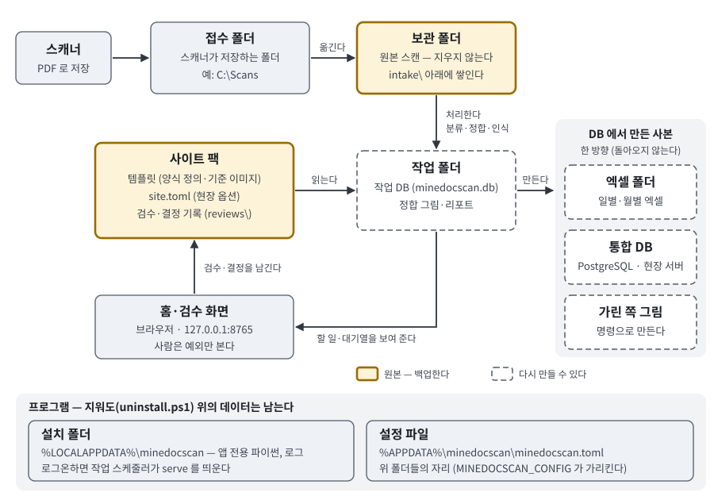

# 1. 개요

minedocscan 은 광산 현장에서 손으로 쓴 문서 — 장비 점검표, 운반 일보, 장비 가동 일보 같은 것 — 를 스캔하면 양식을 알아보고,
칸마다 값을 뽑아, 그 값이 어디서 왔는지와 함께 데이터베이스에 넣는 프로그램이다. 현장 PC 한 대에서 돌고, 외부 인터넷 없이 쓴다.

## 하루의 흐름

1. 종이 문서를 스캐너에 넣는다. 스캐너 프로그램이 PDF 를 **접수 폴더**에 저장한다.
2. minedocscan 이 접수 폴더를 지켜보다가 다 저장된 파일을 **보관 폴더**로 옮긴다. 원본은 거기에 쌓이고 지워지지 않는다.
3. 쪽마다 어느 양식인지 알아보고, 템플릿의 기준 이미지에 맞춰 반듯하게 편 뒤, 칸마다 글씨가 있는지 본다.
   빈 칸과 ✓ 표시는 그림으로 판정하고, 양식에 인쇄된 값(장비명·광종 …)은 템플릿에 적힌 값을 쓴다. 손으로 쓴 값은 인식기가 읽는다.
4. 확실한 값은 그대로 **작업 DB** 에 넣고(자동 적재), 확실하지 않은 값은 **검수 대기**로 둔다.
5. 사람은 **홈**(운영 화면)에서 할 일만 본다 — 날짜를 모르는 문서, 다시 스캔한 것 같은 쪽, 검수 대기 칸. 검수 화면에서는 칸의 그림을 보고
   값을 넣는다.
6. 처리가 한 바퀴 끝날 때마다 **엑셀 폴더**의 일별·월별 파일 가운데 바뀐 것만 다시 쓰고, **통합 DB** 에 바뀐 것을 싣는다.
   엑셀은 엑셀 폴더를, 통합 DB 는 통합 DB 를 설정했을 때만 한다. 엑셀은 설정이 없어도 홈에서 날짜·달마다 내려받을 수 있다.

이 일을 하는 것이 `minedocscan serve` 하나다. 윈도우에 설치하면 로그온할 때 저절로 켜지고(창은 뜨지 않는다), 바탕 화면의
"광산 문서 스캔"이 홈을 연다 ([2. 설치](2-설치.md)). 화면 하나하나는 [4. 날마다 쓰기](4-날마다-쓰기.md)에 있다.

### 처음에는 손글씨를 읽지 않는다

설치한 그대로는 손글씨 인식기의 모델이 없다 (설정 `[recognize] backend = "null"`). 그래서 글씨가 있는 칸은 모두 검수 대기로 가고,
사람이 넣은 값이 그대로 데이터가 된다. 빈 칸, ✓ 표시, 인쇄된 값은 모델 없이도 정해진다.

검수한 값이 쌓이면 관리자가 그것으로 숫자 인식기를 학습할 수 있다. 학습은 설치 묶음 밖의 일이다 — 학습 도구가 있는 다른 컴퓨터에서 하고,
만든 모델을 사이트 팩에 넣는다 ([DATA.md](../DATA.md#숫자-인식기-학습에서-평가까지)). 그 뒤에는 숫자 칸을 기계가 읽고, 확신이 있는 값만
그대로 넣는다. 소수·시각·계기 값(예: `1234.5`, `08:00`)은 인식기가 있어도 읽지 않고 검수로 보낸다.

## 지키는 약속

- **사람은 예외만 본다.** 확신이 없는 값만 검수 대기로 보내고, 나머지는 자동으로 넣는다. 사람이 볼 것은 홈의 "할 일"과 "대기열"에 모인다.
- **모든 값은 출처를 가진다.** 어느 문서의 몇 쪽, 어느 칸에서 나왔는지, 기계가 읽은 값과 사람이 넣은 값, 신뢰도가 같이 남는다.
  엑셀의 값도 그 칸까지 거슬러 올라갈 수 있다.
- **문서끼리 맞지 않는 값은 계산해서 보여 준다 — 고치지 않는다.** 예를 들어 같은 운반 횟수가 운반 일보와 운반 행렬에 따로 적히면
  둘을 비교하고(교차검증), 같은 장비의 어제 종료 계기와 오늘 시작 계기를 비교한다(계기 검산). 다르면 다르다고 보여 줄 뿐, 어느 쪽에
  맞춰 넣지 않는다. 차이를 맞추는 일(물질수지 조정)은 이 프로그램의 일이 아니다.
- **확정되지 않은 값을 확정된 것처럼 내보내지 않는다.** 엑셀에서 검수 대기 칸은 `?` 로 나온다. 값은 검수 화면에서 넣는다 —
  그러면 다음 내보내기에서 값이 된다.
- **엑셀·통합 DB·가린 쪽 그림은 작업 DB 에서 만든 사본이다 — 한 방향.** 엑셀이나 통합 DB 를 고쳐도 작업 DB 로 돌아오지 않는다.
  사본은 지워도 다시 만들 수 있다.
- **날짜는 사람이 정한다.** 파일 이름에서 날짜를 읽을 수 없는 문서는 처리하지 않고 기다린다. 사람이 종이에 적힌 날짜를 넣는다.
  손으로 쓴 월·일이나 파일을 만든 시각으로 짐작하지 않는다.
- **다시 스캔한 것 같은 쪽은 사람이 정한다.** 같은 날·같은 양식으로 먼저 들어온 쪽과 손글씨 자리가 거의 같은 쪽은 넣지 않고 붙잡아 둔다.
  같은 종이인지 다른 종이인지는 홈에서 사람이 고른다.
- **원본을 지우지 않는다.** 접수 폴더의 파일은 보관 폴더에 옮겨 확인한 뒤에야 치운다.
- **외부 네트워크에 닿지 않는다.** 인식은 이 PC 안에서 한다. 설치도 인터넷 없이 된다. 홈과 검수 화면은 이 PC 에서만 열린다
  (`http://127.0.0.1:8765/`). 밖으로 나가는 것은 설정했을 때 현장 서버의 통합 DB 하나다.
- **양식은 데이터다.** 양식 하나는 사이트 팩의 템플릿 하나다. 새 양식은 템플릿을 더해서 넣는다 — 프로그램을 고치지 않는다
  ([7. 새 양식 더하기](7-새-양식-더하기.md)).

## 하지 않는 일

이 프로그램은 1단계, 곧 **스캐너 → 인식 → 데이터베이스**(와 그 사본)까지다.

- 통합 DB 를 쓰는 다른 화면, 직접 입력, 시각화, 물질수지 조정은 2단계의 일이다. 2단계는 통합 DB 에 실린 표를 읽어 간다.
- 교차검증·계기 검산의 불일치를 맞춰 넣지 않는다.
- 엑셀을 읽어 들이지 않는다. 엑셀의 `?` 칸에 값을 적어도 데이터가 되지 않는다.
- 날짜를 모르는 문서를 짐작한 날짜로 넣지 않는다. 다시 스캔 의심 쪽을 스스로 버리거나 합치지 않는다.
- 양식에 인쇄된 값을 읽지 않는다. 템플릿에 없는 양식의 쪽은 "양식 없는 쪽"으로 남긴다.
- 인터넷에 있는 인식 서비스를 부르지 않는다.

## 데이터가 어디에 있는가

| 자리 | 무엇이 있나 | 보기 | 잃으면 |
|---|---|---|---|
| 접수 폴더 | 스캐너가 막 저장한 파일. 다 저장되면 보관 폴더로 옮겨지고 비워진다. 이미 받은 것과 같은 파일은 `_already`, 읽을 수 없는 파일은 `_failed` 폴더로 간다 | `C:\Scans` | 잠깐 머무는 곳이다 |
| 보관 폴더 | **원본 스캔.** 접수한 파일은 `intake\<해-달>\<받은 시각>-<문서 ID>\` 아래에 원래 이름 그대로 쌓인다 | `D:\minedocscan\archive` | 다시 만들 수 없다 — **백업한다** |
| 사이트 팩 | 한 현장의 템플릿(양식 정의·기준 이미지), 현장 옵션 `site.toml`, **검수 기록** `reviews\reviews.jsonl`, **결정 기록** `reviews\decisions.jsonl` | `D:\minedocscan\site` | 사람이 넣은 값과 결정이다 — **백업한다** |
| 작업 폴더 | 작업 DB `minedocscan.db`, 정합 그림, 리포트 | `D:\minedocscan\work` | 보관 폴더·검수 기록·결정 기록으로 다시 만든다 ([5. 관리](5-관리.md#다시-만들-수-있는-것)) |
| 엑셀 폴더 | 일별 `daily\`·월별 `monthly\` 엑셀과 기록 파일 | `D:\minedocscan\excel` | 사본 — 다시 쓴다 |
| 통합 DB | 현장 서버의 PostgreSQL 에 실은 표. 2단계가 읽는다 | 현장 서버 | 사본 — 다시 싣는다 |
| 가린 쪽 그림 | 이름·서명 자리를 가린 쪽 그림. 명령(`export masked-pages`)으로 그때 만든다 | 명령에 준 폴더 | 사본 — 다시 만든다 |
| 설치 폴더 | 앱 전용 파이썬 `python\`, 로그 `logs\serve-YYYYMMDD.log` (30일) | `%LOCALAPPDATA%\minedocscan` | 프로그램 — 다시 설치한다 |
| 설정 파일 | 위 폴더들의 자리와 설정 | `%APPDATA%\minedocscan\minedocscan.toml` | 설치가 매개변수로 다시 쓴다 — 손으로 고쳤으면 백업한다 |

원본은 셋이다 — 보관 폴더의 스캔, 검수 기록, 결정 기록. 작업 DB 는 이 셋과 사이트 팩의 템플릿으로 다시 만들 수 있고, 엑셀·통합 DB·가린
쪽 그림은 작업 DB 로 다시 만들 수 있다. 무엇을 어떻게 백업하는지는 [5. 관리](5-관리.md#백업)에 있다.

프로그램을 지워도(`uninstall.ps1`) 설치 폴더의 프로그램과 로그만 지워진다. 사이트 팩·보관 폴더·작업 폴더·엑셀 폴더는 그대로 남고,
설정 파일도 `-RemoveConfig` 를 주지 않으면 남는다 ([2. 설치](2-설치.md#지우기)).

설정 파일의 키와 환경 변수는 [부록 — 설정 목록](설정.md)에, 폴더마다의 자세한 규칙은 [DATA.md](../DATA.md)에 있다.

## 현장 데이터를 지킨다

접수 폴더, 보관 폴더, 사이트 팩, 작업 폴더, 엑셀 폴더에는 작업자 이름, 서명, 차량번호가 있다.

- 이 폴더들은 현장의 PC·공유 드라이브 안에 둔다.
- 화면 갈무리, 엑셀 파일, 로그 파일, 쪽 그림을 이슈·메일·문서에 붙이지 않는다. 물어볼 때는 수와 화면의 글을 옮긴다
  (보내도 되는 것은 [6장의 "물어볼 때"](6-문제-해결.md#물어볼-때)).
- 가린 쪽 그림도 템플릿이 아는 자리만 가렸다. 사람이 한 장씩 보고 쓴다.
- 통합 DB 의 주소와 비밀번호는 설정 파일에 적지 않는다. 주소는 환경 변수 `MINEDOCSCAN_PUBLISH_URL`, 비밀번호는 PostgreSQL 의 비밀번호 파일
  (pgpass)에 둔다 ([2. 설치](2-설치.md#통합-db-의-비밀번호)).

## 말 몇 가지

| 말 | 뜻 |
|---|---|
| 문서 | 스캐너가 저장한 파일 하나 (보통 PDF 하나). 16자리 문서 ID 가 붙는다 |
| 쪽 | 문서 안의 한 장. 쪽 ID 는 문서 ID 뒤에 `-p` 와 쪽 번호 (`1582ec6d99d57ca4-p3`) |
| 양식 | 인쇄된 빈 종이의 종류 — 점검표, 운반 일보, 가동 일보 … |
| 템플릿 | 양식 하나의 정의 — 기준 이미지(그 양식을 스캔한 그림 한 장), 표와 칸의 자리, 칸마다 무엇을 적는지. 사이트 팩에 있다 |
| 사이트 팩 | 한 현장의 템플릿·옵션·기록을 담은 폴더. 현장에 관한 것은 전부 여기에 있다 |
| 정합 | 스캔한 쪽을 템플릿의 기준 이미지에 맞춰 반듯하게 펴는 것. 맞지 않으면 "정합 실패 쪽" |
| 적재 | 쪽의 값이 작업 DB 에 들어간 것 |
| 검수 | 사람이 칸의 그림을 보고 값을 넣거나 확인하는 것. 아직 사람이 보지 않은 칸은 "검수 대기" |
| 대기열 | 검수할 칸을 종류별로 모은 목록. 홈의 "대기열"에서 들어간다 |
| 바퀴 | 프로그램이 몇 초마다 되풀이하는 한 차례의 일 — 접수 → 처리 → 엑셀 쓰기 → 통합 DB 싣기. "다음 바퀴에"는 보통 몇 초 뒤다 |
| 결정 | 사람이 문서·쪽에 대해 정한 것 — 날짜, 버리기, 되살리기, "다른 종이 — 둘 다 쓴다" |
| 업무 표 | 칸의 값을 업무의 단위로 묶은 표 — 점검·운반·가동 기록·작업량·교차검증 같은 표. 엑셀의 업무 시트가 되고 통합 DB 에 실린다 |
| 교차검증 | 두 양식에 같은 값이 적혔을 때 서로 비교하는 것. 다르면 "불일치"로 보여 준다 |
| 사본 | 작업 DB 에서 만든 것 — 엑셀, 통합 DB, 가린 쪽 그림. 고쳐도 작업 DB 로 돌아오지 않는다 |
