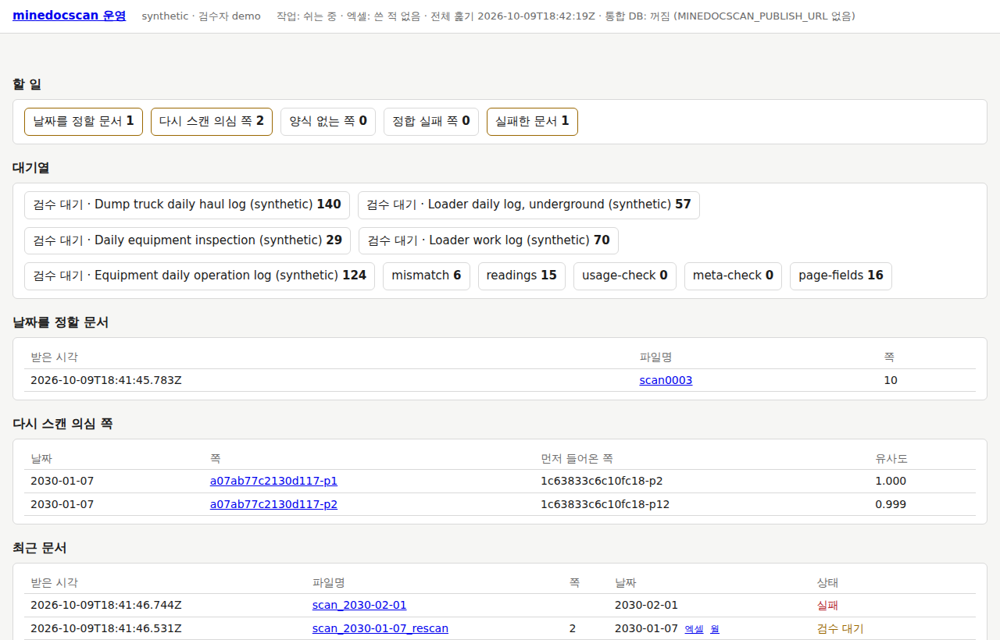

# 3. 처음 설정

[2장 설치](2-설치.md)를 마친 뒤 관리자가 한 번 한다. 차례는 이렇다.

1. [사이트 팩](#사이트-팩)을 놓고 `[site] name` 을 적는다
2. [폴더](#폴더)를 정한다
3. [설정 파일](#설정-파일)을 확인한다
4. [`minedocscan info`](#info-로-확인하기)로 본다
5. [자가 시험](#자가-시험)을 돌린다
6. [홈](#홈-열기)을 연다

양식(템플릿)을 만드는 일은 [7장 새 양식 더하기](7-새-양식-더하기.md)에 있다.

명령은 **새 PowerShell 창**에서 친다. 설치가 `minedocscan` 명령과 설정 파일의 자리를 사용자 환경에 넣어 두었으므로 어느 폴더에서나 돈다.

## 사이트 팩

사이트 팩은 한 현장의 폴더다. 들어 있는 것:

- 양식 정의(템플릿)와 기준 이미지 — `templates\<양식>\`
- 현장 옵션 — `site.toml`
- 사람이 남긴 **검수 기록**(`reviews\reviews.jsonl`)과 **결정 기록**(`reviews\decisions.jsonl`) — 프로그램이 쓴다

형식은 [SITE_PACK.md](../SITE_PACK.md)에 있다.

- 사이트 팩은 관리자가 만들거나 받아서 놓는다. 백업되는 곳에 둔다. 검수·결정 기록은 다시 만들 수 없다 ([5장 관리](5-관리.md#백업)).
- 사이트 팩에는 현장의 이름·서명이 든 그림이 있다. 메일·이슈에 붙이지 않는다.
- 템플릿이 아직 없으면 [7장](7-새-양식-더하기.md)에서 만든다. 템플릿이 없어도 설치·자가 시험·`info` 는 된다.

### 사이트 이름을 적는다

`site.toml` 의 `[site] name` 은 이 현장의 짧은 이름이다. 엑셀 폴더와 통합 DB 는 이 이름으로 "어느 현장의 사본인가"를 적어 둔다.
다른 현장의 사본이면 쓰지도 지우지도 않는다.

- 이름이 없으면, 엑셀 폴더나 통합 DB 를 설정했어도 serve 가 엑셀 자동 쓰기와 싣기를 켜지 않는다. 홈에 "엑셀: 꺼짐 (사이트 팩에 [site] name 없음)"이
  나온다. `export excel`·`publish` 명령도 거절한다. 폴더 이름으로 대신하지 않는다.
- 짧은 영문 식별자로 적는다 (보기: 합성 데모의 `synthetic`).
- 한 번 정하면 바꾸지 않는다. 바꿀 때의 순서는 [5장](5-관리.md#사이트-이름을-바꿀-때)에 있다.

**순서가 중요하다.** 평가셋(정확도를 재는 test 날짜)은 `[eval] split_salt`(소금값)로 나뉜다. 소금값이 없으면 사이트 이름을 쓰고,
이름도 없으면 **폴더 이름**을 쓴다. 그래서 이름을 그냥 적으면 소금값이 바뀌고 test 날짜가 흐트러진다. 다음 순서로 적는다.

**1.** `minedocscan info` 를 돌린다 ([아래](#info-로-확인하기)). 소금값이 이름을 따르고 있으면 이런 줄이 나온다
(사이트 팩 폴더의 이름이 `site` 일 때).

```text
사이트 이름 [site] name: 없음 — 적어야 엑셀 자동 내보내기·통합 DB 싣기가 켜지고 export excel·publish 가 돕니다
  평가셋의 분할 소금값([eval] split_salt)이 없어 폴더 이름 "site" 을 씁니다 — [site] name 을 적거나 바꾸기 전에 [eval] split_salt = "site" 를 먼저 적으십시오 (그러지 않으면 test 날짜가 바뀝니다)
```

**2.** 메모장으로 `site.toml` 을 열어, 그 줄이 알려 준 값을 **그대로** 먼저 적는다.

```text
[eval]
split_salt = "site"
```

**3.** 그다음 이름을 적는다. `[site]` 표가 이미 있으면 그 안에 `name` 한 줄만 더한다.

```text
[site]
name = "synthetic"
```

**4.** `minedocscan info` 를 다시 돌린다. "사이트 이름 [site] name: synthetic (엑셀 폴더·통합 DB 의 주인)"이 나오고 소금값 줄이 없으면 됐다.

새 현장의 사이트 팩이면 두 줄을 처음부터 같이 적는다. 소금값은 아무 글자로 정하고 다시 바꾸지 않는다 (보기: `split_salt = "synthetic-2030"`).
왜 이렇게 하는지는 [DATA.md](../DATA.md)의 "사본의 주인"과 [ADR 0009](../decisions/0009-evalset-by-date.md)에 있다.

`site.toml` 은 UTF-8 로 저장한다 (메모장의 기본값). 문법이 틀리면 명령이 "site.toml 을 읽을 수 없습니다 (…)"로 멈춘다.

## 폴더

| 폴더 | 설정 키 (설치의 매개변수) | 무엇이 있나 | 어디에 |
|---|---|---|---|
| 사이트 팩 | `[paths] site` (`-Site`) | 템플릿, 현장 옵션, 검수·결정 기록 | 백업되는 곳 |
| 보관 폴더 | `[paths] archive_root` (`-Archive`) | 스캔 원본. 접수한 파일이 `intake\<해-달>\<받은 시각>-<문서 ID>\` 아래로 복사된다 | 백업되는 곳, **짧은 경로** |
| 작업 폴더 | `[paths] work_root` (`-Work`) | 작업 DB(`minedocscan.db`), 정합 그림 — 다시 만들 수 있다 | 이 PC 의 디스크 |
| 접수 폴더 | `[paths] inbox` (`-Inbox`) | 스캐너 프로그램이 저장한 파일. 다 쓰이면 보관 폴더로 옮겨지고 처리된다 | 스캐너 프로그램의 저장 폴더 |
| 엑셀 폴더 | `[export] excel_dir` (`-ExcelDir`) | 일별·월별 엑셀 — DB 의 사본 | 현장이 여는 폴더 |

지킬 것:

- **보관 폴더는 원본이다.** 프로그램은 그 안의 `intake\` 아래에만 쓰고, 아무것도 지우지 않는다. 사람도 지우지 않는다.
- **보관 폴더는 짧은 경로로** 둔다 (보기: `D:\minedocscan\archive`). 보관할 경로가 윈도우의 한계(259자)를 넘으면 그 파일을 접수하지
  않고 접수 폴더에 둔 채 알린다 ([6장](6-문제-해결.md#할-일)).
- **작업 폴더는 이 PC 의 디스크에** 둔다. 동기화 폴더(클라우드 드라이브)나 네트워크 폴더에 두면 DB 파일이 깨질 수 있다.
- **접수 폴더는 다른 폴더와 겹치지 않는다.** 보관 폴더·작업 폴더·사이트 팩의 안에 두지 않고, 그것들을 품지도 않는다. 겹치면 serve 가
  "접수 폴더를 쓸 수 없습니다: 접수 폴더가 archive_root 와 겹칩니다 — …"로 켜지지 않는다. 같은 폴더를 다른 이름(연결한 드라이브 문자와
  `\\서버\공유`)으로 적어도 겹침으로 본다.
- **엑셀 폴더는 접수 폴더·보관 폴더 밖에** 둔다. 안이면 엑셀을 쓰지 않는다 (홈: "엑셀: 꺼짐 (저장소·접수 폴더 안이라 쓰지 않습니다)").
- **엑셀 폴더는 미리 만들어 둔다.** 프로그램은 엑셀 폴더를 만들지 않는다 — 없으면 "폴더가 없습니다"로 알린다. 그 아래의 `daily\`·`monthly\` 는 만든다.
- 스캐너 프로그램의 저장 폴더를 접수 폴더로 맞춘다. 스캔 설정(PDF, 300 dpi, 회색조, 화질 보정 끄기 …)은 [DATA.md](../DATA.md)의
  "스캐너와 스캔 설정"을 따른다.
- 접수 폴더에 `_already`·`_failed` 폴더가 생길 수 있다. 프로그램이 같은 파일·읽지 못한 파일을 옮겨 두는 곳이다 ([6장](6-문제-해결.md#그-밖의-문제)).

엑셀 폴더·작업 폴더·보관 폴더에는 현장의 값(이름·차량번호)이 있다. 그 파일이나 화면 갈무리를 메일·이슈에 붙이지 않는다.

## 설정 파일

설치가 쓴 설정 파일은 `%APPDATA%\minedocscan\minedocscan.toml` 이다 (`-Config` 를 줬으면 그 파일). 모든 명령이 이 파일을 읽는다 —
사용자 환경 변수 `MINEDOCSCAN_CONFIG` 가 이 파일을 가리킨다. 그 변수가 없으면 명령을 돌리는 폴더의 `minedocscan.toml` 을 읽는다.

설치가 쓴 파일은 이렇게 생겼다 ([2장](2-설치.md#installps1-돌리기)의 보기로 설치했을 때).

```text
# minedocscan 설정 — install.ps1 이 썼다 (2030-01-06). 보기: 묶음의 minedocscan.example.toml
# 통합 DB 의 주소는 여기에 적지 않는다 — 사용자 환경 변수 MINEDOCSCAN_PUBLISH_URL, 비밀번호는 %APPDATA%\postgresql\pgpass.conf
[paths]
site = 'D:\minedocscan\site'
archive_root = 'D:\minedocscan\archive'
work_root = 'D:\minedocscan\work'
inbox = 'C:\Scans'

[export]
excel_dir = 'D:\minedocscan\excel'
```

고칠 때:

- 메모장으로 연다: `notepad $env:MINEDOCSCAN_CONFIG` (`-Config` 로 준 파일이어도 이것으로 열린다)
- **윈도우 경로는 작은따옴표**(`'D:\…'`)로 감싼다. 큰따옴표로 감싸면 `\` 를 두 번 적어야 한다 (`"D:\\minedocscan\\site"`). 한 번만 적으면
  대개 "설정 오류: 설정 파일을 읽을 수 없습니다 (…): Unescaped '\' in a string …"이 나온다. `\n`·`\t` 처럼 읽히는 짝이 있으면 오류 없이
  다른 글자가 되니, `info` 의 경로를 꼭 본다.
- **UTF-8 로, BOM 없이** 저장한다 (메모장의 기본값). BOM 이 붙으면 "… Invalid statement (at line 1, column 1)"로 읽지 못한다.
- 다른 키(접수의 기다리는 시간, 엑셀의 훑기 간격, 통합 DB 의 스키마 …)는 묶음의 `minedocscan.example.toml` 과 [부록 — 설정 목록](설정.md)에 있다.
- **통합 DB 의 주소·비밀번호는 여기에 적지 않는다** — [2장의 "통합 DB 의 비밀번호"](2-설치.md#통합-db-의-비밀번호).
- 고친 뒤에는 `minedocscan info` 로 보고, 작업 스케줄러의 serve 를 멈췄다가 켠다 ([2장](2-설치.md#작업-스케줄러의-serve)). 돌고 있는 serve 는
  고친 것을 모른다.

값은 이 차례로 이긴다: 명령줄의 선택(`--site` …) > 환경 변수(`MINEDOCSCAN_SITE` …) > 설정 파일 > 기본값.
현장 PC 에서는 설정 파일 하나에 모아 두는 것이 알기 쉽다.

## info 로 확인하기

```powershell
minedocscan info
```

설정·사이트 팩·인식기를 한 번에 보여 준다. 아무것도 바꾸지 않는다. 합성 데모에서는 이렇게 나온다 (경로는 이 장의 보기로 바꿨다).

<!-- 시험: 돌리지 않음 -->
```text
minedocscan 1.0.0
  site: D:\minedocscan\site
  archive_root: D:\minedocscan\archive
  work_root: D:\minedocscan\work
  db_url: sqlite:///D:/minedocscan/work/minedocscan.db
  dpi: 200
  recognizer: null
  corrector: none
  auto_accept_conf: 0.9
백엔드: recognizers=['digits', 'null', 'oracle'], correctors=['none'], handlers=['generic', 'haul', 'inspection', 'usage']
엑셀 폴더: D:\minedocscan\excel (전체 훑기 30분마다 — 달마다 한 조각, 바꾸지 못한 파일은 60초 뒤에 다시)
통합 DB: 없음 (환경변수 MINEDOCSCAN_PUBLISH_URL) — 싣기 꺼짐
인식기 [handwritten_number]: null
인식기 [handwritten_text]: null
사이트 팩: synthetic — 템플릿 3종, 페이지 라벨 4개, 장비명 대응표 0개 (해시 4f53cda18c2baa0c, 마스터 12대)
사이트 이름 [site] name: synthetic (엑셀 폴더·통합 DB 의 주인)
결정 기록: D:\minedocscan\site\reviews\decisions.jsonl (0줄)
가린 쪽 그림 [redact]: 메타 키 operator, vehicle_no, 넓히는 폭 48 px (기본값)
운반 표 [haul_table]: 열 순서 0개, 자리 순서 0개 지정 (없음 — 템플릿의 행 순서·자리 이름 순)
접수 폴더: C:\Scans (다 쓰인 뒤 5초, 포기 120초, 3초마다)
  synth_haul_log           handler=haul        표 2개, 셀 65개
  synth_haul_matrix        handler=haul        표 1개, 셀 74개
  synth_inspection         handler=inspection  표 1개, 셀 80개
```

볼 것:

| 줄 | 볼 것 |
|---|---|
| `minedocscan 1.0.0` | 설치한 판 |
| `site`·`archive_root`·`work_root` | 정한 폴더인가. `site: None`, `work_root: work` 로 나오면 **설정 파일을 찾지 못한 것**이다 — 파일이 그 자리에 있는지, `MINEDOCSCAN_CONFIG` 가 맞는지 본다 |
| `recognizer`, `인식기 […]` | 손글씨를 읽는 부품. 처음에는 `null` 이다 — 손글씨 칸은 전부 검수 대기열로 간다. 숫자 인식기는 [DATA.md](../DATA.md)의 "숫자 인식기" |
| `엑셀 폴더:` | "없음 … 자동 내보내기 꺼짐"이면 엑셀을 저절로 쓰지 않는다 (홈의 내려받기는 된다) |
| `통합 DB:` | 싣지 않는 현장이면 "없음 … 싣기 꺼짐"이 맞다. 싣는 현장이면 서버·DB 이름과 "켜짐" |
| `사이트 팩:` | 템플릿이 몇 종인가. "사이트 팩: 지정되지 않았거나 폴더가 없습니다"면 `site` 의 경로를 고친다 |
| `사이트 이름 [site] name:` | 이름이 있는가. 소금값 줄이 없는가 ([위](#사이트-이름을-적는다)) |
| `결정 기록:` | 사이트 팩 안의 `reviews\decisions.jsonl` — 백업할 파일이다 |
| `접수 폴더:` | 스캐너 프로그램의 저장 폴더인가. "없음"이면 스캔이 저절로 들어오지 않는다 |
| 템플릿 줄 | 양식마다 한 줄. "(분류 전용 — 셀 정의 없음)"은 아직 칸을 정하지 않은 양식이다 ([7장](7-새-양식-더하기.md)) |

- 맨 처음에 "설정 오류: …"나 "템플릿 오류: …" 한 줄만 나오면 그 줄이 까닭이다. 설정 파일의 문법은 [위](#설정-파일), 템플릿은 [7장](7-새-양식-더하기.md#막혔을-때).
- 폴더가 서로 겹치는지는 `info` 가 보지 않는다. serve 가 시작할 때 보고, 겹치면 켜지지 않는다 ([위](#폴더)).
- `info` 의 결과에는 폴더 경로와 현장 이름이 있다. 밖으로 보낼 때는 그것을 지운다.

## 자가 시험

`minedocscan selftest` 는 **설치한 프로그램이 이 PC 에서 제대로 도는지** 본다.

- 합성 데이터(만든 가짜 양식과 글씨)만 쓴다. 임시 폴더에서 돌고 끝나면 지운다. 망에 닿지 않는다.
- 이 PC 의 설정·사이트 팩·폴더는 쓰지 않는다. 통합 DB 는 `--publish-schema` 를 줄 때만 쓴다 ([아래](#통합-db-까지-시험하기)).
  그래서 serve 가 돌고 있어도 된다. 이 현장의 설정은 `info` 로 본다.
- 보통 1분 안팎이다 (느린 PC 는 3분까지).

<!-- 시험: 돌리지 않음 -->
```powershell
minedocscan selftest --out D:\minedocscan\selftest
```

`--out` 은 결과 파일을 쓸 폴더다. 주지 않으면 명령을 돌리는 폴더(새 창이면 보통 `C:\Users\<사용자>`)에 쓴다.

검사는 여덟이다. 앞의 검사가 실패하면 그것에 기대는 뒤의 검사는 "건너뜀"이 된다.

| 검사 | 보는 것 |
|---|---|
| `synth` | 합성 묶음 이틀치(점검표·운반 일보·가동 일보)와 접수 폴더를 만든다 |
| `intake` | 접수 → 날짜를 기다리는 문서에 날짜를 정한다 → 처리. 쪽이 다 적재된다 |
| `recognition` | 정답을 아는 인식기로 읽어, 기계가 읽는 칸은 틀린 글자가 0. 읽지 않는 칸(소수·시각·계기)은 "잉크 있음 + 검수 대기" |
| `reprocess` | 검수·결정을 넣고 다시 처리한 DB 가 처음부터 만든 DB 와 같다 |
| `excel` | 일별·월별 엑셀을 써서 다시 읽으면 DB 와 같다. 검수로 넣은 칸은 그 값이다 |
| `masked` | 가린 쪽 그림: 상자 밖은 그대로, 상자 안은 한 색 |
| `serve` | 화면을 빈 포트로 띄워 홈과 엑셀 내려받기가 되고, 로그 파일이 UTF-8 이다 |
| `publish` | 통합 DB 에 싣고 견준 뒤 지운다 — `--publish-schema` 를 줄 때만. 주지 않으면 "건너뜀" |

화면에는 검사마다 한 줄이 나온다.

```text
자가 시험을 시작합니다 — 합성 데이터만, 임시 폴더에서 (망에 닿지 않습니다)
통과  synth           4.5초  합성 묶음 이틀치와 접수 폴더
통과  intake         15.9초  접수 → 날짜 결정 → 처리, 쪽이 다 적재
통과  recognition     0.0초  기계가 읽는 표의 칸의 CER 0, 읽지 않는 칸은 잉크 있음 + 검수 대기
통과  reprocess      20.1초  검수·결정 → 다시 처리 = 처음부터 만든 DB
통과  excel           0.7초  일별·월별 되읽기 = 모델, 운반 표 = 정답, 검수한 칸은 그 값
통과  masked          1.9초  가린 그림: 상자 밖 = 정합 그림, 안 = 한 색
통과  serve           0.9초  화면: /api/home·/export/day.xlsx 가 200, 로그 파일 UTF-8
건너뜀 publish         0.0초  통합 DB 에 싣고 --check, 스키마 지우기 — 요청하지 않았다 (--publish-schema)
자가 시험: 통과 — 통과 7, 실패 0, 건너뜀 1 (44.1초). 결과: D:\minedocscan\selftest\selftest.json, D:\minedocscan\selftest\selftest.md
```

- **결과 파일** `selftest.md`(사람이 읽는 표)와 `selftest.json` — 검사마다 결과와 시간, 그리고 환경(윈도우 판, 파이썬, 꾸러미의 판, CPU 수, 메모리).
  경로와 이름은 넣지 않는다. 문제를 알릴 때 `selftest.md` 를 그대로 보내도 된다.
- **종료 코드**는 통과 0, 실패 1 이다. 실패한 줄 끝에 까닭이 한 줄 붙는다. 흔한 까닭과 할 일은
  [6장의 "자가 시험이 실패할 때"](6-문제-해결.md#자가-시험이-실패할-때)에 있다. 풀리지 않으면 그 줄과 `selftest.md` 를 개발자에게 보낸다.
- `--keep` 을 주면 임시 폴더를 지우지 않고 자리를 알린다 ("임시 폴더를 남겼습니다: …"). 실패를 살펴볼 때 쓴다.
- 합성 데이터의 수치다. 이 현장 글씨의 인식률을 말하는 것이 아니다.

### 통합 DB 까지 시험하기

통합 DB 를 설정했으면([2장](2-설치.md#통합-db-의-비밀번호)) 싣기까지 시험할 수 있다. 자가 시험만 쓰는 스키마를 하나 만들고, 싣고, 견주고, 지운다.

<!-- 시험: 돌리지 않음 -->
```powershell
minedocscan selftest --out D:\minedocscan\selftest --publish-schema minedocscan_selftest_pc1
```

- 주소는 환경 변수 `MINEDOCSCAN_PUBLISH_URL`, 비밀번호는 `pgpass.conf` 에서 읽는다. 주소가 없으면 그 검사가 실패한다.
- 스키마 이름은 `minedocscan_selftest_` 로 시작하고 영문 소문자·숫자·밑줄만 쓴다. 다른 이름은 받지 않는다 (종료 코드 2).
  실제로 싣는 스키마(`minedocscan`)는 건드리지 않는다.
- 그 스키마가 이미 있으면 실패한다. 자가 시험이 만들지 않은 것은 쓰지도 지우지도 않는다 — 다른 이름으로 다시 돌린다.
- 계정에 스키마를 만들 권한(CREATE)이 없으면 이 검사만 "건너뜀"이다. 다른 검사가 통과하면 결과는 통과다.
- 다 되면 그 스키마를 지운다. `--keep` 이면 남긴다.

## 홈 열기

설치가 작업 스케줄러로 serve 를 켜 두었다. 바탕 화면의 **광산 문서 스캔**을 열거나, 브라우저에서 `http://127.0.0.1:8765/` 로 간다.
이 주소는 이 PC 에서만 열린다.



윗줄에 사이트 이름 · 검수자, 그리고 작업·엑셀·통합 DB 의 상태가 나온다. 처음에 볼 것:

- **사이트 이름과 검수자**가 맞는가 (그림에서는 `synthetic · 검수자 demo`).
- **"작업: 쉬는 중"** 이면 접수 폴더를 보며 기다리는 것이다. 스캔이 들어오면 "작업: 처리 중 — …"이 된다.
- **"엑셀: 꺼짐 (…)"**, **"통합 DB: 꺼짐 (…)"** 이면 괄호 안이 까닭이다.

| 괄호 안 | 뜻 |
|---|---|
| `excel_dir 없음` | 엑셀 폴더를 설정하지 않았다 |
| `MINEDOCSCAN_PUBLISH_URL 없음` | 통합 DB 를 설정하지 않았다 (싣지 않는 현장이면 맞다) |
| `사이트 팩에 [site] name 없음` | [사이트 이름](#사이트-이름을-적는다)을 적는다 |
| `저장소·접수 폴더 안이라 쓰지 않습니다` | 엑셀 폴더가 접수 폴더나 보관 폴더 안에 있다 (프로그램의 소스 저장소(git) 안이어도 그렇다) — [폴더](#폴더)를 고친다 |
| `psycopg 없음` | 통합 DB 드라이버가 없다 (묶음으로 설치했으면 생기지 않는다) |
| `[publish] enabled = false` | 설정 파일에서 싣기를 껐다 |
| `--no-watch` | 처리하지 않고 화면만 띄운 serve 다. 엑셀·싣기는 처리하는 쪽(`watch`)이 한다. 작업 스케줄러의 serve 는 이렇지 않다 |

홈이 열리지 않으면 serve 가 돌지 않는 것이다. 로그 `%LOCALAPPDATA%\minedocscan\logs\serve-YYYYMMDD.log` 의 맨 끝의 몇 줄에 까닭이 있다
(설정 오류, 사이트 팩이 없다, 접수 폴더가 겹친다 …). 고친 뒤 작업을 켠다 (`Start-ScheduledTask -TaskName minedocscan-serve`, 또는 다시 로그온).
까닭마다 할 일은 [6장의 "serve 가 켜지지 않을 때"](6-문제-해결.md#serve-가-켜지지-않을-때)에 있다.

홈의 나머지(할 일, 대기열, 날짜를 정할 문서, 최근 문서)와 날마다 하는 일은 [4장 날마다 쓰기](4-날마다-쓰기.md)에 있다.

## 다음

- 템플릿이 없으면 [7장 새 양식 더하기](7-새-양식-더하기.md).
- 템플릿이 있으면 한 장을 스캔해 본다. 스캐너 프로그램이 접수 폴더에 저장하면 몇 초 뒤 홈의 "최근 문서"에 나온다.
  그다음은 [4장 날마다 쓰기](4-날마다-쓰기.md).
- 무엇을 백업하는지 [5장 관리](5-관리.md#백업)에서 정해 둔다.
