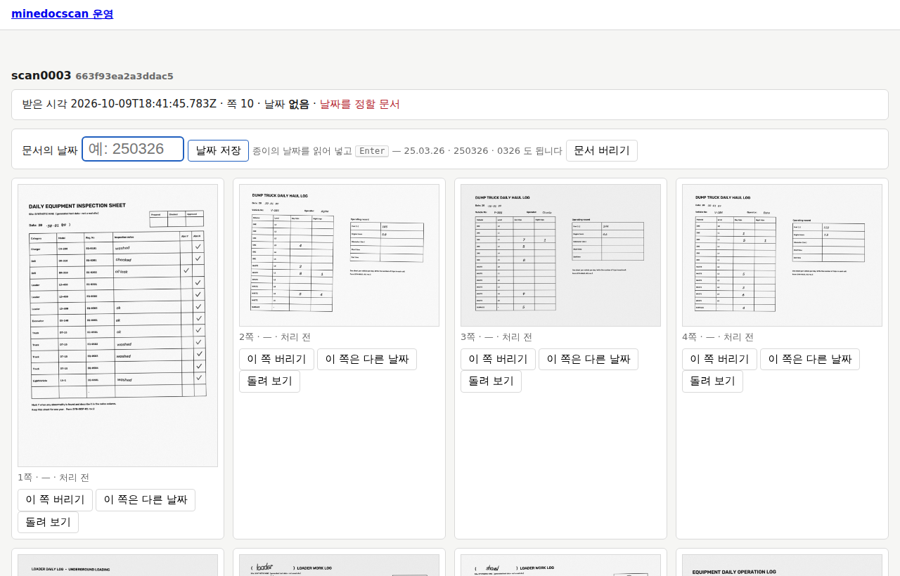
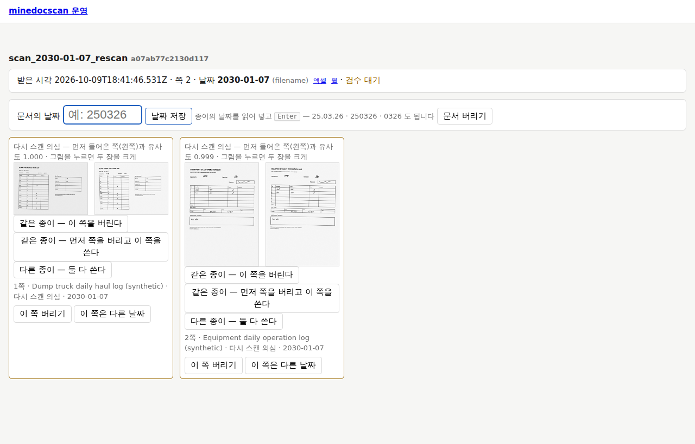
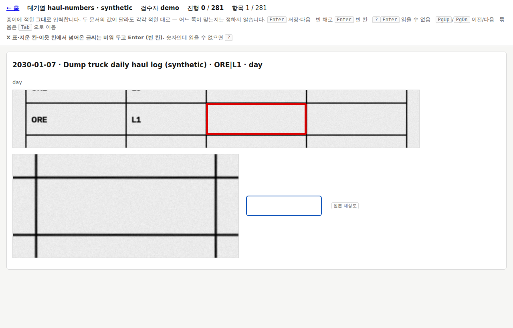
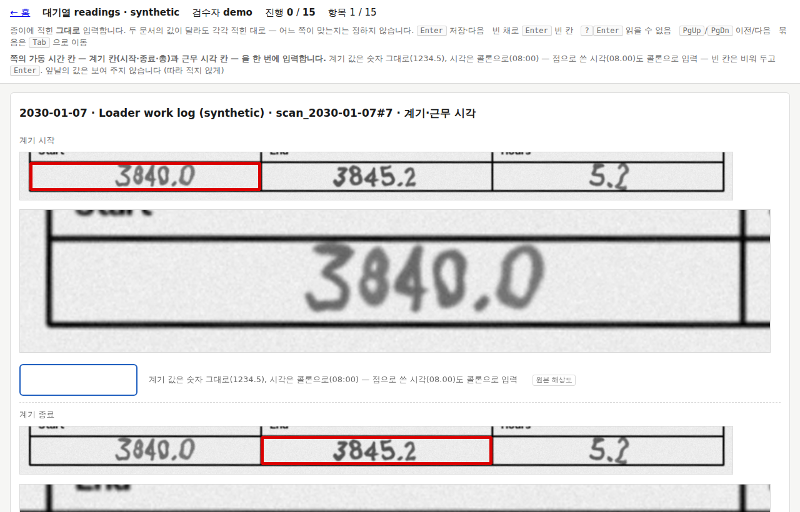

# 4. 날마다 쓰기

현장 담당자가 날마다 하는 일이다. 스캔하고, 홈에서 할 일을 보고, 날짜와 다시 스캔을 정하고, 검수 대기열에서 값을 넣고, 엑셀을 연다.

시작하기 전에:

- 프로그램(`minedocscan serve`)은 PC 에 로그온하면 저절로 켜져 있다. 창은 뜨지 않는다 ([2장 설치](2-설치.md#작업-스케줄러의-serve)).
- 홈은 바탕 화면의 **광산 문서 스캔**을 열거나, 브라우저에서 `http://127.0.0.1:8765/` 로 간다. 이 주소는 이 PC 에서만 열린다.
- 이 장의 그림은 모두 **합성 데모**다 (사이트 이름 `synthetic`, 검수자 `demo`). 우리 현장의 화면에는 같은 자리에 실제 값이 보인다.
  **우리 현장 화면의 갈무리를 메일·이슈·문서에 붙이지 않는다** — 이름·서명·차량번호가 보인다.

## 하루의 순서

1. 종이를 [스캔한다](#스캔하기). 파일이 접수 폴더에 저장되면 프로그램이 가져간다.
2. [홈](#홈)에서 "할 일"을 본다.
3. [날짜를 정할 문서](#날짜를-정할-문서)가 있으면 종이의 날짜를 넣는다.
4. [다시 스캔 의심 쪽](#다시-스캔-의심-쪽)이 있으면 같은 종이인지 고른다.
5. [검수 대기열](#검수-대기열)에서 값을 넣는다.
6. [엑셀](#엑셀)을 연다. `?` 칸은 아직 확정되지 않은 칸이다.
7. 홈 윗줄의 [엑셀·통합 DB 상태](#통합-db-의-상태)에 빨간 글이 없는지 본다.

3번과 4번은 미루지 않는다. 날짜를 모르는 문서와 다시 스캔 의심 쪽은 사람이 정할 때까지 데이터에 들어가지 않는다.

## 스캔하기

스캐너 프로그램이 파일을 **접수 폴더**에 저장하게 해 둔다 (관리자가 맞춘다 — [3장 처음 설정](3-처음-설정.md#폴더)).
스캔 설정(PDF, 300 dpi, 회색조, 화질 보정 끄기)은 관리자가 [DATA.md](../DATA.md)의 "스캐너와 스캔 설정"대로 맞춘다.

- **PDF 로 저장한다.** 그림 파일(PNG·JPG·TIF·BMP)도 받지만 파일 하나가 한 쪽짜리 문서가 된다. 여러 쪽짜리 TIF 는 읽지 않는다 ("실패한 문서"가 된다).
- **한 파일에는 같은 날의 종이만** 넣는다. 날짜는 파일마다 정해지기 때문이다.
- 하루치가 많으면 여러 번에 나눠 스캔해도 된다. 파일이 여럿이어도 된다.
- 양면으로 스캔했다면 빈 뒷면은 "빈 쪽"으로 저절로 빠진다.

저장이 끝나면 몇 초 뒤 파일이 접수 폴더에서 사라지고, 홈의 "최근 문서"에 나온다. 사라진 파일은 **보관 폴더** 안(`intake\` 아래, 받은 달과
받은 시각의 폴더)에 원래 이름 그대로 있다.
보관 폴더의 파일은 원본이다. 지우거나 옮기지 않는다.

접수 폴더에 이런 것이 생길 수 있다.

| 보이는 것 | 뜻 |
|---|---|
| `_already` 폴더 | 이미 받은 것과 바이트까지 같은 파일. 다시 넣은 것이다 — 아무 일도 일어나지 않는다 |
| `_failed` 폴더 | 잠겨서 읽을 수 없었던 파일. 관리자에게 알린다 ([6장 문제 해결](6-문제-해결.md#그-밖의-문제)) |
| 사라지지 않는 파일 | 아직 저장 중이다. 오래 남아 있으면 PDF·그림이 아닌 파일이거나, 경로가 너무 길다 (홈의 "할 일"에 나온다 — [6장](6-문제-해결.md#할-일)) |

`_` 로 시작하는 폴더와 `.`·`~` 로 시작하는 파일은 프로그램이 보지 않는다.

### 파일 이름과 날짜

문서의 날짜는 **작업한 날**, 곧 종이에 적힌 날이다. 프로그램은 날짜를 이렇게 정한다.

- **파일 이름에 날짜가 있으면** 그 날짜다. 어떤 이름이 날짜인지는 사이트 팩의 규칙이 정한다 (관리자가 알려 준다 —
  [부록 — 설정 목록](설정.md)의 `[ingest] date_from_filename`). 합성 데모의 규칙은 `해-달-날` 이다: `scan_2030-01-07.pdf`,
  `scan_2030-01-08_1.pdf`.
- **이름에 날짜가 없으면** 처리하지 않고 기다린다. 스캐너가 붙이는 이름(`scan0003.pdf` 같은)이 그렇다. 홈의
  "[날짜를 정할 문서](#날짜를-정할-문서)"에 나오고, 사람이 종이의 날짜를 넣으면 그때 처리한다.
- 사람이 화면에서 넣은 날짜가 파일 이름의 날짜보다 앞선다. 이름의 날짜가 틀렸으면 [문서 화면](#문서-화면)에서 날짜를 넣으면 된다.

스캐너 프로그램이 이름에 **스캔한 날**을 붙이게 하지 않는다. 그 꼴이 규칙에 맞으면 스캔한 날이 작업한 날로 들어간다.
이름에 날짜를 넣으려면 종이에 적힌 날을 넣는다. 잘 모르겠으면 이름은 스캐너가 붙이는 대로 두고 화면에서 날짜를 넣는다.

## 홈


홈은 5초마다 저절로 새로 읽는다. 화면의 시각은 끝에 `Z` 가 붙은 세계 표준시(UTC)다 — 한국 시각은 9시간을 더한다.

### 윗줄

맨 위 줄에 사이트 이름, 검수자, 작업·엑셀·통합 DB 의 상태가 이어서 나온다. 그림에서는
`synthetic · 검수자 demo` 다음에 `작업: 쉬는 중 · 엑셀: 쓴 적 없음 · 전체 훑기 2026-10-09T18:42:19Z · 통합 DB: 꺼짐 (MINEDOCSCAN_PUBLISH_URL 없음)`.

프로그램은 몇 초마다 한 바퀴를 돈다 — 접수 → 처리 → 엑셀 쓰기 → 통합 DB 싣기.

| 보이는 글 | 뜻 |
|---|---|
| `synthetic · 검수자 demo` | 사이트 이름과 검수자 ID. 이 화면에서 넣은 검수·결정은 이 ID 로 남는다 (관리자가 설치할 때 정한다) |
| `작업: 쉬는 중` | 접수 폴더를 보며 기다리고 있다 |
| `작업: 처리 중 — 문서 1582ec6d99d57ca4 3/12쪽` | 그 문서를 처리하고 있다. 30쪽짜리 문서는 1분쯤 걸린다 |
| `작업: 엑셀 쓰는 중 — 5초째`, `작업: 통합 DB 에 싣는 중 — 5초째` | 바퀴 끝의 일. 그동안 새 스캔은 다음 바퀴를 기다린다 |
| `· 지난 바퀴 오류 …` | 지난 바퀴에 오류가 났다. 관리자에게 알린다 |
| `작업: 꺼짐 (--no-watch — 처리는 watch 가 합니다)` | 이 화면은 처리를 하지 않는다. 관리자가 따로 띄운 화면이다 |
| `엑셀: 마지막 <시각> · 4개 씀` | 그 시각에 엑셀 파일 4개를 새로 썼다 |
| `엑셀: 쓴 적 없음` | 프로그램이 켜진 뒤 새로 쓴 파일이 아직 없다. 바뀐 것이 없으면 쓰지 않는다 |
| `전체 훑기 <시각>` | 마지막으로 전체를 한 번 다 살펴본 시각. `처음 훑는 중 3/13`, `훑는 중 3/13` 이면 달마다 나눠 살펴보는 중이다 |
| `엑셀: 꺼짐 (…)`, `통합 DB: 꺼짐 (…)` | 괄호 안이 까닭이다 — [3장의 표](3-처음-설정.md#홈-열기) |
| 빨간 글 | 엑셀은 [엑셀](#엑셀), 통합 DB 는 [통합 DB 의 상태](#통합-db-의-상태)를 본다 |

### 할 일

사람이 봐야 하는 것의 수다. 날짜를 정할 문서·다시 스캔 의심 쪽이 있으면, 그리고 오류 난 쪽·실패한 문서·경로가 너무 긴 파일이 나오면
그 칸의 테두리가 갈색이 된다. 이 칸들은 눌러지지 않는다 — 아래의 표에서 연다.

| 칸 | 뜻 | 할 일 |
|---|---|---|
| 날짜를 정할 문서 | 날짜를 몰라 처리를 기다리는 문서 | [날짜를 넣는다](#날짜를-정할-문서) |
| 다시 스캔 의심 쪽 | 먼저 들어온 쪽과 거의 같아 붙잡아 둔 쪽 | [같은 종이인지 고른다](#다시-스캔-의심-쪽) |
| 양식 없는 쪽 | 어느 양식인지 알아보지 못한 쪽 | 양식이 아닌 종이(메모·표지)면 그 쪽을 버린다. 우리 양식인데 여기 있으면 관리자에게 |
| 정합 실패 쪽 | 양식은 알아봤지만 반듯하게 펴지 못한 쪽 (비뚤어짐, 접힘, 잘림) | 그 종이를 다시 스캔하고, 이 쪽은 버린다 ([다시 스캔할 때](#다시-스캔할-때)). 여러 쪽이 한꺼번에 그러면 관리자에게 |
| 오류 난 쪽 | 처리하다 오류가 난 쪽 (있을 때만 나온다) | 관리자에게 |
| 실패한 문서 | 파일을 읽지 못했다 — 저장이 끊겼거나 깨진 파일 (있을 때만) | 종이를 다시 스캔하고, 실패한 문서는 "문서 버리기" |
| 다시 처리 대기 | 새로 받았거나 결정을 남겨 처리를 기다리는 문서 (있을 때만) | 기다린다. 몇 초에서 몇 분 |
| 경로가 너무 길어 접수하지 않은 파일 | 보관할 경로가 윈도우의 한계를 넘었다 (있을 때만) | 관리자에게 ([6장](6-문제-해결.md#할-일)) |

### 대기열

검수할 칸이 종류별로 모여 있다. 칸을 누르면 그 대기열의 검수 화면이 열린다. 수는 남은 항목의 수다.
대기열마다의 쓰임은 [검수 대기열](#검수-대기열)에 있다.

### 날짜를 정할 문서, 다시 스캔 의심 쪽

할 일이 있을 때만 표가 나온다.

- **날짜를 정할 문서** — 받은 시각, 파일명, 쪽 수. 파일명을 누르면 그 문서 화면이 열린다.
- **다시 스캔 의심 쪽** — 날짜, 쪽(쪽 ID), 먼저 들어온 쪽, 유사도. 쪽을 누르면 그 문서 화면의 그 쪽으로 간다.

### 최근 문서

가장 최근에 받은 문서 50건이다. 받은 시각, 파일명, 쪽 수, 날짜, 상태가 나온다. 파일명을 누르면 문서 화면이 열린다.
날짜 옆의 **엑셀**·**월**은 그 날짜·그 달의 엑셀을 내려받는 연결이다 ([엑셀](#엑셀)).

| 상태 | 뜻 |
|---|---|
| 받음 | 받았고 아직 처리하지 않았다 |
| 날짜를 정할 문서 | 날짜를 기다린다 |
| 처리함 | 처리했고 볼 것이 없다 |
| 검수 대기 | 처리했고 검수할 칸이나 볼 쪽이 있다 |
| 실패 | 파일을 읽지 못했다 |
| 버림 | 사람이 버렸다 |

상태 옆에 **다시 처리 대기**가 붙으면 결정을 남긴 뒤 다시 처리를 기다리는 것이다.

## 문서 화면

홈에서 파일명이나 쪽을 누르면 문서 하나의 화면이 열린다. 위에서부터:

- **제목** — 파일명과 문서 ID.
- **첫 상자** — 받은 시각, 쪽 수, 날짜와 그 출처, 엑셀 내려받기(엑셀·월), 상태. 날짜 옆 괄호의 `(filename)` 은 파일 이름에서,
  `(decision)` 은 사람이 넣은 날짜에서, `(label)` 은 관리자가 사이트 팩의 라벨에 적은 날짜에서 왔다는 뜻이다.
  실패한 문서는 그 아래에 까닭이 한 줄 나온다.
- **둘째 상자** — 문서의 날짜 칸, "날짜 저장", "문서 버리기"(버린 문서면 "문서 되살리기").
- **쪽 카드** — 쪽마다 그림 한 장과 그 아래 `1쪽 · <양식> · <상태> · <날짜>`, 그리고 단추들:
  "이 쪽 버리기"(버린 쪽이면 "되살리기"), "이 쪽은 다른 날짜", 아직 처리하지 않은 쪽이면 "돌려 보기".

**쪽 그림을 누르면 크게** 나온다. 위의 "원래 크기 / 맞추기"나 그림을 누르면 원래 크기와 화면 폭 맞추기를 오간다.
처리 전 쪽은 "돌려 보기"(크게 본 화면에서는 `R` 도)로 90°씩 돌려 볼 수 있다 — 화면에서만 돌리고 파일은 그대로다.
크게 본 화면은 `Esc` 나 "닫기"로 닫는다.
처리한 쪽은 프로그램이 이미 바로 세워서 보여 준다.

문서 화면은 저절로 새로 읽지 않는다. 처리가 끝났는지 보려면 브라우저의 새로 고침(`F5`)을 누르거나 홈으로 돌아간다.

| 쪽의 상태 | 뜻 |
|---|---|
| 처리 전 | 아직 처리하지 않았다 (날짜를 기다리는 문서의 쪽) |
| 적재 | 값이 데이터에 들어갔다 |
| 다시 스캔 의심 | 붙잡아 두었다 — [다시 스캔 의심 쪽](#다시-스캔-의심-쪽) |
| 빈 쪽 | 거의 흰 쪽 (양면 스캔의 뒷면) — 할 일 없음 |
| 양식 없음 | 어느 양식인지 알아보지 못했다 |
| 정합 실패 | 반듯하게 펴지 못했다 |
| 분류만 | 양식은 알지만 아직 칸을 읽지 않는 양식 (관리자가 템플릿을 만드는 중) |
| 버림 | 사람이 버렸다 (그림이 흐리게 보인다) |
| 오류 | 처리하다 오류가 났다 |

## 날짜를 정할 문서



그림은 이름에 날짜가 없는 `scan0003` 이다. 첫 상자에 `날짜 없음 · 날짜를 정할 문서`, 쪽마다 `1쪽 · — · 처리 전` 이 보인다.

1. 홈의 "날짜를 정할 문서" 표에서 파일명을 누른다.
2. 쪽 그림에서 **종이에 적힌 날짜**를 읽는다. 작으면 그림을 눌러 크게 본다. 옆으로 누워 있으면 "돌려 보기".
3. "문서의 날짜" 칸에 넣고 `Enter` (또는 "날짜 저장"). 칸은 화면이 열릴 때 이미 골라져 있다. 화면이 미리 채워 주지 않는다.
4. 위에 초록 글 `결정을 남겼습니다 — 다시 처리 대기` 가 나오면 끝이다. 몇 초 뒤 처리가 시작되고, 끝나면 홈의 "할 일"에서 빠진다.

날짜는 이런 꼴로 넣는다 (화면의 안내: `25.03.26 · 250326 · 0326 도 됩니다`).

| 꼴 | 보기 | 읽는 날짜 |
|---|---|---|
| 네 자리 해 | `2030-01-09`, `2030.01.09`, `2030/01/09`, `20300109` | 2030-01-09 |
| 두 자리 해 | `30-01-09`, `30.01.09`, `30/01/09`, `300109` | 2030-01-09 (두 자리 해는 20xx) |
| 해 없이 | `01-09`, `01.09`, `0109` | 받은 날을 넘지 않는 가장 가까운 해의 1월 9일 |

- 달력에 없는 날짜(`0230`)나 읽을 수 없는 글은 빨간 글로 거절하고 저장하지 않는다.
- 넣은 날짜가 **받은 날보다 뒤**이거나 **받은 날보다 31일 넘게 앞**이면 한 번 되묻는다 (`… 받은 날(…)보다 뒤의 날짜입니다 … 그래도 저장할까요?`).
  지난 묶음을 모아 넣는 중이면 "확인", 잘못 쳤으면 "취소"하고 고친다. "받은 날"은 파일이 접수 폴더에서 들어온 날이다.
- 한 해보다 오래된 종이는 해까지 넣는다. 해를 빼면 가장 가까운 해로 읽는다.

지킬 것:

- **종이에 적힌 날짜를 넣는다.** 스캔한 날, 파일을 만든 시각은 작업한 날이 아니다.
- 양식에 인쇄된 해(`20__년`)가 묵은 양식이라 틀려 있을 수 있다. 작업한 해를 넣는다.
- 종이에 날짜가 없거나 읽을 수 없으면 짐작해서 넣지 않는다. 쓴 사람에게 확인한다. 그동안 그 문서는 기다릴 뿐 다른 문서의 처리를 막지 않는다.
- 날짜를 잘못 넣었으면 같은 칸에 다시 넣는다. 나중에 넣은 날짜가 이긴다. 문서는 그 날짜로 다시 처리된다.

### 이 쪽은 다른 날짜

한 파일에 두 날의 종이가 섞였을 때 쓴다. 다른 날의 쪽 카드에서 "이 쪽은 다른 날짜"를 누르고, 뜨는 칸
(`이 쪽의 날짜 (종이에 적힌 날짜)`)에 위와 같은 꼴로 넣는다. 쪽 카드에 `(쪽의 날짜 2030-01-08)` 처럼 붙는다.

- 쪽의 날짜가 문서의 날짜보다 앞선다. 나머지 쪽은 문서의 날짜를 따른다.
- 날짜를 정할 문서라면 **문서의 날짜를 먼저** 넣는다. 쪽의 날짜만으로는 그 문서가 처리되지 않는다.
- 다음부터는 날마다 따로 스캔한다.

### 버리기와 되살리기

| 단추 | 언제 쓰나 |
|---|---|
| 문서 버리기 | 종이가 걸려 구겨진 스캔, 잘못 넣은 종이, 시험 삼아 한 스캔, 실패한 문서 (다시 스캔한 뒤) |
| 이 쪽 버리기 | 양식이 아닌 종이(메모·표지), 정합 실패 쪽(다시 스캔한 뒤), 같은 종이를 두 번 넣은 쪽 |
| 문서 되살리기, 되살리기 | 잘못 버렸을 때 |

- **누르면 바로 남는다. 되묻지 않는다.** 잘못 눌렀으면 같은 자리에 생긴 "되살리기"를 누른다.
- 버린 문서·쪽의 값은 데이터와 엑셀에서 빠진다. **원본은 보관 폴더에 그대로 남는다** — 버리기는 원본을 지우지 않는다.
- 버린 쪽은 그림이 흐리게 보인다.

## 다시 스캔 의심 쪽

같은 종이를 두 번 스캔하면 값이 두 번 들어간다. 그래서 프로그램은 **같은 날·같은 양식에 먼저 들어온 쪽과 손글씨 자리가 거의 같은 쪽**을
넣지 않고 붙잡아 둔다. 같은 종이인지는 사람이 그림을 보고 정한다 — 프로그램은 스스로 버리거나 합치지 않는다.



1. 홈의 "다시 스캔 의심 쪽" 표에서 쪽을 누른다. 그 문서 화면의 그 쪽으로 간다.
2. 카드 위에 `다시 스캔 의심 — 먼저 들어온 쪽(왼쪽)과 유사도 1.000 · 그림을 누르면 두 장을 크게` 가 있다.
   **왼쪽이 먼저 들어온 쪽, 오른쪽이 이 쪽**이다. 그림을 누르면 두 장이 크게 나란히 나오고, 세 단추가 그 아래에도 있다.
3. 두 장의 손글씨를 견주어 보고 세 단추 중 하나를 누른다.

| 단추 | 뜻 | 그 뒤 |
|---|---|---|
| 같은 종이 — 이 쪽을 버린다 | 같은 종이를 또 넣었다. 먼저 들어온 쪽을 쓴다 | 이 쪽이 "버림"이 된다. 데이터는 그대로 |
| 같은 종이 — 먼저 쪽을 버리고 이 쪽을 쓴다 | 같은 종이인데 이번 스캔이 낫다 (먼저 것이 흐리거나 비뚤었다) | 먼저 쪽이 "버림"이 되고 이 쪽이 다시 처리되어 들어간다 |
| 다른 종이 — 둘 다 쓴다 | 비슷해 보이지만 다른 종이다 | 두 쪽 모두 들어간다. 이 둘은 다시 붙잡지 않는다 |

- **유사도**는 1 에 가까울수록 닮았다는 뜻이다. 기본으로 0.80 이상이면 붙잡는다. 수가 높아도 반드시 그림을 보고 고른다.
- "먼저 쪽을 버리고 이 쪽을 쓴다"를 고르면 먼저 쪽에 넣었던 검수 값은 이 쪽으로 옮겨지지 않는다. 이 쪽의 칸은 새로 검수한다.
- 잘못 골랐으면: 버린 쪽은 그 쪽 카드의 "되살리기"로 되돌린다. "다른 종이 — 둘 다 쓴다"는 되돌리는 단추가 없다 —
  사실은 같은 종이였다면 둘 중 한 쪽을 "이 쪽 버리기" 한다 (버린 것이 이긴다).

### 다시 스캔할 때

스캔이 잘못된 종이(비뚤어짐, 잘림, 종이 걸림)를 다시 스캔하는 길은 둘이다.

- **먼저 버리고 다시 스캔한다.** 잘못된 문서는 "문서 버리기", 잘못된 쪽은 "이 쪽 버리기"를 누른 뒤 종이를 다시 스캔한다.
  새 스캔은 붙잡히지 않고 그대로 들어간다.
- **그냥 다시 스캔한다.** 새 쪽이 "다시 스캔 의심"으로 붙잡히면 "같은 종이 — 먼저 쪽을 버리고 이 쪽을 쓴다"를 누른다.
  먼저 쪽이 "정합 실패"·"양식 없음"이었다면 새 쪽은 붙잡히지 않는다 — 그때는 먼저 쪽을 "이 쪽 버리기" 한다.

"다른 종이 — 둘 다 쓴다"는 **다시 스캔한 것이 아니다**라는 뜻이다. 다시 스캔한 쪽을 남기는 단추가 아니다.
(관리자 명령으로는 `doc keep` — [아래](#관리자-명령으로-하기).)

## 검수 대기열

검수는 칸의 그림을 보고 종이에 적힌 값을 넣는 일이다. 넣은 값이 데이터가 되고, 엑셀의 `?` 가 값으로 바뀐다.

처음 설치한 그대로는 손글씨를 읽는 모델이 없어서 손으로 쓴 숫자·글자 칸에 글씨가 있으면 거의 다 검수 대기가 된다
([1장](1-개요.md#처음에는-손글씨를-읽지-않는다)).
빈 칸, ✓ 표시, 인쇄된 값은 대부분 사람이 넣지 않아도 정해진다.

### 대기열 고르기

홈의 "대기열"에 있는 것:

| 홈의 칸 | 무엇 |
|---|---|
| 검수 대기 · (양식 이름) | 그 양식의 손으로 쓴 칸 가운데 확실하지 않은 칸 전부, 한 칸씩. 인식기가 읽은 값이 있으면 입력 칸에 미리 들어 있다 — 종이와 같은지 보고 `Enter` |
| mismatch | 교차검증 불일치. 같은 날·같은 자리·광종·편의 운반 횟수가 운반 일보와 행렬에서 다르다. 일보의 주간·야간 칸과 행렬 칸을 한 항목으로 보여 준다 |
| readings | 가동 일보의 가동 시간 칸. 쪽마다 계기 칸(시작·종료·총)과 근무 시각 칸을 한 번에 넣는다 |
| usage-check | 계기 검산이 어긋난 곳 (총 ≠ 종료 − 시작, 소계 ≠ 합, 어제 종료 ≠ 오늘 시작). 비교한 칸들을 같이 보여 준다 |
| meta-check | 기계가 읽은 차량번호·작성자가 사람이 넣은 값과 다른 쪽 (차량번호·작성자를 읽는 모델을 쓰는 현장만) |
| page-fields | 표 밖의 칸(장비명·차량번호·작성자 …) 가운데 아직 값이 없는 것. 항목 하나가 쪽 하나다 |

홈에 없는 **표본 대기열** 둘은 관리자가 부탁할 때 한다. 인식기의 정확도를 재고 학습할 정답을 만드는 일이다. 브라우저 주소 칸에 친다.

| 주소 | 무엇 |
|---|---|
| `http://127.0.0.1:8765/?name=haul-numbers` | 운반 숫자 칸의 표본 (기본 1,500칸). 기계 값을 보여 주지 않는다 |
| `http://127.0.0.1:8765/?name=checks` | 점검표의 ✓ 행 표본 (기본 300행). 기계의 판정을 보여 주지 않는다 |

### 검수 화면



- **윗줄** — "← 홈", 대기열 이름(`대기열 haul-numbers · synthetic`), 검수자, `진행 0 / 281`(끝낸 수 / 전체), `항목 1 / 281`(지금 보는 항목).
- **안내** — 첫 줄은 키와 적는 규칙. 둘째 줄은 대기열마다 다르다 (검수 대기 · (양식 이름)과 page-fields 에는 없다).
- **항목 제목** — 날짜 · 양식 · 행 · 열. 그림에서는 `2030-01-07 · Dump truck daily haul log (synthetic) · ORE|L1 · day`.
- **행 띠** — 그 칸이 있는 행. 넣을 칸에 빨간 테두리가 있다. 이웃 칸과 견주어 본다.
- **크게 본 칸**과 **입력 칸**. 옆의 작은 글 `원본 해상도`(또는 `정합 이미지`)는 그림을 어디서 잘랐는지다.

그림의 칸은 비어 있다. 빈 채로 `Enter` 를 누르면 "빈 칸"으로 저장하고 다음 항목으로 간다.
대기열을 다 하면 `이 대기열은 끝났습니다.` 가 나온다. "다시 받기"는 그 사이에 새로 생긴 항목을 받는다.

### 키

| 키 | 하는 일 |
|---|---|
| 값을 치고 `Enter` | 저장하고 다음 항목 |
| 빈 채로 `Enter` | "빈 칸"으로 저장 |
| `?` 를 치고 `Enter` | "읽을 수 없음"으로 저장 |
| `PgUp` / `PgDn` | 이전 / 다음 항목 (저장하지 않고 옮긴다) |
| `Tab` | 칸이 여럿인 항목(묶음)에서 다음 칸으로 |

- 칸이 여럿인 항목에서는 `Enter` 도 다음 칸으로 간다. **마지막 칸에서 `Enter`** 하면 전부 한 번에 저장한다.
  한 칸이라도 꼴이 틀리면 아무것도 저장하지 않고 빨간 글로 알린다.
- 새 항목이 뜬 뒤 잠깐(0.3초)은 `Enter` 가 먹지 않는다. 앞 항목에 두 번 누른 `Enter` 가 보지 않은 칸을 빈 칸으로 저장하지 않게 하려는 것이다.
- 저장하면 아래에 `저장했습니다` 가 나온다.

### 적는 규칙

**종이에 적힌 그대로 넣는다.** 계산하거나 고쳐 쓰지 않는다. 두 문서의 값이 달라도 각각 적힌 대로 넣는다 — 어느 쪽이 맞는지는
정하지 않는다 (화면의 첫 안내 줄).

- **숫자 칸에서 X 표, 지운 칸, 이웃 칸에서 넘어온 글씨는 빈 칸이다.** 비워 두고 `Enter`. 글씨가 칸보다 커서 윗칸·아랫칸의 숫자 꼬리가
  넘어오는 일이 많다 — 행 띠의 빨간 테두리 안에 쓴 숫자만 그 칸의 값이다.
- **숫자인데 읽을 수 없으면** `?` + `Enter`. 빈 칸에 `?` 를 쓰지 않는다.
- 숫자 칸에는 숫자와 `?` 만 쳐진다. 세 자리 이상이면 `세 자리 이상입니다: … — 맞습니까?` 하고 되묻는다.
- 한글 입력 상태로 친 전각 숫자·기호(`８：００`)는 저절로 반각으로 바뀐다.

칸마다 받는 꼴이 정해져 있다. 정수 칸과 글자 칸 밖에는 입력 칸 옆에 안내가 나온다. 글자 칸이 아니면 꼴에 맞지 않는 글자는 쳐지지 않는다.

| 칸의 꼴 | 화면의 안내 | 넣는 보기 |
|---|---|---|
| 정수 (운반 횟수 같은 숫자 칸) | (없음 — 숫자와 `?` 만 쳐진다) | `7`, `12` |
| 글자 (작업 내용·이름 같은 칸) | (없음) | 적힌 그대로 |
| 소수 | 소수 (예: 1234.5) | `1234.5` |
| 시각 | 시각 (예: 08:00, 8:00, 0800) | `08:00` |
| 시각 범위 | 시각 범위 (예: 08:00~17:00, 8-17) | `08:00~17:00` 또는 `8-17` (저장하면 `08:00~17:00` 이 된다) |
| 계기 | 계기 값은 숫자 그대로(1234.5), 시각은 콜론으로(08:00) — 점으로 쓴 시각(08.00)도 콜론으로 입력 | `1234.5`, `08:00` |

### 계기 칸과 시각



readings 대기열은 가동 일보 한 쪽의 가동 시간 칸을 한 번에 넣는다. 그림은 `계기 시작` 칸이다: 행 띠의 `3840.0` 에 빨간 테두리가 있다.
`3840.0` 을 치고 `Enter` → `계기 종료` 칸으로 가서 `3845.2` → `총` 칸에 `5.2` → 그 쪽에 근무 시각 칸이 있으면 그 칸들 → 마지막 칸에서 `Enter` 로 저장한다.
빈 칸은 비워 두고 `Enter` 로 넘어간다.

- **계기 값은 적힌 숫자 그대로** 넣는다 (`1234.5`).
- 계기가 없는 장비는 같은 칸에 **시각**을 적는다. 시각은 **콜론으로** 넣는다 (`08:00`). 종이에 점으로 썼어도(`08.00`) 콜론으로 넣는다.
- 계기 시작·종료 칸에 `08.00` 처럼 점으로 쓴 시각 같은 값을 넣으면 화면이 묻는다:
  `08.00 — 점으로 쓴 시각입니까? 시각이면 콜론으로 (08:00). 계기 값이면 그대로 저장합니다.`
  `1` 이면 시각(`08:00`)으로, `2` 면 계기 값(`08.00`) 그대로 저장한다. `Esc` 는 돌아가서 고쳐 쓴다.
  점으로 쓴 시각과 계기 값은 모양으로 갈리지 않는다 — 종이를 보고 사람이 가른다.
- **앞날의 값은 보여 주지 않는다.** 어제 종이를 보고 따라 적지 않는다. 이 종이에 적힌 것만 넣는다.

### 대기열마다 다른 것

- **검수 대기 · (양식 이름)** — 미리 들어 있는 값은 기계가 읽은 값이다. 종이와 같으면 `Enter`, 다르면 고쳐 친다. 계기 칸이면 위의 물음이 여기서도 나온다.
- **mismatch** — 일보의 칸과 행렬의 칸이 같이 나온다 (`일보 day (p3)`, `행렬 T01 V-101 (p9)` 처럼). 칸마다 적힌 대로 넣는다.
  넣은 뒤에도 값이 다르면 엑셀과 리포트에 "불일치"로 남는다 — 그것이 맞다. **맞춰 넣지 않는다.**
- **usage-check** — 위에 `비교: 3845.2 대 3846.0 · 차이 0.8` 처럼 비교한 두 값과 차이가, 칸마다 `지금 값` 이 나온다.
  종이와 **다르게 입력된 칸만 고치고** `Enter` — 맞게 되면 대기열에서 빠진다. 모두 종이와 같으면 아무것도 고치지 않고 `Enter` —
  "종이에 적힌 대로"를 확인한 것이고, 어긋남은 그대로 남는다. 값을 맞춰 넣지 않는다.
- **page-fields** — 장비명·차량번호·작성자 같은 칸. 입력 칸 옆에 후보 목록이 나오고 `Alt`+`1`–`9` 로 고를 수 있다. 목록에 없는 값을 넣으면
  `목록에 없는 값입니다: … — 그대로 저장합니까?` 하고 되묻는다. 새 사람·새 차면 "확인", 오타면 "취소"하고 고친다.
- **meta-check** — 라벨·검수의 값과 기계의 값이 같이 나온다. 종이에 적힌 값을 넣는다. `Alt`+`L` 은 라벨 값을, `Alt`+`K` 는 기계 값을 칸에 넣는다.
- **checks** — 점검표 행의 유·무 두 칸을 보고 표시된 칸을 고른다. `1` 유, `2` 무, `Enter` 표시 없음, `?` 모름 — 누르면 바로 저장하고 다음 행.
  ✓ 가 경계선을 넘었으면 **시작한 칸**이 표시한 칸이다.

### 잘못 넣었을 때

- 바로 `PgUp` 으로 돌아가 다시 넣고 `Enter`. 칸 옆에 `입력했던 값` 이 보인다. 나중에 넣은 값이 이긴다.
- 검수한 칸은("읽을 수 없음"도) 화면을 다시 열면 대기열에서 빠진다. checks 만은 전에 고른 답이 보이고, 다시 고르면 고쳐 저장한다.
- 화면을 떠난 뒤에 고칠 칸을 찾으면 관리자에게 문서 ID 와 쪽을 알린다.

## 검수·결정 뒤에 일어나는 일

화면에서 넣은 것은 두 가지다. 둘 다 사이트 팩의 파일에 한 줄씩 쌓인다 — 검수 기록(`reviews.jsonl`)과 결정 기록(`decisions.jsonl`). 이 둘이 원본이다.

| | 무엇 | 그 뒤 |
|---|---|---|
| 검수 | 칸의 값 (검수 화면) | 바로 작업 DB 에 들어간다 — 그 칸, 그 칸으로 만든 업무 표의 행, 그날의 교차검증·계기 검산. 엑셀과 통합 DB 는 다음 바퀴(몇 초)에 바뀐다 |
| 결정 | 날짜, 버리기·되살리기, "다른 종이" (문서 화면) | 그 문서가 "다시 처리 대기"가 된다. 프로그램이 그 문서가 만든 것을 지우고 결정대로 처음부터 다시 처리한다. 이미 넣은 검수 값은 다시 붙는다 |

**손으로 고치지 않는다.** 작업 DB, 엑셀 파일, 검수·결정 기록, 보관 폴더의 파일은 손대지 않는다.
고치는 곳은 화면이다 — 값은 검수 화면, 날짜·버리기는 문서 화면. 검수·결정 기록은 관리자가 백업한다 ([5장 관리](5-관리.md#백업)).

## 엑셀

엑셀 파일은 작업 DB 의 **사본**이다. 프로그램이 바퀴마다 바뀐 날짜의 파일만 다시 쓴다.

| 파일 | 자리 | 들어 있는 것 |
|---|---|---|
| 일별 | `<엑셀 폴더>\daily\<달>\<날짜>.xlsx` (보기: `daily\2030-01\2030-01-07.xlsx`) | 요약, 양식마다 한 장(종이와 같은 행·열), 업무 표(운반(일보)·운반(행렬)·교차검증·배차·가동 기록·작업량·계기 검산·점검) |
| 월별 | `<엑셀 폴더>\monthly\<달>.xlsx` (보기: `monthly\2030-01.xlsx`) | 요약(날짜별 수), 운반 표, 배차, 긴 표 |
| 엑셀의 기록 파일 | `<엑셀 폴더>\.minedocscan-export.json` | 프로그램이 무엇을 썼는지 적어 둔 것 — 건드리지 않는다 |

날짜는 쪽의 날짜(작업한 날)다. 날짜를 정할 문서와 실패한 문서는 엑셀에 없다 — 홈에서 본다.

**홈에서 내려받기.** "최근 문서"의 날짜 옆 **엑셀**은 그 날짜의 일별 파일, **월**은 그 달의 월별 파일이다. 문서 화면의 첫 상자에도 있다.
누를 때 그 자리에서 만들어 주므로 늘 지금의 값이다. 엑셀 폴더를 설정하지 않은 PC 에서도 된다.

### 칸의 표시

요약 시트 아래에 같은 범례가 있다.

| 표시 | 뜻 |
|---|---|
| 값 (`12`) | 확정된 값 — 기계가 자동으로 넣었거나 사람이 검수한 값 |
| 인쇄된 값 (`ORE`) | 양식에 인쇄된 값 — 템플릿이 정한 값이다 |
| 쪽의 값 (`V-101`) | 차량번호·작성자 같은 쪽의 값 — 사람이 넣었거나 파일 이름·라벨에서 왔거나, 기계가 자동으로 넣은 값 |
| `?` | **검수 대기 — 값을 싣지 않는다.** 검수 화면에서 넣으면 다음 내보내기에 값이 된다 |
| `판독 불가` | 사람이 보았고 읽지 못했다 (`?` + `Enter`) |
| `✓` | ✓ 칸에 표시가 있다 |
| `●` | 글씨가 있다 (값을 읽지 않는 칸 — 서명, 작업 표) |
| 빈 칸 | 빈 칸 (확정) |
| `–` | 운반 표: 그 날짜·자리의 일보가 없다 |
| `–?` | 운반 표: 그 날짜·자리의 일보가 없는데 자리 미정인 일보가 있다 |
| 색으로 표시한 숫자 | 교차검증 불일치 — 일보의 값을 그대로 적고 표시만 한다 (고치지 않는다) |
| `(잠정)` (보기: `불일치 (잠정)`) | 확정되지 않은 값이 끼어 있는 판정 — 검수가 끝나면 바뀔 수 있다 |
| `겹침` | 월별 운반 표: 한 일보 쪽에 같은 광종·편·주야의 줄이 둘 이상이다 — 더하지 않는다. 관리자에게 (템플릿을 고친다) |

**`?` 를 엑셀에서 고쳐 쓰지 않는다.** 엑셀은 읽어 들이지 않는다 — 적어 넣어도 데이터가 되지 않고, 다음에 프로그램이 파일을 다시 쓰면 사라진다.
`?` 를 값으로 바꾸는 길은 검수뿐이다. 대부분 홈의 "검수 대기 · (양식 이름)"에 있다. 운반 표의 합계는 그 줄이 전부 확정일 때만 나온다.

### 열어 볼 때

- **엑셀 폴더의 파일을 열어 둔 채 두지 않는다.** 열려 있는 파일은 프로그램이 바꾸지 못한다. 홈 윗줄에
  `쓰지 못함 2개 (열려 있는 파일 — 잠시 뒤에 다시)` 가 나오고, 닫으면 1분쯤 뒤에 다시 쓴다. 오래 볼 파일은 홈에서 내려받거나 복사해서 본다.
- 엑셀 파일은 현장 데이터다. 메일·이슈에 붙이지 않는다. 내려받은 파일도 같다.
- 엑셀 폴더의 파일을 고쳐 저장하지 않는다. 지운 파일은 얼마 뒤 프로그램이 다시 쓴다.

| 윗줄의 빨간 글 | 뜻 | 할 일 |
|---|---|---|
| `쓰지 못함 N개 (열려 있는 파일 — 잠시 뒤에 다시)` | 열려 있는 파일이 있다 | 엑셀을 닫는다 |
| `폴더가 없습니다` | 엑셀 폴더(공유 드라이브 …)에 닿지 않는다 | 공유 드라이브가 연결되어 있는지 본다. 그래도 나오면 관리자에게 |
| `다른 사이트의 폴더 (쓰지도 지우지도 않음)` | 그 폴더는 다른 사이트의 엑셀이 있는 곳이다 | 관리자에게 ([6장](6-문제-해결.md#윗줄--엑셀)) |

## 통합 DB 의 상태

통합 DB 는 현장 서버의 PostgreSQL 이다. 프로그램이 바퀴 끝에 바뀐 것을 싣는다. 이것도 사본이다 — 통합 DB 의 표를 고쳐도 작업 DB 로 돌아오지 않는다.
상태는 홈 윗줄의 마지막 부분에 나온다.

| 보이는 글 | 뜻 |
|---|---|
| `통합 DB: 꺼짐 (MINEDOCSCAN_PUBLISH_URL 없음)` | 통합 DB 를 쓰지 않는 PC 다. 싣지 않는 현장이면 맞다. 다른 까닭은 [3장의 표](3-처음-설정.md#홈-열기) |
| `통합 DB <서버>/<DB>/<스키마>: 마지막 <시각>` | 그 시각에 마지막으로 실었다. 비밀번호는 나오지 않는다 |
| `… 실은 적 없음` | 프로그램이 켜진 뒤 아직 실은 적이 없다 (켜진 직후) |
| `싣지 못함 (<까닭>, 밀린 범위 N)` | 이번에 싣지 못했다. N 은 실을 것이 밀린 수 |
| `작업 DB 에 쪽이 없어 싣지 않음 (통합 DB 는 그대로)` | 작업 DB 에 쪽이 하나도 없어 싣지 않았다 — 대상을 비우지 않으려고. 관리자에게 ([6장](6-문제-해결.md#윗줄--통합-db)) |
| `실을 수 없는 값이 있어 건너뛴 범위 N` | 그 범위는 싣지 않았다. 관리자에게 |
| `처음 훑는 중 3/14`, `전체 훑기 <시각>` | 엑셀과 같다 — 달마다 나눠 전체를 다시 견주는 중, 또는 마지막으로 다 견준 시각 |

`싣지 못함` 의 괄호 안은 까닭이다 (닿지 못함, 대상의 잠금을 기다리다 그만둠, 다른 사이트의 대상 …). 까닭마다의 뜻과 할 일은
[6장의 "윗줄 — 통합 DB"](6-문제-해결.md#윗줄--통합-db)에 있다.

- 싣지 못해도 **접수·처리·엑셀은 계속된다.** 밀린 것은 잃지 않는다 — 다음에 실을 수 있을 때 같이 싣는다. 실패한 뒤 1분쯤은 다시 연결하지 않는다.
- 닿지 못함·연결이 끊김이 잠깐이면 기다린다. 오래 가거나 다른 까닭이면 관리자에게 알린다.

## 관리자: 명령으로 하기

화면에서 하는 일을 PowerShell 창의 명령으로도 할 수 있다. 결정 명령(`doc date`·`discard`·`restore`·`keep`)은 serve 가 돌고 있어도 된다 —
결정만 남기고, 처리는 serve 가 몇 초 안에 한다. `--reviewer` 는 꼭 준다 (결정한 사람으로 남는다 — 없으면 저장하지 않는다).
명령의 출력에 나오는 문서 ID·파일명은 합성 데모의 것이다.

문서 목록과 날짜를 정할 문서:

```powershell
minedocscan doc list                            # 문서 전부: 받은 시각, 문서 ID, 쪽 수, 날짜, 상태, 파일명
minedocscan doc list --status needs_date        # 날짜를 정할 문서만
```

```text
받은 시각                    문서 ID              쪽 날짜         상태            파일명
2026-10-09T19:02:25.877Z d6181d052a91d36c  14 2030-01-07 needs_review  scan_2030-01-07
2026-10-09T19:02:26.412Z c7ae7ab81a630355  12 -          needs_date    scan0003
2026-10-09T19:02:27.718Z 339db43aff2eaccb   - 2030-02-01 failed        scan_2030-02-01
```

상태는 영문으로 나온다: `received`(받음), `needs_date`(날짜를 정할 문서), `processed`(처리함), `needs_review`(검수 대기),
`failed`(실패), `discarded`(버림). 다시 처리를 기다리면 줄 끝에 `(다시 처리 대기)` 가 붙는다.

날짜를 넣는다 — 문서 ID 를 주면 문서의 날짜, 쪽 ID 를 주면 그 쪽의 날짜("이 쪽은 다른 날짜"). 날짜는 화면과 같은 꼴로 준다.
받은 날보다 뒤이거나 31일 넘게 앞이면 `경고: …` 를 찍고 **저장한다** (화면처럼 되묻지 않는다).

```powershell
minedocscan doc date <문서 ID> <날짜> --reviewer <검수자>
minedocscan doc date <쪽 ID> <날짜> --reviewer <검수자>
```

버리기와 되살리기 — 쪽 ID 대신 문서 ID 를 주면 문서 전체다:

```powershell
minedocscan doc discard <쪽 ID> --reviewer <검수자>      # 버린다
minedocscan doc restore <쪽 ID> --reviewer <검수자>      # 버린 것을 되살린다
```

다시 스캔 의심 쪽 — 목록의 `오류` 칸에 먼저 들어온 쪽과 유사도가 나온다. 정하는 것은 위의 세 단추와 같다:
"같은 종이 — 이 쪽을 버린다"는 붙잡힌 쪽을 `doc discard`, "먼저 쪽을 버리고 이 쪽을 쓴다"는 먼저 들어온 쪽을 `doc discard`,
"다른 종이 — 둘 다 쓴다"는 `doc keep` 이다. `keep` 은 "다시 스캔한 것이 아니다 — 다른 종이다"라는 뜻이고 쪽에만 건다.
명령으로는 붙잡힌 쪽에 건다 (화면의 단추는 먼저 들어온 쪽에도 같이 남긴다). 붙잡힌 쪽의 쪽 ID 는 홈의 "다시 스캔 의심 쪽" 표에 있고,
명령으로는 `--json` 을 붙이면 `page_id` 로 나온다.

```powershell
minedocscan pages --status duplicate
minedocscan doc keep <쪽 ID> --reviewer <검수자>
```

serve 를 쓰지 않는 PC 라면 결정을 남긴 뒤 `minedocscan watch --once` 가 한 바퀴(접수 + 대기 중인 문서 처리)를 돈다.
serve 가 돌고 있으면 그럴 필요가 없다 (그리고 돌지 않는다 — [5장의 "serve 를 멈추고 하는 명령"](5-관리.md#serve-를-멈추고-하는-명령)).

엑셀을 명령으로 쓴다 — 설정의 엑셀 폴더에, 바뀐 파일만:

```powershell
minedocscan export excel --date <날짜>
minedocscan export excel --month <달>
```

`export excel` 은 **serve 가 돌고 있으면 돌지 않는다** — `다른 파이프라인(run·watch·serve)이 이미 돌고 있습니다 …` 한 줄로 끝난다.
serve 가 도는 동안에는 serve 가 엑셀을 쓰고, 그때그때 필요한 파일은 홈에서 내려받는다. 다른 폴더에 쓰려면 끝에 그 폴더를 준다
(이미 있는 폴더여야 한다 — 명령은 폴더를 만들지 않는다).

검수가 얼마나 되었는지 — 판정별·양식별·날짜별·검수자별 수와 대기열마다 끝낸 수:

```powershell
minedocscan review stats
```

명령과 선택의 전체 목록은 [부록 — 명령 목록](명령.md)에 있다. 문제가 생겼을 때는 [6장 문제 해결](6-문제-해결.md)을 본다.
