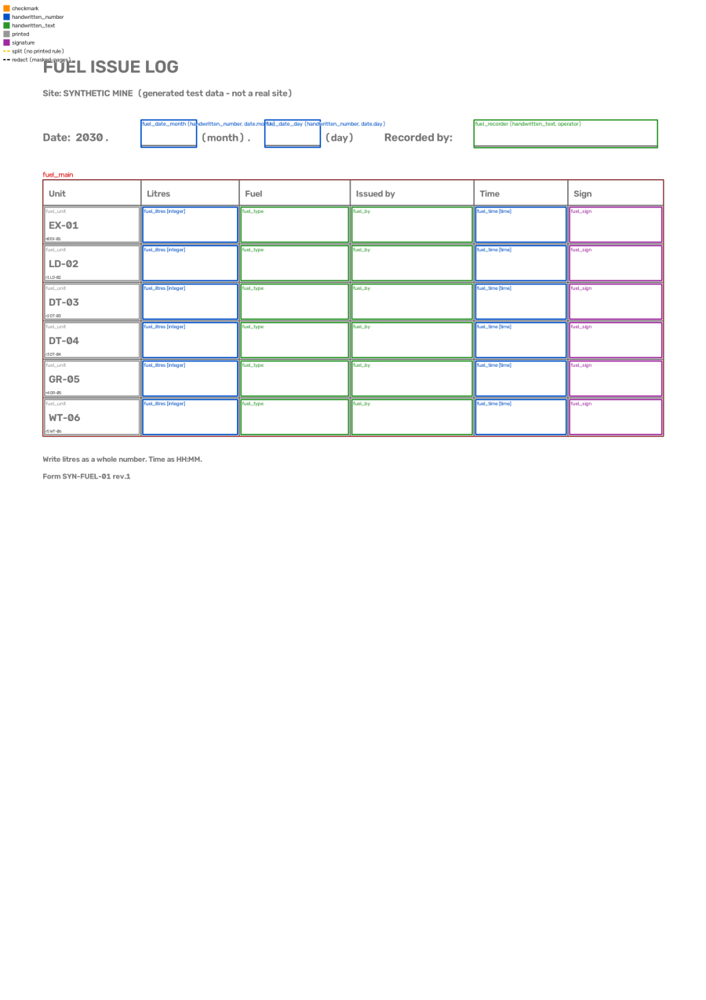

# 7. 새 양식 더하기

이 장은 관리자가 읽는다. 홈의 "양식 없는 쪽"이 늘거나, 현장에서 새 양식을 쓰기 시작하면 이 장의 일이다.

새 양식은 **사이트 팩의 템플릿 폴더 하나**다. `<사이트 팩>\templates\<양식>\` 안에 `template.yaml`(어디에 무엇이 있는가)과
`reference.png`(기준 이미지)가 있다. 프로그램은 고치지 않는다. 도구가 괘선을 잡아 뼈대를 쓰고, 사람이 열·행·필드의 이름과 종류를 적는다.

이 장은 [SITE_PACK.md](../SITE_PACK.md#새-양식을-추가하는-절차)의 "새 양식을 추가하는 절차"를 차례대로 따라간다. 보기는 합성 데모의
**유류일지**(`fuel_log`)다. `minedocscan synth … --v2-forms` 가 만드는 가상 양식이다. 키의 뜻과 규칙은 SITE_PACK.md 에 있고,
이 장은 순서와 확인하는 법을 적는다. 이 순서로 다시 만든 유류일지 템플릿은 칸이 원래 템플릿과 4 px 안이고 처리 결과가 같다
(저장소의 시험이 확인한다).

1. [기준 이미지 고르기](#1-기준-이미지-고르기)
2. [뼈대 만들기](#2-뼈대-만들기) — `template init`
3. [표 더하기](#3-표-더하기) — `template add-region`
4. [칸 채우기](#4-칸-채우기) — `template.yaml` 을 메모장으로
5. [확인하기](#5-확인하기) — `template check`, `template preview`, `info`
6. [필요할 때만 하는 일](#6-필요할-때만-하는-일) — 분류 전용, 인쇄 층, 섞여 쓰이는 판
7. [돌리고 결과 보기](#7-돌리고-결과-보기) — `run --fresh`, `report`, `pages`, 엑셀
8. [회귀 기준 갱신](#8-회귀-기준-갱신)

합성 데모로 먼저 연습하려면 [연습할 곳 만들기](#연습할-곳-만들기)부터 한다.

## 시작하기 전에

**유류일지.** 표가 하나다. 인쇄된 장비 여섯 줄(`EX-01` … `WT-06`)에 장비·주유량(L)·유종·주유자·주유 시각·서명의 여섯 열이 있다.
표 밖에는 날짜 줄의 월·일과 작성자를 손으로 쓴다. 그림은 [5. 확인하기](#5-확인하기)에 있다.

**serve 와의 관계.**

- serve 는 **시작할 때** 사이트 팩을 읽는다. 템플릿을 만드는 동안에도 serve 는 그대로 돌아도 된다. 새 템플릿은 serve 를 다시 켠 뒤부터
  쓰인다 ([7. 돌리고 결과 보기](#7-돌리고-결과-보기)).
- 사이트 팩에 **읽을 수 없는 템플릿**(YAML 문법, 모르는 `kind`·`format`, 겹친 행 키 …)이 하나라도 있으면, 사이트 팩을 읽는
  명령(`info`, `doc list`, `run`, `serve` …)이 "템플릿 오류: …" 한 줄로 멈춘다. 돌고 있는 serve 는 그대로 돌지만, PC 를 다시 켜거나
  다시 로그온하면 serve 가 시작하지 못한다.
- 칸이 겹치거나 쪽 밖으로 나가는 것은 `template check` 만 잡는다. 사이트 팩은 그대로 읽히고, 그 칸은 틀린 자리로 적재된다.
  그래서 `template check` 를 먼저 통과시킨다 ([5. 확인하기](#5-확인하기)).
- 읽을 수 있으면 덜 채운 템플릿도 serve 가 다시 켜질 때 그대로 쓰인다 (칸 이름이 자리표시인 채로 적재된다). 하루에 끝내지 못하면 그 템플릿
  폴더를 사이트 팩 밖으로 옮겨 두었다가 다음에 다시 가져온다.

**현장 데이터.**

- 기준 이미지와 미리보기 그림에는 실제 양식이 보인다 (인쇄된 이름, 쪽 위에 그리면 손글씨). 메일·이슈에 붙이지 않는다.
- 사이트 팩과 작업 폴더는 git 저장소 밖에 둔다. `template add-region`·`preview`·`print-layer`·`variant` 는 저장소 폴더 안의 경로를
  "… 은 git 작업 트리 안입니다" 로 거절한다.

**명령.** 새 PowerShell 창에서 친다. 경로의 `\` 는 `/` 로 적어도 된다 (보기의 `<사이트 팩>/templates/<양식>`).

## 연습할 곳 만들기

합성 데모로 먼저 해 보면 좋다. 현장 데이터 없이, 지금 쓰는 사이트 팩·작업 폴더를 건드리지 않는다. 바로 우리 현장의 양식을 만들 거면
이 절을 건너뛴다.

**1.** 합성 데모를 만들고 연습용 설정 파일을 연다.

<!-- 시험: 돌리지 않음 -->
```powershell
minedocscan synth D:\minedocscan-demo --v2-forms --days 3
New-Item -ItemType Directory D:\minedocscan-demo\excel, D:\minedocscan-demo\answer | Out-Null
notepad D:\minedocscan-demo\minedocscan.toml
```

메모장이 새 파일을 만들지 물으면 "예"를 누르고, 이렇게 적어 저장한다.

```text
[paths]
site = 'D:\minedocscan-demo\site'
archive_root = 'D:\minedocscan-demo\scans'
work_root = 'D:\minedocscan-demo\work'

[export]
excel_dir = 'D:\minedocscan-demo\excel'
```

**2.** 이 창에서만 연습 설정을 쓰게 한다. 창을 닫으면 원래 설정으로 돌아간다. 이 창에서는 `serve`·`watch`·`publish` 를 돌리지 않는다.

<!-- 시험: 돌리지 않음 -->
```powershell
$env:MINEDOCSCAN_CONFIG = 'D:\minedocscan-demo\minedocscan.toml'
minedocscan info                                    # site: D:\minedocscan-demo\site 가 보이면 된다
```

**3.** 데모에는 완성된 유류일지 템플릿이 이미 들어 있다. 사이트 팩 밖(`answer`)으로 옮겨 답안으로 두고 처리한다.
유류일지 3쪽이 "양식 없는 쪽"(`unknown_form`)이 된다 — 현장에 새 양식이 들어온 때와 같다.

<!-- 시험: 돌리지 않음 -->
```powershell
Move-Item D:\minedocscan-demo\site\templates\fuel_log D:\minedocscan-demo\answer\
minedocscan run
minedocscan pages --status unknown_form
```

```text
출처                           날짜         양식                          여유    인라이어    괘선 상태               오류
scan_2030-01-07#7            2030-01-07 -                         2.40       -     - unknown_form
scan_2030-01-08#7            2030-01-08 -                         1.71       -     - unknown_form
scan_2030-01-09#6            2030-01-09 -                         2.53       -     - unknown_form
쪽 3개
```

연습에서는 자리표시를 이렇게 바꿔 친다.

| 자리표시 | 연습에서 |
|---|---|
| `<사이트 팩>` | `D:\minedocscan-demo\site` |
| `<작업 폴더>` | `D:\minedocscan-demo\work` |
| `<엑셀 폴더>` | `D:\minedocscan-demo\excel` |
| `<기준 이미지>` | `D:\minedocscan-demo\answer\fuel_log\reference.png` — 합성 생성기가 그린 빈 유류일지 |
| `<새 양식>` | `fuel_log_draft` |
| `<양식>` | `fuel_log_draft` (다 채운 뒤) |
| `<표 둘레>` | `90,410,1564,1030` |
| `<날짜>` | `2030-01-07` |
| `<달>` | `2030-01` |

## 1. 기준 이미지 고르기

기준 이미지는 템플릿의 좌표계다. 칸·필드의 자리는 모두 이 그림의 화소(200 dpi)로 적는다. 처리할 때는 쪽마다 이 그림에 맞춰 편 뒤
칸을 자른다. 만든 뒤에는 바꾸지 않는다.

- **빈 양식**이 가장 좋다. 없으면 글씨가 적고 반듯하게 스캔된 한 장.
- 200 dpi 로. 스캔한 PDF 는 그대로 주고 `--page` 로 쪽을 고른다 — 프로그램이 200 dpi 로 그린다. 그림 파일이면 200 dpi 로 스캔한 것
  (A4 세로면 1654×2339 화소).
- 빈 양식을 스캔할 때는 **접수 폴더가 아닌 곳**에 저장한다. 접수 폴더에 넣으면 serve 가 문서로 받는다 (그랬으면 문서 화면의 "문서 버리기").
- 스캐너에 옆으로 들어가 돌아간 그림이면 `template init` 에 `--rotate 90`(또는 `180`·`270` — 시계 방향으로 그만큼 돌려 세운다).
- 그 양식의 쪽이 이미 들어와 있으면 미리보기로 찾는다. `<작업 폴더>\thumbs\unknown_form\` 에 1/4 크기 그림이 생긴다.
  미리보기는 작아서 기준 이미지로 쓰지 않는다. 고른 쪽의 원본 스캔(어디에 있는지는 [5. 확인하기](#5-확인하기)의 `--scan`)을
  `--page` 와 같이 준다.

```powershell
minedocscan pages --status unknown_form --thumbs
```

빈 양식이 없어 **글씨가 채워진 쪽**을 기준 이미지로 쓰면, 표를 더하기 전에 인쇄 층을 만드는 편이 낫다 ([인쇄 층](#인쇄-층)).

유류일지는 합성 생성기가 그린 빈 양식(1654×2339 화소)을 쓴다.

## 2. 뼈대 만들기

```powershell
minedocscan template init <기준 이미지> --name <새 양식>
```

```text
템플릿 뼈대를 만들었습니다: D:\minedocscan-demo\site\templates\fuel_log_draft\template.yaml
열 이름·kind·행 키를 채우세요 (docs/SITE_PACK.md).
```

- 사이트 팩의 `templates\<새 양식>\` 에 `reference.png`(기준 이미지를 회색조로 베낀 것)와 `template.yaml` 이 생긴다.
- `--name` 은 템플릿 이름이다. 영문 소문자·숫자·밑줄로 적는다. `report`·`pages` 에 이 이름이 보인다.
- PDF 이면 `--page 2` 처럼 쪽을 준다. 같은 이름이 이미 있으면 멈춘다 — 긴 오류 글의 마지막 줄에
  "이미 있습니다: … (덮어쓰려면 --overwrite)" 가 보인다.

`--roi` 없이 만들면 쪽 전체에서 괘선을 찾아 표 하나(`main`)를 적어 둔다. 미리보기로 본다.

```powershell
minedocscan template preview <사이트 팩>/templates/<새 양식>
```

그림은 `<작업 폴더>\template-preview\<새 양식>.png` 다. 유류일지에서는 표의 윗선이 **날짜 줄의 밑줄**(y 341)에 잡혔다. 인쇄된 머리글
(Unit, Litres …)이 데이터 행 0 이 되고 행이 일곱이 되었다. `template.yaml` 에서는 이렇게 보인다 (줄임).

```text
regions:
- name: main
  grid:
    ys:
    - 341          # 날짜 줄의 밑줄 — 표의 괘선이 아니다
    - 420
    - 480
    # … (줄임)
```

이 표는 지우고, 다음 단계에서 표를 따로 더한다. 메모장으로 `template.yaml` 을 열어 `regions:` 아래의 `- name: main` 블록을 통째로 지우고
`regions: []` 로 둔다. 끝은 이렇게 된다.

```text
handler: generic
handler_options: {}
regions: []
fields: []
```

- `template.yaml` 은 메모장으로 고친다. **UTF-8** 로 저장하고(메모장의 기본값), 들여쓰기는 **빈칸**으로 한다 (탭은 안 된다).
- `regions: []` 인 템플릿은 **분류 전용**이다 — 쪽을 그 양식으로 골라내기만 하고 칸은 없다. `info` 에 "(분류 전용 — 셀 정의 없음)"으로
  나온다 ([분류 전용으로 먼저 돌리기](#분류-전용으로-먼저-돌리기)).
- `template init` 에 `--roi <표 둘레>` 를 주면 그 영역에서 표 하나를 바로 잡는다. 그러나 표 이름이 `main` 으로 정해진다.
  이 장은 표 이름을 정하려고 다음 단계의 `add-region` 을 쓴다. 표가 여럿인 양식도 같은 방법으로 하나씩 더한다.

## 3. 표 더하기

먼저 표의 둘레를 읽는다. 그림판으로 `<사이트 팩>\templates\<새 양식>\reference.png` 를 열고 마우스를 올리면 왼쪽 아래에 화소 위치가
보인다. 표의 왼쪽 위와 오른쪽 아래 모서리를 읽고, 둘 다 **10–20 화소씩 바깥으로** 넓힌 `x0,y0,x1,y1` 이 `<표 둘레>` 다
(왼쪽 위는 빼고, 오른쪽 아래는 더한다). 이웃한 인쇄 선(유류일지의 날짜 줄 밑줄)까지는 넣지 않는다. 유류일지의 표는
(100, 420)–(1554, 1020) 이라 `90,410,1564,1030` 이다.

```powershell
minedocscan template add-region <사이트 팩>/templates/<새 양식> --roi <표 둘레> --name fuel_main
```

```text
표를 더했습니다: fuel_main → D:\minedocscan-demo\site\templates\fuel_log_draft\template.yaml
  기준 이미지에서 괘선을 잡았습니다: 가로 8개, 세로 7개 (영역 90,410,1564,1030) → 머리 행 1, 데이터 행 6개, 열 6개
  열 이름·kind·format, 행 키·메타는 자리표시입니다 — 채운 뒤 minedocscan template check 와 template preview (--print) 로 확인합니다. …
  …
참고: 인쇄 층이 없어 기준 이미지에서 잡았습니다 — 기준 이미지가 채워진 스캔이면 손글씨의 세로획이 괘선으로 섞일 수 있습니다 (…)
```

- `--name` 은 표 이름이다 (영문·숫자·밑줄). 유류일지는 `fuel_main`.
- 머리글이 두 줄이면 `--header-rows 2` (기본 1). 합성 환경일지가 두 줄이다.
- `--role` 은 가동 일보의 표에만 준다 (SITE_PACK.md 의 [가동 일보 템플릿을 만드는 절차](../SITE_PACK.md#가동-일보-템플릿을-만드는-절차)).
- **괘선 수를 인쇄된 표와 맞춰 본다.** 유류일지는 가로 8개(머리 1줄과 장비 6줄의 위·아래 선), 세로 7개(6열의 양옆 선)다.
  많으면 손글씨나 다른 인쇄 선이 괘선으로 잡혔고, 적으면 영역이 표를 덜 덮었다.
- 마지막 "참고" 줄은 기준 이미지가 빈 양식이면 신경 쓰지 않아도 된다.
- 표는 `regions:` 에 글자로 끼워 넣는다. 다른 줄과 주석은 그대로다. 열은 `col_0` … `col_5`(모두 `handwritten_text`), 행은 `row_0` … `row_5` —
  모두 **자리표시**다.

다시 미리보기로 표의 테두리가 인쇄된 표에 맞는지, 머리글 줄이 칸에서 빠졌는지 본다.

```powershell
minedocscan template preview <사이트 팩>/templates/<새 양식>
```

이때 `template check` 를 해 보면 "오류 없음"이 나온다. 자리표시도 틀린 값은 아니기 때문이다. **아직 채운 것이 아니다.**

<!-- 시험: 돌리지 않음 -->
```powershell
minedocscan template check <사이트 팩>/templates/<새 양식>      # 뼈대만으로도 "오류 없음"
```

## 4. 칸 채우기

`template.yaml` 을 메모장으로 열어 자리표시를 그 양식의 것으로 바꾼다. 아래가 다 채운 유류일지다 — 합성 데모의 `fuel_log` 그대로이고,
적는 모양만 짧게 줄였다. 연습이면 답안(`D:\minedocscan-demo\answer\fuel_log\template.yaml`)과 견주며 적는다. 다른 것은 `name` 뿐이어야 한다.

```text
name: fuel_log                                  # template init 의 --name 그대로 (연습이면 fuel_log_draft)
title: Fuel issue log (synthetic V2 form)       # 사람이 읽는 이름 — 홈의 대기열에 보인다
display: 유류일지                                # 엑셀의 양식 시트 이름
reference_image: reference.png                  # 여기서부터 세 줄은 template init 이 적은 그대로
dpi: 200
page_size: [1654, 2339]
handler: generic                                # 업무 표 없이 칸의 값만 (아래)
handler_options: {}
regions:
  - name: fuel_main                             # add-region 의 --name
    display: 주유                                # 엑셀에서 표의 제목
    grid:                                       # add-region 이 잡은 그대로 둔다
      ys: [420, 480, 570, 660, 750, 840, 930, 1020]
      xs: [100, 330, 560, 820, 1110, 1330, 1554]
    header_rows: 1
    columns:
      - {idx: 0, name: fuel_unit,   kind: printed,            display: 장비}
      - {idx: 1, name: fuel_litres, kind: handwritten_number, format: integer, display: 주유량(L)}
      - {idx: 2, name: fuel_type,   kind: handwritten_text,   display: 유종}
      - {idx: 3, name: fuel_by,     kind: handwritten_text,   display: 주유자}
      - {idx: 4, name: fuel_time,   kind: handwritten_number, format: time, display: 주유 시각}
      - {idx: 5, name: fuel_sign,   kind: signature,          display: 서명}
    rows:                                       # key = 인쇄된 장비. 인쇄된 열(fuel_unit)의 값도 행에 적는다
      - {row: 0, key: EX-01, fuel_unit: EX-01}
      - {row: 1, key: LD-02, fuel_unit: LD-02}
      - {row: 2, key: DT-03, fuel_unit: DT-03}
      - {row: 3, key: DT-04, fuel_unit: DT-04}
      - {row: 4, key: GR-05, fuel_unit: GR-05}
      - {row: 5, key: WT-06, fuel_unit: WT-06}
fields:                                         # 표 밖에 손으로 쓰는 자리 — bbox 는 [x0, y0, x1, y1]
  - {name: fuel_date_month, kind: handwritten_number, bbox: [330, 280, 460, 344],   meta_key: date.month, display: 월}
  - {name: fuel_date_day,   kind: handwritten_number, bbox: [620, 280, 750, 344],   meta_key: date.day,   display: 일}
  - {name: fuel_recorder,   kind: handwritten_text,   bbox: [1110, 280, 1540, 345], meta_key: operator,   display: 작성자}
```

### 양식의 이름과 핸들러

- `title` 은 사람이 읽는 이름이다. 홈의 대기열에 "검수 대기 · Fuel issue log (synthetic V2 form)"처럼 보인다.
- `display` 는 엑셀에 보이는 이름이다. 양식·표·열·행·필드 어디에나 둔다. 양식에 인쇄된 머리글대로 적는다. 없으면 양식은 `title`,
  표·열·필드는 `name`, 행은 `key` 가 보인다 (SITE_PACK.md 의 [표시 이름](../SITE_PACK.md#표시-이름-display)).
- `handler` 는 이 양식의 값을 어디로 보낼지다. 핸들러는 칸의 값을 업무 표(점검·운반·가동 기록)로 옮기는 프로그램의 부분이다.
  - `generic` — 업무 표 없이 **칸의 값만** 남는다 (작업 DB·통합 DB 의 칸 표 `doc_field`, 엑셀의 양식 시트). 유류일지가 이것이다.
  - `inspection`(점검표)·`haul`(운반 일보·행렬)·`usage`(가동 일보) — 이미 있는 종류의 양식이면 그 핸들러의 약속(`handler_options`,
    행·열의 메타)을 따른다 (SITE_PACK.md 의 [핸들러별 약속](../SITE_PACK.md#핸들러별-약속)).
  - 위에 없는 업무 표가 필요하면 [새 종류의 업무 기록이면](#새-종류의-업무-기록이면).

### 표의 열과 행

- `idx`·`row` 와 `grid` 는 도구가 적은 그대로 둔다.
- 열마다 `name`(영문 소문자·밑줄, 한 표 안에서 겹치지 않게), `kind`, 필요하면 `format`, 그리고 `display`(엑셀의 머리글).
  열 이름 `display` 는 쓸 수 없다.

| `kind` | 칸 | 유류일지 |
|---|---|---|
| `printed` | 인쇄된 값. 읽지 않는다 — 값은 행에 적는다 | 장비 |
| `handwritten_number` | 손으로 쓴 수. 형식은 `format` | 주유량(`integer`), 주유 시각(`time`) |
| `handwritten_text` | 손으로 쓴 글자 | 유종, 주유자 |
| `checkmark` | ✓ 표시 | — |
| `signature` | 서명. 있는지만 본다 (엑셀에 `●`) | 서명 |

- `format` 은 `integer`(정수 — 수 칸의 기본), `decimal`(소수), `time`(시각), `time_range`(시각 범위), `reading`(계기 값 또는 시각) 가운데
  하나다. 손으로 쓰는 칸에만 준다. 자세히는 SITE_PACK.md 의 [값의 형식](../SITE_PACK.md#값의-형식-format).
- 글자 칸은 지금의 인식기가 읽지 않고, 형식이 `integer` 가 아닌 수 칸(소수·시각 …)은 인식기에 보내지 않는다 — 글씨가 있으면 검수
  대기다. `integer` 칸은 숫자 인식기를 켠 현장에서 기계가 읽는다. 처음 설치한 그대로는 손으로 쓴 수·글자 칸에 글씨가 있으면 모두
  검수 대기다 ([1장](1-개요.md#처음에는-손글씨를-읽지-않는다)). 빈 칸과 서명은 사람이 보지 않아도 정해진다.
  시각 칸(`time`)은 검수에서 `8:00`, `0800`, `08.00` 처럼 넣어도 `08:00` 으로 남는다.
- 행마다 `key` 는 그 행을 가리키는 값이다. 유류일지는 인쇄된 장비 코드다. 한 표 안에서 겹치지 않게 한다.
- **인쇄된 값은 읽지 않는다.** 인쇄된 열(`printed`)의 값은 행에 **그 열의 이름으로** 적는다 (`fuel_unit: EX-01`).
- 행의 `display` 는 엑셀의 행 이름이다. 없으면 `key` 가 보인다.

### 표 밖 필드

`fields:` 에 손으로 쓰는 자리마다 한 줄씩 적는다.

- `bbox` 는 글씨가 올 자리 `[x0, y0, x1, y1]` 이다 (기준 이미지의 화소 — 그림판으로 읽는다). 밑줄 위로 글씨가 올라오는 자리까지 넉넉히.
- `meta_key` 를 주면 그 값이 쪽 전체의 정보가 된다.
  - `operator`(작성자)·`vehicle_no`(차량번호) — 홈의 대기열 `page-fields` 에서 넣는다. 가린 쪽 그림에서 기본으로 가린다.
  - `date.month`·`date.day`(손으로 쓴 월·일) — 날짜를 정하지 않는다. 쪽의 날짜와 견주기만 한다 (`pages --meta-mismatch`). 날짜는 파일 이름과
    사람이 정한다. `date` 는 쓸 수 없다.
- 필드가 아닌데 가린 쪽 그림에서 가릴 자리(결재란, 인쇄된 이름)가 있으면 `redact` 상자를 적는다
  (SITE_PACK.md 의 [가릴 자리](../SITE_PACK.md#가릴-자리-redact)).

**검수를 시작한 뒤에는** 표·열·필드의 `name` 을 바꾸지 않고, 행을 끼워 넣어 번호(`row`)를 밀지 않는다. 검수는 그 이름과 번호로 칸에 붙는다.
`title`·`display` 는 보이는 이름일 뿐이라 언제 바꿔도 된다.

## 5. 확인하기

다 채운 뒤에는 이 템플릿도 사이트 팩에 있는 양식이다. 아래 명령의 `<양식>` 에 그 이름을 쓴다 (연습이면 `fuel_log_draft`).

```powershell
minedocscan template check <사이트 팩>/templates/<양식>
```

"오류 없음"이 나올 때까지 고친다. 오류가 있으면 한 줄에 하나씩 전부 나오고 끝에 "오류 N개"가 붙는다. 자주 나오는 것은
[막혔을 때](#막혔을-때)에 있다.

```powershell
minedocscan template preview <사이트 팩>/templates/<양식>
```

`<작업 폴더>\template-preview\<양식>.png` 에 칸과 필드를 그린다. 명령의 마지막 줄 "저장소에 넣지 마세요 — 실제 양식의 이름·차량번호가
보입니다."는 우리 현장의 양식이면 그대로 지킨다. 유류일지는 이렇게 나온다 (폭을 줄였다).



- 테두리의 색이 칸의 종류다. 파랑은 손으로 쓴 수, 초록은 손으로 쓴 글자, 회색은 인쇄, 보라는 서명, 주황은 ✓ 다. 빨간 테두리는 표,
  대각선이 그어진 검은 점선 상자는 가릴 자리(`redact`), 노란 점선은 인쇄되지 않은 나눔 선(`split_ys`·`split_xs`)이다. 왼쪽 위에 범례가 있다.
- 칸 위의 글은 열 이름과 형식이다 (`fuel_litres [integer]`, `fuel_time [time]`). 첫 열 아래의 `r0 EX-01` 은 행 번호와 키다. 필드 위의 글은
  이름·종류·메타 키다. 그림에는 영문만 나온다 — `display` 는 엑셀에서 본다.
- 칸이 인쇄된 칸 안에 맞는지, 표 밖 필드가 손으로 쓰는 자리를 다 덮는지 본다.

실제 글씨가 든 쪽 위에 그려 보려면 `--scan` 에 스캔 파일, `--page` 에 쪽 번호를 준다. 그 쪽을 기준 이미지에 맞춰 편 위에 그린다.
우리 현장의 스캔은 보관 폴더의 `intake\<받은 해-달>\<받은 시각>-<문서 ID>\` 에 있고, 쪽 번호는 `pages` 의 출처 `파일명#쪽` 의 뒤의 수다.

<!-- 시험: 돌리지 않음 -->
```powershell
minedocscan template preview D:\minedocscan-demo\site\templates\fuel_log_draft --scan D:\minedocscan-demo\scans\scan_2030-01-07.pdf --page 7
```

```text
그렸습니다: D:\minedocscan-demo\work\template-preview\fuel_log_draft__scan_2030-01-07_p7.png — 테두리 39개 (칸 + 필드)
정합: 통과, 인라이어 884, 괘선 오차 0.0 px
저장소에 넣지 마세요 — 실제 양식의 이름·차량번호가 보입니다.
```

마지막으로 사이트 팩 전체가 읽히는지 본다. `template check` 는 템플릿 하나만 본다 — 템플릿끼리의 오류(같은 `name` 이 둘 …)는 사이트 팩을
읽을 때 나온다.

```powershell
minedocscan info
```

"템플릿 오류: …" 없이 끝나고, 양식마다 한 줄에 표와 칸의 수가 맞으면 된다. 칸 수는 표의 칸과 표 밖 필드를 더한 것이다
(유류일지: 6열 × 6행 + 필드 3 = 39).

```text
  fuel_log_draft           handler=generic     표 1개, 셀 39개
```

## 6. 필요할 때만 하는 일

유류일지에는 이 절의 일이 하나도 필요 없다. 빈 양식이 있고, 값 칸 안에 인쇄된 글자가 없고, 같은 날 섞여 쓰이는 판도 없다.
우리 현장의 양식이 아래에 해당하면 그 절을 본다.

### 분류 전용으로 먼저 돌리기

`regions: []`·`fields: []` 인 템플릿([2. 뼈대 만들기](#2-뼈대-만들기))은 쪽을 그 양식으로 골라내기만 한다. 쪽의 상태는 `classified_only` 다.
이것으로 먼저 돌리는 때는 둘이다.

- 칸을 채우기 전에, 새 양식의 쪽이 다른 양식과 잘 갈리는지 본다.
- [인쇄 층](#인쇄-층)을 만들어야 한다 — 그 양식으로 분류된 쪽이 있어야 만든다.

serve 를 멈추고 다시 처리한 뒤 다시 켠다 (연습 폴더에서는 가운데 두 줄만).

<!-- 시험: 돌리지 않음 -->
```powershell
Stop-ScheduledTask -TaskName minedocscan-serve
minedocscan run --fresh
minedocscan pages --status classified_only --template <새 양식>
Start-ScheduledTask -TaskName minedocscan-serve
```

```text
출처                           날짜         양식                          여유    인라이어    괘선 상태               오류
scan_2030-01-07#7            2030-01-07 fuel_log_draft            5.78       -     - classified_only
scan_2030-01-08#7            2030-01-08 fuel_log_draft            7.64       -     - classified_only
scan_2030-01-09#6            2030-01-09 fuel_log_draft            7.28       -     - classified_only
```

"여유"는 그 양식과, 그다음으로 닮은 양식의 점수 비율이다. 1.5(`[pipeline] classify_min_margin`) 아래면 헷갈릴 수 있다 —
SITE_PACK.md 의 [손봐야 할 때](../SITE_PACK.md#손봐야-할-때). 분류 전용 템플릿도 사이트 팩에 들이는 것이라 `template check` 를 먼저 한다.

### 인쇄 층

인쇄 층은 그 양식에 **인쇄된 것만** 있는 그림이다. `template print-layer` 가 그 양식으로 분류된 쪽들을 겹쳐 손글씨를 지우고
만든다. 쪽이 3장보다 적으면 만들지 않고, 5장보다 적으면 경고한다 — 쪽이 적으면 같은 자리에 쓴 값의 잔상이 남는다. 필요한 때는 둘이다.

- **값 칸 안에 인쇄된 글자가 있는 가동 일보** ("하단: _ 대", "~", "시작:"). 인쇄 층이 없으면 그런 칸은 비어 있어도 늘 검수 대기다.
  인쇄 층은 가동 일보(`handler: usage`)의 계기·근무 시각·작업량 표(`role` 이 `meter`·`shifts`·`tally`)에만 쓰인다. 다른 양식에
  `print_image` 를 적어도 값 유무에는 쓰이지 않는다 (`template check` 가 "참고: … 인쇄 층으로 재는 칸 … 이 없습니다"로 알린다).
- **빈 양식이 없어** 글씨가 채워진 쪽을 기준 이미지로 쓸 때. 채워진 쪽에서 괘선을 잡으면 손글씨의 세로획이 괘선으로 섞인다.
  `print_image` 가 적혀 있으면 `add-region` 이 인쇄 층에서 괘선을 잡는다.

순서는 분류 전용으로 돌리기 → 인쇄 층 → `template.yaml` 에 `print_image: print.png` 를 적기 → 표 더하기다
(SITE_PACK.md 의 [가동 일보 템플릿을 만드는 절차](../SITE_PACK.md#가동-일보-템플릿을-만드는-절차)와 [인쇄 층](../SITE_PACK.md#인쇄-층-print_image)).

<!-- 시험: 돌리지 않음 -->
```powershell
minedocscan template print-layer <사이트 팩>/templates/<새 양식>
```

`print.png` 에는 날마다 같은 자리에 쓰는 글씨(작성자 이름, 서명)의 잔상이 남는다. 현장 데이터다 — 밖으로 보내지 않는다.

### 같은 날 섞여 쓰이는 판

묵은 양식을 같이 쓰면 같은 날 묶음에 인쇄 판 둘이 섞인다. 머리는 같은 자리이고 표만 몇 화소 내려가 있다. 그 양식의 몇 쪽만
"정합 실패"이거나 괘선 오차가 다른 쪽보다 크게 떨어져 있으면 이것을 의심한다 (`pages --template <양식>` 의 괘선 열).
`template variant` 가 그 판의 깨끗한 쪽에서 판 B 의 템플릿을 만든다 (`--scan` 에 그 쪽이 든 스캔 파일, `--page` 에 쪽 번호).
그리고 두 판의 `template.yaml` 에 같은 `family` 와 `concurrent: true` 를 적는다. 순서와 규칙은
SITE_PACK.md 의 [같은 날 섞여 쓰이는 판을 추가하는 절차](../SITE_PACK.md#같은-날-섞여-쓰이는-판을-추가하는-절차).

<!-- 시험: 돌리지 않음 -->
```powershell
minedocscan template variant <사이트 팩>/templates/<양식> --scan <스캔 파일> --page <쪽 번호> --name <양식>_b
```

### 날짜로 바뀐 판

어느 날부터 양식이 새로 인쇄되어 바뀌었으면(개정판) 새 판의 템플릿을 따로 만들고, 두 템플릿에 같은 `family` 를 적고 옛 판에 `valid_to`,
새 판에 `valid_from` 을 적는다. `report --by-month` 에서 그달부터 정합 수치가 나빠지면 이것이다 (SITE_PACK.md 의
[개정판을 추가하는 절차](../SITE_PACK.md#개정판같은-양식의-새-판을-추가하는-절차)).

## 7. 돌리고 결과 보기

`template check` 가 "오류 없음"이고 `info` 가 사이트 팩을 읽으면 새 템플릿을 쓰기 시작한다. 이미 들어와 있는 쪽("양식 없는 쪽")에도
쓰려면 처음부터 다시 처리한다. serve 를 멈추고 돌린 뒤 다시 켠다. 다시 켜야 serve 가 새 템플릿을 읽는다.

<!-- 시험: 돌리지 않음 -->
```powershell
Stop-ScheduledTask -TaskName minedocscan-serve
minedocscan run --fresh
Start-ScheduledTask -TaskName minedocscan-serve
```

- `run --fresh` 는 작업 DB 를 지우고 보관 폴더의 스캔 전부를 다시 처리한다. 검수·결정 기록은 사이트 팩에 있어 그대로 다시 붙는다.
  오래 걸린다 — [5장의 "다시 처리"](5-관리.md#다시-처리).
- 연습 폴더에는 serve 가 없다. `minedocscan run --fresh` 만 친다.
- 다시 처리하지 않고 serve 만 다시 켜면, 새로 들어오는 스캔부터 새 템플릿을 쓴다. 이미 들어온 쪽은 "양식 없는 쪽"으로 남는다.

### 리포트와 쪽 목록

```powershell
minedocscan report
minedocscan pages --template <양식>
```

`report` 에서 볼 줄 (연습):

```text
페이지 23장 — 상태: loaded 23
양식별 페이지: env_log 3, fuel_log_draft 3, synth_haul_log 11, synth_haul_matrix 3, synth_inspection 3
정합:
  fuel_log_draft: 3/3 통과, 인라이어 최소 864, 괘선 오차 최대 0.0 px
```

- "양식 없는 쪽"(`unknown_form`)이 그 양식의 쪽 수만큼 줄었는가. 연습에서는 3쪽이 모두 `loaded` 가 되었다.
- 그 양식의 쪽이 모두 정합을 통과했는가. 괘선 오차가 다른 양식과 비슷한가 ("인라이어"·"괘선 오차"의 뜻은
  [5장의 "report"](5-관리.md#report)). 몇 쪽만 실패하거나 오차가 크게 떨어져 있으면 [같은 날 섞여 쓰이는 판](#같은-날-섞여-쓰이는-판)일 수 있다.
- `pages --template` 은 쪽마다 날짜·여유·인라이어·괘선 오차·상태를 보여 준다. 출처 열(`파일명#쪽`)은 원래 파일 이름이다 — 밖으로 보낼 때는 지운다.

### 홈과 검수

serve 가 다시 켜지면, 새 양식에 검수 대기 칸이 있는 동안 홈의 "대기열"에 그 양식의 칸이 생긴다. 이름은 템플릿의 `title` 이다
(보기: "검수 대기 · Fuel issue log (synthetic V2 form)").
작성자처럼 `meta_key` 가 있는 표 밖 필드는 `page-fields` 대기열에 나온다. 넣는 법은 [4장의 "검수 대기열"](4-날마다-쓰기.md#검수-대기열).

### 엑셀

일별 파일에 양식마다 시트가 한 장 생긴다. 시트 이름은 양식의 `display` 다. serve 가 다시 켜지면 엑셀 폴더 전체를 훑어 바뀐 파일을
다시 쓴다 (달마다 한 조각씩, 몇 바퀴에 걸쳐). 홈의 "최근 문서"에서 날짜 옆의 **엑셀** 을 눌러 내려받아도 된다.
명령으로 그날의 파일을 바로 쓰려면 serve 가 멈춘 동안 친다 ([5장의 "serve 를 멈추고 하는 명령"](5-관리.md#serve-를-멈추고-하는-명령)).
연습 폴더에서는 그대로 친다.

```powershell
minedocscan export excel --date <날짜>
```

파일은 `<엑셀 폴더>\daily\<달>\<날짜>.xlsx` 다. 연습의 2030-01-07 파일에서 "유류일지" 시트는 이렇게 보인다 (숫자 인식기 없이, 검수 전).

**표 밖 필드** — 월 `1`, 일 `7`, 작성자 `?`

**주유**

| 행 | 장비 | 주유량(L) | 유종 | 주유자 | 주유 시각 | 서명 |
|---|---|---|---|---|---|---|
| EX-01 | EX-01 | | | | | |
| LD-02 | LD-02 | ? | ? | ? | ? | ● |
| DT-03 | DT-03 | | | | | |
| DT-04 | DT-04 | ? | ? | ? | ? | |
| GR-05 | GR-05 | ? | ? | ? | ? | ● |
| WT-06 | WT-06 | ? | ? | ? | ? | ● |

- 시트 이름·표 제목·머리글·필드 이름이 템플릿의 `display` 다 (유류일지, 주유, 주유량(L) …). 영문 이름이 보이면 그 자리에 `display` 가 없다.
- 장비 열은 인쇄된 값이라 템플릿에서 온다. 빈 칸은 그날 쓰지 않은 줄이다.
- `?` 는 **검수 대기 — 값을 싣지 않은 칸**이다. 검수하면 다음 내보내기에 값이 된다. 엑셀에서 고쳐 쓰지 않는다 (엑셀은 사본이다 —
  [4장의 "칸의 표시"](4-날마다-쓰기.md#칸의-표시)).
- `●` 는 서명이 있다는 뜻이다. 월·일은 쪽의 날짜(파일 이름이나 사람이 정한 날짜)에서 온 값이다 (손으로 쓴 월·일은 견주기만 한다).
- `generic` 양식이라 업무 시트는 없다. 통합 DB 를 쓰면 같은 칸이 통합 DB 의 `doc_field` 표에 실린다.

## 8. 회귀 기준 갱신

회귀 기준(`<사이트 팩>\expected\regression.json`)을 쓰는 현장이면, 새 양식을 들인 뒤 회귀 검사를 돌린다. 기준의 묶음에 새 양식의 쪽이
있었으면 수가 달라진다 — 양식 없는 쪽이 줄고, 그 양식의 쪽과 칸이 생긴다. 그것으로 설명이 되면 기준을 갱신하고, 언제 무엇을 바꿨는지
적어 둔다 ([5장의 "회귀 검사"](5-관리.md#회귀-검사)).

<!-- 시험: 돌리지 않음 -->
```powershell
minedocscan regress
minedocscan regress --update
```

## 새 종류의 업무 기록이면

`generic` 양식의 값은 **칸으로만** 남는다 — 작업 DB 의 칸 표(`doc_field`), 엑셀의 양식 시트, 통합 DB 의 `doc_field`. 점검·운반·가동 기록처럼
날짜·장비별로 묶은 업무 표나, 그 값으로 하는 검산이 필요하면 새 핸들러가 있어야 한다. 이것은 **프로그램을 고치는 일**이다 —
개발자에게 맡긴다 (저장소의 [ARCHITECTURE.md](../ARCHITECTURE.md#10-확장-지점) "10. 확장 지점"). 이 장의 일이 아니다.

그때도 템플릿은 이 장대로 먼저 만들어 `generic` 으로 들여 둘 수 있다. 그동안 칸의 값과 검수가 쌓인다.

## 막혔을 때

| 보이는 것 | 뜻 | 할 일 |
|---|---|---|
| `template init`: 긴 오류 글의 마지막 줄이 "FileExistsError: 이미 있습니다: … (덮어쓰려면 --overwrite)" | 같은 이름의 템플릿이 있다 | 다른 이름으로. 처음부터 다시 만들려면 `--overwrite` (고친 것이 사라진다) |
| `add-region`: "괘선이 모자랍니다: 가로 N개, 세로 N개 …" | 영역에서 표를 찾지 못했다 | `<표 둘레>` 가 표를 다 덮는지 본다. 조금 넉넉히 다시 준다 |
| `add-region`: "같은 이름의 표가 이미 있습니다: …" | 그 표를 이미 더했다 | 다시 하려면 `template.yaml` 에서 그 표의 블록을 지우고 한다 |
| "… 은 git 작업 트리 안입니다" | 사이트 팩이나 작업 폴더가 git 저장소 안에 있다 | 저장소 밖으로 옮긴다 |
| `template check`: "칸이 겹칩니다: main/col_0/행 1 ↔ fuel_main/col_0/행 0" | `template init` 이 잡은 표(`main`)를 지우지 않고 표를 더했다 | `main` 블록을 지운다 ([2. 뼈대 만들기](#2-뼈대-만들기)) |
| `template check`: "YAML 을 읽을 수 없습니다: found character '\t' that cannot start any token (줄 N, 칸 N)" | 들여쓰기에 탭이 있다 | 그 줄의 탭을 빈칸으로 |
| `template check`: "YAML 을 읽을 수 없습니다: 'utf-8' codec can't decode byte …" | UTF-8 이 아닌 인코딩(ANSI)으로 저장했다 | 메모장의 "다른 이름으로 저장"에서 인코딩 UTF-8 |
| `template check`: "…/fuel_sign: format 은 손으로 쓰는 칸(…)에만 — kind 가 'signature'" | 서명·인쇄·✓ 칸에 `format` 을 주었다 | 그 열의 `format` 을 지운다 |
| `template check`: "열 이름 '…' 이 겹칩니다", "행 N 의 행 키가 앞의 행과 겹칩니다" | 한 표 안에서 이름·키가 둘 | 하나를 바꾼다 |
| `template check`: "fields/…: 쪽 밖으로 나갑니다 (쪽 1654×2339 px)" | 필드의 `bbox` 가 기준 이미지 밖이다 | 그림판으로 좌표를 다시 읽는다 |
| `template check`: "열 이름 'display' 는 쓸 수 없습니다 …" | 열의 `name` 을 `display` 로 적었다 | 다른 이름으로. 엑셀의 머리글은 열의 `display:` 키로 |
| 다른 명령이 "템플릿 오류: …" 로 멈춘다 | 사이트 팩의 템플릿 하나를 읽을 수 없다 | `template check` 로 그 템플릿의 오류를 전부 보고 고친다 |
| `template check` 는 오류(칸이 겹침, 쪽 밖)인데 `info` 는 그대로 읽힌다 | 그런 오류는 `template check` 만 잡는다 | 그대로 돌리면 틀린 자리의 칸이 적재된다. "오류 없음"이 될 때까지 고친다 |
| 새 양식의 쪽이 아직 "양식 없는 쪽"이다 | serve 를 다시 켜지 않았거나 `run --fresh` 를 하지 않았다. 둘 다 했다면 기준 이미지가 그 쪽들과 많이 다르다 (다른 판, 흐린 그림) | [7. 돌리고 결과 보기](#7-돌리고-결과-보기). 다른 판이면 그 판의 템플릿을 따로 만든다 |
| 그 양식의 몇 쪽만 "정합 실패" | 같은 날 섞여 쓰이는 다른 판이거나, `grid` 가 실제 괘선과 어긋났다 | [같은 날 섞여 쓰이는 판](#같은-날-섞여-쓰이는-판), SITE_PACK.md 의 [손봐야 할 때](../SITE_PACK.md#손봐야-할-때) |
| `pages --low-margin` 에 그 양식이 나온다 | 닮은 양식과 헷갈린다 | SITE_PACK.md 의 [손봐야 할 때](../SITE_PACK.md#손봐야-할-때) |
| 엑셀의 시트 이름·머리글이 영문이다 | 그 자리에 `display` 가 없다 | `display` 를 적는다. 다시 처리할 필요는 없다 — serve 를 다시 켜면 엑셀이 바뀐다 |
